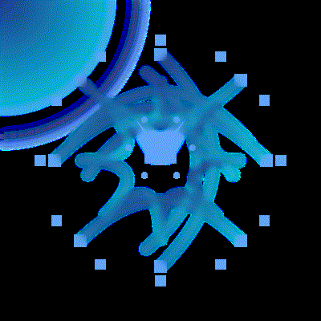
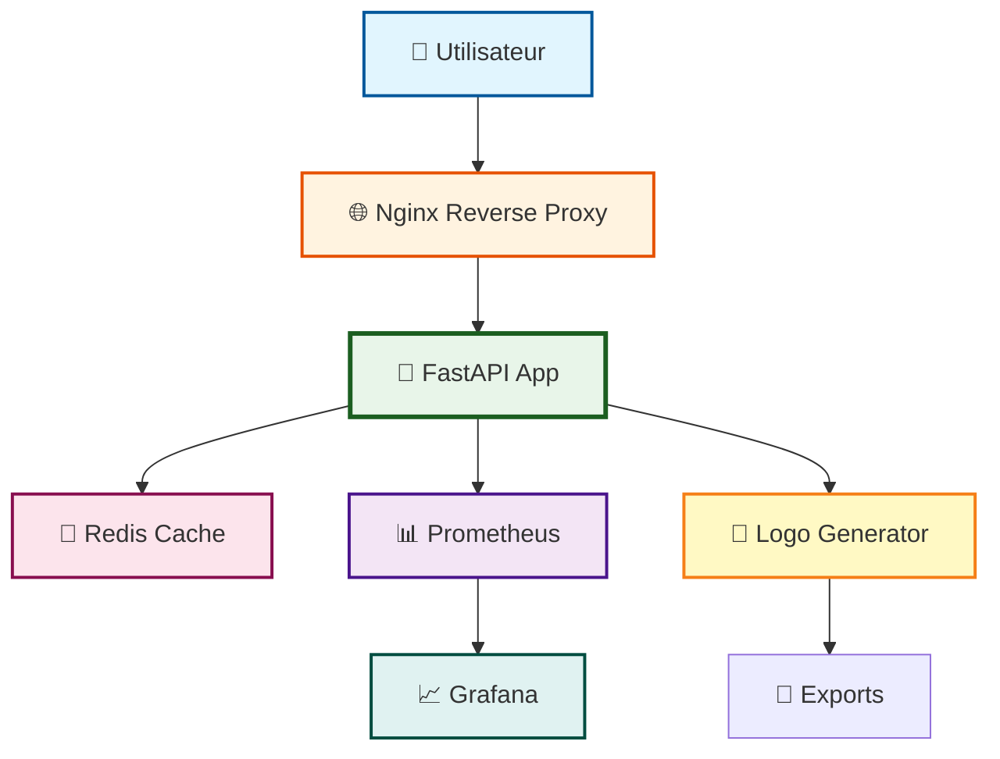
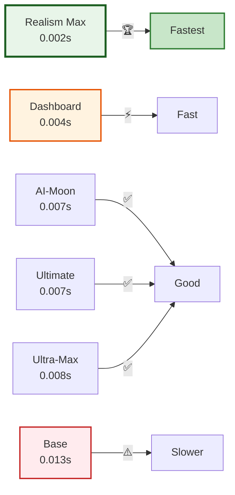

# 🎨⚡️🤖 **Arkalia-LUNA Logo Generator**

> **🌍 English**: Professional SVG/PNG logo generator with 11 unique styles, 10 emotional variants, FastAPI integration, monitoring & CI/CD - like Figma/Canva but for developers.

> **🇫🇷 Français**: Générateur professionnel de logos SVG/PNG multi-styles avec 11 styles uniques, 10 variantes émotionnelles, API FastAPI, monitoring & CI/CD inclus - comme Figma/Canva mais pour développeurs.

[](https://python.org)
[](LICENSE)
[](https://github.com/arkalia-luna-system/arkalia-luna-logo/releases)
[](CHANGELOG.md)
[](https://github.com/psf/black)
[](https://github.com/astral-sh/ruff)
[](tests/)
[](htmlcov/)
[](Dockerfile.prod)
[](main.py)
[](monitoring/)
[](http://localhost:8000/metrics)

[](CONTRIBUTING.md)
[](https://github.com/arkalia-luna-system/arkalia-luna-logo/labels/good%20first%20issue)
[](https://github.com/arkalia-luna-system/arkalia-luna-logo/labels/help%20wanted)

## 📋 Table of Contents

<div align="center">

| Section | Description | Lien |
|:-------:|:-----------:|:----:|
| 🎯 **Vue d'ensemble** | Présentation du projet | [📘 Voir](#-vue-densemble) |
| 🎯 **Cas d'Usage** | Dans quel projet utiliser ce générateur | [📘 Voir](#-cas-dusage---dans-quel-projet-utiliser-ce-générateur-) |
| ✨ **Démonstration** | Démonstration live | [📘 Voir](#-démonstration-en-temps-réel) |
| 🚀 **Installation** | Guide d'installation | [📘 Voir](#-installation) |
| 💻 **Utilisation** | Guide d'utilisation | [📘 Voir](#-utilisation) |
| 🎨 **Styles** | 11 styles disponibles | [📘 Voir](#-styles-disponibles) |
| 🔧 **Configuration** | Configuration avancée | [📘 Voir](#-configuration) |
| 📊 **Monitoring** | Prometheus + Grafana | [📘 Voir](#-monitoring) |
| 🤝 **Contribution** | Guide de contribution | [📘 Voir](#-contribution) |
| 📚 **Documentation** | Documentation complète | [📘 Voir](#-documentation) |
| 🛠️ **Dépannage** | Résolution de problèmes | [📘 Voir](#️-dépannage) |
| 📄 **Licence** | Informations de licence | [📘 Voir](#-licence) |

</div>

---

## 🎯 Vue d'Ensemble

<div align="center">

**🌍 English** : Arkalia-LUNA Logo Generator is a complete SVG vector logo generation system with **11 unique styles** and **10 emotional variants**. Professional modular architecture perfect for showcase projects, demonstrating advanced Python skills, design patterns, and graphics generation.

**🇫🇷 Français** : Arkalia-LUNA Logo Generator est un système complet de génération de logos vectoriels SVG avec **11 styles uniques** et **10 variantes émotionnelles** distinctes. L'architecture modulaire et professionnelle en fait un excellent projet vitrine pour GitHub, démontrant des compétences en Python avancé, design patterns, et génération de contenu graphique.

</div>

## 🎯 **Cas d'Usage - Dans Quel Projet Utiliser Ce Générateur ?**

| Type de Projet | Usage Recommandé | Bénéfice | Intégration |
|----------------|------------------|----------|-------------|
| **🌐 Applications Web** | Logos dynamiques selon le thème | Cohérence visuelle | API REST + Frontend |
| **📱 Apps Mobiles** | Favicons et icônes adaptatives | Multi-résolution automatique | CLI dans CI/CD |
| **📊 Dashboards Business** | Branding personnalisé | Identité professionnelle | Docker + monitoring |
| **🎮 Plateformes Gaming** | Logos émotionnels immersifs | Engagement utilisateur | API temps réel |
| **🤖 Projets IA/ML** | Visualisation d'émotions | Interface intuitive | Python natif |
| **🏢 Solutions Entreprise** | Multi-tenant branding | Personnalisation client | API scalable |
| **📚 Projets Open Source** | Branding cohérent | Identité communautaire | GitHub Actions |
| **🎨 Outils Créatifs** | Assets vectoriels de qualité | Export professionnel | CLI + batch processing |

## 🎬 Démonstration en Temps Réel

<div align="center">



**⚡ Génération de logos en 0.03 secondes - 10 variantes émotionnelles**

</div>

### 🎨 Galerie Visuelle Complète

<div align="center">

#### 🌟 Tous les Styles - Variante Sérénité

| Style | Logo | Performance | Complexité |
|:-----:|:----:|:-----------:|:----------:|
| **🌙 Base** |  | ⚡ ~0.002s | ⭐ Simple |
| **📊 Dashboard** |  | ⚡ ~0.004s | ⭐⭐ Modéré |
| **🌙 AI-Moon** |  | ✅ ~0.007s | ⭐⭐⭐ Avancé |
| **🎨 Advanced** |  | ✅ ~0.006s | ⭐⭐⭐ Avancé |
| **⚡ Simple-Advanced** |  | ⚡ ~0.005s | ⭐⭐ Modéré |
| **🚀 Ultra-Max** |  | ✅ ~0.008s | ⭐⭐⭐⭐ Complexe |
| **🌍 Realism Max** |  | 🏆 ~0.002s | ⭐⭐⭐ Avancé |
| **🌟 Ultimate** |  | ✅ ~0.007s | ⭐⭐⭐⭐⭐ Extrême |

#### ⚡ Comparaison Variantes - Style Dashboard

| Variante | Logo | Caractéristique | Usage |
|:--------:|:----:|:---------------:|:-----:|
| **🌙 Sérénité** |  | Calme et mystique | Applications calmes |
| **⚡ Puissance** |  | Énergique et dynamique | Applications dynamiques |
| **🔮 Mystère** |  | Intrigant et mystérieux | Applications créatives |
| **✨ Éveil** |  | Lumineux et éclairé | Applications éducatives |
| **🎇 Créative** |  | Coloré et créatif | Applications design |

</div>

## 🎨 **Comparaison des 11 Styles de Logos**

### **🌟 Variante Sérénité** (Halo doux, pulsations lentes)
| Style | Logo | Description |
|-------|------|-------------|
| **🌙 Simple** |  | Logo de base Arkalia-LUNA |
| **📊 Dashboard** |  | Interface optimisée et épurée |
| **🌙 AI-Moon** |  | IA réaliste avec lune vivante |
| **🎨 Advanced** |  | Techno-mystique avancé |
| **⚡ Simple-Advanced** |  | Équilibré et configurable |
| **🚀 Ultra-Max** |  | Effets exceptionnels et performance |
| **🌍 Realism Max** |  | Ultra-réaliste avec effets organiques |
| **🌟 Ultimate** |  | Cosmique extrême (100+ stops, holographie) |

### **⚡ Variante Puissance** (Halo vibrant, réseau accéléré)
| Style | Logo | Description |
|-------|------|-------------|
| **🌙 Simple** |  | Logo de base Arkalia-LUNA |
| **📊 Dashboard** |  | Interface optimisée et épurée |
| **🌙 AI-Moon** |  | IA réaliste avec lune vivante |
| **🎨 Advanced** |  | Techno-mystique avancé |
| **⚡ Simple-Advanced** |  | Équilibré et configurable |
| **🚀 Ultra-Max** |  | Effets exceptionnels et performance |
| **🌍 Realism Max** |  | Ultra-réaliste avec effets organiques |
| **🌟 Ultimate** |  | Cosmique extrême (100+ stops, holographie) |

### **🔮 Variante Mystère** (Brumes mouvantes, réseau irrégulier)
| Style | Logo | Description |
|-------|------|-------------|
| **🌙 Simple** |  | Logo de base Arkalia-LUNA |
| **📊 Dashboard** |  | Interface optimisée et épurée |
| **🌙 AI-Moon** |  | IA réaliste avec lune vivante |
| **🎨 Advanced** |  | Techno-mystique avancé |
| **⚡ Simple-Advanced** |  | Équilibré et configurable |
| **🚀 Ultra-Max** |  | Effets exceptionnels et performance |
| **🌍 Realism Max** |  | Ultra-réaliste avec effets organiques |
| **🌟 Ultimate** |  | Cosmique extrême (100+ stops, holographie) |

### **✨ Variante Éveil/Sagesse** (Halo rayonnant, Λ-core clair)
| Style | Logo | Description |
|-------|------|-------------|
| **🌙 Simple** |  | Logo de base Arkalia-LUNA |
| **📊 Dashboard** |  | Interface optimisée et épurée |
| **🌙 AI-Moon** |  | IA réaliste avec lune vivante |
| **🎨 Advanced** |  | Techno-mystique avancé |
| **⚡ Simple-Advanced** |  | Équilibré et configurable |
| **🚀 Ultra-Max** |  | Effets exceptionnels et performance |
| **🌍 Realism Max** |  | Ultra-réaliste avec effets organiques |
| **🌟 Ultimate** |  | Cosmique extrême (100+ stops, holographie) |

### **🎇 Variante Énergie Créative** (Flux rapides, reflets multicolores)
| Style | Logo | Description |
|-------|------|-------------|
| **🌙 Simple** |  | Logo de base Arkalia-LUNA |
| **📊 Dashboard** |  | Interface optimisée et épurée |
| **🌙 AI-Moon** |  | IA réaliste avec lune vivante |
| **🎨 Advanced** |  | Techno-mystique avancé |
| **⚡ Simple-Advanced** |  | Équilibré et configurable |
| **🚀 Ultra-Max** |  | Effets exceptionnels et performance |
| **🌍 Realism Max** |  | Ultra-réaliste avec effets organiques |
| **🌟 Ultimate** |  | Cosmique extrême (100+ stops, holographie) |

## ✨ **Fonctionnalités**

### 🎨 11 Styles de Logos Uniques

<div align="center">

| Style | Logo Exemple | Description | Performance |
|:-----:|:------------:|:-----------:|:-----------:|
| **🌙 Base** |  | Logo standard Arkalia-LUNA | ⚡ Rapide |
| **📊 Dashboard** |  | Interface optimisée et épurée | ⚡ Rapide |
| **🌙 AI-Moon** |  | IA réaliste avec lune vivante | ✅ Bon |
| **🎨 Advanced** |  | Techno-mystique avancé | ✅ Bon |
| **⚡ Simple-Advanced** |  | Équilibré et configurable | ⚡ Rapide |
| **🚀 Ultra-Max** |  | Effets exceptionnels et performance | ✅ Bon |
| **🌍 Realism Max** |  | Ultra-réaliste avec effets organiques | 🏆 Le plus rapide |
| **🌟 Ultimate** |  | Cosmique extrême (100+ stops, holographie) | ✅ Bon |
| **🤖 AI** | - | Génération IA avec Stable Diffusion | ⚠️ Optionnel |
| **🌌 Cosmic** | - | Sphères cosmiques et réseaux neuronaux | ✅ Bon |
| **🧠 Hyper-AI** | - | ComfyUI + SDXL + ControlNet | ✅ Fonctionnel |

</div>

> 📘 **En savoir plus** : Voir [COMFYUI.md](docs/COMFYUI.md) pour Hyper-AI

### 🌟 10 Variantes Émotionnelles

<div align="center">

| Variante | Logo Dashboard | Logo Ultra-Max | Description |
|:--------:|:--------------:|:---------------:|:-----------:|
| **🌙 Sérénité** |  |  | Halo doux, pulsations lentes |
| **⚡ Puissance** |  |  | Halo vibrant, réseau accéléré |
| **🔮 Mystère** |  |  | Brumes mouvantes, réseau irrégulier |
| **✨ Éveil** |  |  | Halo rayonnant, Λ-core clair |
| **🎇 Créative** |  |  | Flux rapides, reflets multicolores |

</div>

<div align="center">

**Variantes Dynamiques** (Pluie, Orage, Explosive, Ensoleillé, Neige) disponibles dans tous les styles

</div>

### 🛠️ Capacités Techniques

<div align="center">

| Capacité | Détails | Exemple |
|:--------:|:-------:|:-------:|
| **Génération SVG** | Haute qualité avec gradients et filtres | ✅ Tous les logos |
| **Favicons PNG** | Personnalisables (16x16 à 512x512) |  |
| **Interface CLI** | Complète avec Click et Rich | ✅ Professionnelle |
| **Architecture modulaire** | Séparation des responsabilités | ✅ Clean Code |
| **Factory Pattern** | Création dynamique de générateurs | ✅ Extensible |
| **Système de logging** | Professionnel et structuré | ✅ Traçabilité |
| **Gestion d'erreurs** | Robuste avec fallbacks | ✅ Résilient |
| **Tests automatisés** | Couverture complète (297 tests) | ✅ 75% coverage |

</div>

## 🌐 **API Web & Déploiement**

### **🚀 API FastAPI Production-Ready**
- **API REST** complète avec FastAPI
- **Endpoints** : `/health`, `/generate`, `/download`, `/stats`, `/metrics`
- **Performance** : Génération de logo en 0.03 secondes
- **Documentation** : Swagger UI automatique (`/docs`)
- **Sécurité** : CORS, validation, gestion d'erreurs
- **Monitoring** : Métriques Prometheus enrichies (compteurs par route/labels, histogramme de durées)

### **🐳 Docker & Orchestration**
- **Dockerfile.prod** optimisé pour la production
- **Docker Compose** avec 5 services (app, redis, nginx, prometheus, grafana)
- **Monitoring** : Prometheus + Grafana intégrés (panels p95/p99, erreurs/min, statut par route)
- **Sécurité** : Utilisateur non-root, health checks
- **Scalabilité** : Prêt pour déploiement en production

### 📊 Infrastructure Complète - VALIDÉE ✅

<div align="center">

**🐳 Docker Compose - 5 Services Orchestrés**

</div>

```bash
# Démarrage rapide avec Docker
docker-compose -f docker-compose.prod.yml up -d

# Services opérationnels :
# 🌐 API : http://localhost:8000 (FastAPI + Swagger)
# 🔄 Nginx : http://localhost:80 (Reverse Proxy)
# 📊 Prometheus : http://localhost:9090 (Métriques)
# 📈 Grafana : http://localhost:3000 (Monitoring)
# 💾 Redis : localhost:6379 (Cache)
```

### 🏗️ Architecture Infrastructure



### **⚡ Performance Exceptionnelle**
- **Génération de logo** : 0.03 secondes
- **5 logos en 0.1 seconde** (voir GIF ci-dessus)
- **API response** : < 100ms
- **Infrastructure** : 5 services Docker opérationnels
- **Monitoring** : métriques Prometheus en temps réel (quantiles via histogrammes)

### **🔬 Tests de charge (CI)**
- **Workflow GitHub Actions**: exécute Artillery à la demande avec `target_url`
- **SLA**: p95 < 2s, p99 < 5s, erreurs < 5%
- **Artefacts**: rapport JSON attaché à l’exécution CI

## 🚀 **Installation Rapide**

### **1. Configuration automatique (recommandée)**
```bash
git clone <repository-url>
cd arkalia-luna-logo
make quick-start
```

### **2. Configuration manuelle**
```bash
# Créer l'environnement virtuel
python3 -m venv arkalia-luna-env

# L'activer
source arkalia-luna-env/bin/activate  # Linux/Mac
# ou
arkalia-luna-env\Scripts\activate     # Windows

# Installer les dépendances
pip install -e .
```

## 📖 **Utilisation**

### **Interface CLI Principale**
```bash
# Activer l'environnement virtuel
source arkalia-luna-env/bin/activate

# Voir toutes les variantes
python -m src.cli info

# Voir tous les générateurs disponibles
python -m src.cli generators

# Générer un logo spécifique
python -m src.cli generate -v serenity -s 200 -g ultimate

# Générer toutes les variantes
python -m src.cli generate-all -s 200

# Créer des favicons
python -m src.cli favicon-all -s 32

# Voir les statistiques
python -m src.cli stats

# Nettoyer les fichiers
python -m src.cli clean
```

### **🚀 API FastAPI (Utilisation Complète)**
```bash
# Activer l'environnement virtuel
source arkalia-luna-env/bin/activate

# Démarrer l'API (script automatique)
./scripts/start_api.sh

# Ou manuellement
python main.py

# Accéder à Swagger UI
# http://localhost:8000/docs

# Générer un logo via API
curl -X POST "http://localhost:8000/generate" \
  -H "Content-Type: application/json" \
  -d '{"variant": "serenity", "size": 200, "generator": "ultimate"}'
```

### **🐳 Docker + Infrastructure (Production-Ready)**
```bash
# Démarrer toute l'infrastructure
docker-compose -f docker-compose.prod.yml up -d

# Services disponibles :
# 🌐 API : http://localhost:8000
# 📊 Prometheus : http://localhost:9090
# 📈 Grafana : http://localhost:3000
# 🔄 Nginx : http://localhost:80
```

### **🎨 Utilisation Complète du Potentiel**
```bash
# Explorer toutes les fonctionnalités
./scripts/quick_explore.sh

# Générer avec tous les générateurs avancés
python -m src.cli generate -v serenity -g ultimate    # Cosmique extrême
python -m src.cli generate -v power -g cosmic          # Sphères lumineuses
python -m src.cli generate -v mystery -g hyper_ai     # Hyper-IA
python -m src.cli generate -v awakening -g ai        # Stable Diffusion

# Tester toutes les variantes dynamiques
for variant in rainy stormy explosive sunny snowy; do
  python -m src.cli generate -v $variant -g ultimate
done
```

## 📝 **Conventions de Commit et PR**

### **Format des Titres de PR**
Tous les titres de PR doivent suivre le format : `type(scope): description`

**Types acceptés :**
- `feat` : Nouvelle fonctionnalité
- `fix` : Correction de bug
- `docs` : Documentation
- `style` : Formatage du code
- `refactor` : Refactoring
- `test` : Tests
- `chore` : Maintenance
- `perf` : Performance
- `ci` : CI/CD
- `build` : Build
- `revert` : Annulation

**Exemples valides :**
- ✅ `feat(logo): ajouter nouveau style mystique`
- ✅ `fix(tests): corriger erreur de validation`
- ✅ `docs: mise à jour README avec exemples`
- ✅ `style: reformater le code avec ruff`
- ✅ `ci: corriger workflow GitHub Actions`

**Formats rejetés :**
- ❌ `Ajouter nouveau style` (pas de type)
- ❌ `fix` (pas de description)
- ❌ `feat:` (pas de description)
- ❌ `feat(): description` (scope vide)

### **Commandes Makefile (plus rapides)**
```bash
# Configuration rapide
make quick-start

# Génération
make generate-all
make generate VARIANT=serenity
make favicon VARIANT=power

# Développement
make format      # Formatage du code
make lint        # Vérification du code
make test        # Lancement des tests
```

## 🏗️ **Architecture du Projet**

```
arkalia-luna-logo/
├── src/                          # Code source principal
│   ├── __init__.py              # Configuration du package
│   ├── variants.py              # Gestion des variantes émotionnelles
│   ├── svg_builder.py           # Classe abstraite pour les builders SVG
│   ├── logo_generator.py        # Générateur de base
│   ├── generator_factory.py     # Factory Pattern pour les générateurs
│   ├── cli.py                   # Interface CLI professionnelle
│   │
│   ├── **11 Générateurs Uniques** :
│   │   ├── logo_generator.py              # Base (default)
│   │   ├── dashboard_generator.py         # Interface optimisée
│   │   ├── ai_moon_generator.py           # IA réaliste
│   │   ├── advanced_logo_generator.py      # Techno-mystique
│   │   ├── simple_advanced_generator.py  # Équilibré
│   │   ├── ultra_max_generator.py         # Effets exceptionnels
│   │   ├── realism_max_generator.py       # Ultra-réaliste
│   │   ├── ultimate_generator.py          # Cosmique extrême
│   │   ├── ai_logo_generator.py           # Génération IA (Stable Diffusion)
│   │   ├── cosmic_logo_generator.py       # Sphères cosmiques
│   │   └── hyper_ai_generator.py          # Hyper-IA (ComfyUI + SDXL)
│   │
│   └── **Builders SVG Spécialisés** :
│       ├── svg_builder.py                 # Base abstraite
│       ├── svg_builder_dashboard.py       # Dashboard
│       ├── svg_builder_ai_moon.py         # AI-Moon
│       ├── svg_builder_advanced.py        # Advanced
│       ├── svg_builder_simple_advanced.py # Simple-Advanced
│       ├── svg_builder_ultra_max.py       # Ultra-Max
│       ├── svg_builder_realism_max.py     # Realism Max
│       ├── svg_builder_ultimate.py        # Ultimate
│       └── cosmic_sphere_builder.py       # Cosmic
│
├── tests/                       # Tests automatisés
├── docs/                        # Documentation
│   ├── COMFYUI.md              # 🧠 Guide ComfyUI + Hyper-AI
│   ├── QUICKSTART.md           # Guide de démarrage rapide
│   ├── API.md                  # Documentation API complète
│   ├── ARCHITECTURE.md         # Architecture technique
│   └── INDEX.md                # Index de documentation
├── exports/                     # Exports générés
│   ├── *.svg                   # Logos SVG (tous styles et variantes)
│   ├── *.png                   # Favicons PNG
│   ├── demo-gif/               # Démonstrations animées
│   └── screenshots/            # Captures d'écran
└── .github/                     # CI/CD GitHub Actions
```

## 🧪 **Tests et Qualité**

### **Tests Automatisés**
```bash
# Tests complets
pytest tests/ -v

# Tests avec couverture
pytest tests/ --cov=src --cov-report=html

# Tests rapides
pytest tests/ -x
```

### **Qualité du Code**
```bash
# Formatage
black src/ --line-length=88

# Linting
ruff check src/

# Vérification des types
mypy src/ --strict
```

## 🚀 **Développement**

### **🎯 Roadmap Stratégique**
Le projet suit une **roadmap stratégique** en 4 phases pour atteindre l'excellence :

- **🚨 Phase 1 (2-3 sem)** : Solidification technique (couverture 90%+, tests robustes)
- **🚨 Phase 2 (3-4 sem)** : UX exceptionnelle (démo en ligne, onboarding simple)
- **🟡 Phase 3 (2-3 sem)** : Distribution (PyPI, API externe)
- **🟢 Phase 4 (4+ sem)** : Communauté (badges, communication externe)

**📊 Suivi détaillé** : [Documentation complète](docs/ROADMAP_SUMMARY.md)

### **Ajout d'un Nouveau Style**
1. Créer `svg_builder_*.py` héritant de `SVGBuilder`
2. Implémenter la méthode abstraite `build_logo()`
3. Créer `*_generator.py` héritant de `ArkaliaLunaLogo`
4. Ajouter dans `generator_factory.py`
5. Ajouter les tests correspondants

### **Structure des Tests**
- **Tests unitaires** : Chaque composant testé individuellement
- **Tests d'intégration** : Flux complet de génération
- **Tests de performance** : Benchmark des générateurs
- **Tests de régression** : Validation des fonctionnalités

## 📊 Performance

### ⚡ Benchmark des Générateurs

<div align="center">

| Générateur | Temps | Performance | Logo Exemple |
|:----------:|:-----:|:-----------:|:------------:|
| **Realism Max** | ~0.002s | 🏆 Le plus rapide |  |
| **Dashboard** | ~0.004s | ⚡ Rapide |  |
| **AI-Moon** | ~0.007s | ✅ Bon |  |
| **Ultra-Max** | ~0.008s | ✅ Bon |  |
| **Ultimate** | ~0.007s | ✅ Bon |  |
| **Simple-Advanced** | ~0.008s | ✅ Bon |  |
| **Advanced** | ~0.008s | ✅ Bon |  |
| **Base** | ~0.013s | ⚠️ Plus lent |  |

</div>

> **Note** : Les temps varient selon la taille et la complexité du logo

### 📈 Graphique de Performance



## 🤝 **Contribution**

1. Fork le projet
2. Créer une branche feature (`git checkout -b feature/AmazingFeature`)
3. Commit les changements (`git commit -m 'Add AmazingFeature'`)
4. Push vers la branche (`git push origin feature/AmazingFeature`)
5. Ouvrir une Pull Request

## 📄 **Licence**

Ce projet est sous licence MIT. Voir le fichier `LICENSE` pour plus de détails.

## 🆘 Support

<div align="center">

| Support | Description | Lien Direct |
|:-------:|:-----------:|:-----------:|
| **Issues** | Bugs et demandes de fonctionnalités | [📘 GitHub Issues](https://github.com/arkalia-luna/arkalia-luna-logo/issues) |
| **Discussions** | Questions et discussions générales | [📘 GitHub Discussions](https://github.com/arkalia-luna/arkalia-luna-logo/discussions) |
| **Documentation** | Documentation complète | [📘 Voir docs/](docs/) |

</div>

### 📚 Navigation Rapide Documentation

<div align="center">

| Document | Description | Lien |
|:--------:|:-----------:|:----:|
| **📘 Index** | Navigation complète | [Voir](docs/INDEX.md) |
| **🚀 Quickstart** | Démarrage rapide | [Voir](docs/QUICKSTART.md) |
| **🧠 ComfyUI** | Génération IA avancée | [Voir](docs/COMFYUI.md) |
| **📋 API** | Documentation API | [Voir](docs/API.md) |
| **🏗️ Architecture** | Architecture technique | [Voir](docs/ARCHITECTURE.md) |
| **🤝 Contributing** | Guide de contribution | [Voir](docs/CONTRIBUTING.md) |

</div>

## 🌟 Statut du Projet

<div align="center">

| Métrique | Valeur | Statut | Objectif |
|:--------:|:------:|:------:|:--------:|
| **Version** | 2.0.0 | ✅ | - |
| **Statut** | Production/Stable | ✅ | - |
| **Python** | 3.8+ | ✅ | - |
| **Tests** | 297 tests passent | ✅ | - |
| **Couverture** | 75% | ✅ | 90%+ |
| **CI/CD** | GitHub Actions | ✅ | Automatisé |
| **Qualité** | Black + Ruff + MyPy | ✅ | - |
| **Benchmarks** | 7/7 tests | ✅ | - |

</div>

---

**🌙 Arkalia-LUNA Logo Generator** - Créé avec ❤️ par l'équipe Arkalia-LUNA

*Dernière mise à jour : Novembre 2025*
