<div align="center">

# 🌙⚡️🤖 Arkalia-LUNA Logo Generator

**Générateur Professionnel de Logos Vectoriels avec IA**

*11 Styles Uniques • 10 Variantes Émotionnelles • API FastAPI • Monitoring Intégré*

[](https://python.org)
[](LICENSE)
[](CHANGELOG.md)
[](tests/)
[](htmlcov/)
[](Dockerfile.prod)


**⚡ Génération Ultra-Rapide • 🎨 Qualité Professionnelle • 🤖 IA Intégrée • 🚀 Production-Ready**

[🚀 Quick Start](#-quick-start-30-secondes) • [🎨 Galerie Complète](#-galerie-interactive-complète) • [🤖 Génération IA](#-génération-ia-avancée) • [💻 Utilisation](#-utilisation) • [🤝 Contribution](#-contribution)

</div>

---

## 🚀 **Quick Start (30 secondes)**

<div align="center">

### **Générez votre premier logo en 3 étapes simples**

</div>

### **Étape 1 : Installation** ⚙️

```bash
git clone https://github.com/arkalia-luna-system/Arkalia-luna-logo.git
cd arkalia-luna-logo
python3 -m venv arkalia-luna-env
source arkalia-luna-env/bin/activate  # Linux/Mac
pip install -e ".[dev]"
```

### **Étape 2 : Génération** 🎨

```bash
# Générer un logo Ultimate en variante Sérénité
python -m src.cli generate -v serenity -s 200 -g ultimate
```

**Résultat :**

<div align="center">

| Commande | Logo Généré |
|:--------:|:-----------:|
| `generate -v serenity -g ultimate` |  |
| `generate -v power -g ultimate` |  |
| `generate -v mystery -g ai_moon` | 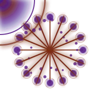 |

</div>

### **Étape 3 : Utilisation** 💻

```bash
# Voir toutes les variantes disponibles
python -m src.cli info

# Générer tous les logos
python -m src.cli generate-all -s 200
```

<div align="center">

**✅ C'est tout ! Votre logo est dans `exports/`**

</div>

---

## 🎯 **Vue d'Ensemble - Toutes les Capacités**

<div align="center">

### **Un Système Complet de Génération de Logos avec IA Intégrée**

Arkalia-LUNA Logo Generator est un générateur professionnel de logos avec **11 styles uniques** (8 vectoriels + 3 IA), **10 variantes émotionnelles**, API FastAPI, monitoring Prometheus/Grafana, et infrastructure Docker complète.

**🌍 English**: Professional SVG/PNG logo generator with 11 unique styles (8 vectorial + 3 AI), 10 emotional variants, FastAPI integration, AI generation (Stable Diffusion, ComfyUI, SDXL), monitoring & CI/CD.

**🇫🇷 Français**: Générateur professionnel de logos SVG/PNG multi-styles avec 11 styles uniques (8 vectoriels + 3 IA), 10 variantes émotionnelles, API FastAPI, génération IA (Stable Diffusion, ComfyUI, SDXL), monitoring & CI/CD inclus.

</div>

### **✨ Capacités Complètes du Projet**

<div align="center">

| Capacité | Détails | Quantité |
|:--------:|:-------:|:--------:|
| **🎨 Styles Vectoriels** | 8 générateurs SVG professionnels | 8 styles |
| **🤖 Styles IA** | 3 générateurs avec intelligence artificielle | 3 styles |
| **🌙 Variantes Émotionnelles** | 5 de base + 5 dynamiques | 10 variantes |
| **🔄 Combinaisons Possibles** | Styles × Variantes | **110+ logos** |
| **⚡ Performance Vectorielle** | Génération en 0.002s - 0.008s | Ultra-rapide |
| **🤖 Performance IA** | Génération avec Stable Diffusion/ComfyUI | Qualité professionnelle |
| **📱 Formats Export** | SVG vectoriel + PNG favicon | 2 formats |
| **🚀 API REST** | FastAPI avec Swagger UI | 9 endpoints |
| **🐳 Docker** | 5 services orchestrés | Infrastructure complète |
| **📊 Monitoring** | Prometheus + Grafana | Métriques en temps réel |
| **🧪 Tests** | 297 tests automatisés | 75% couverture |
| **🔧 CLI** | Interface en ligne de commande | Professionnelle |

</div>

---

## 🎨 **Galerie Interactive Complète**

<div align="center">

### **🌟 Tous les Styles × Toutes les Variantes = 110+ Logos Uniques**

**Explorez toutes les combinaisons possibles !**

</div>

### **📊 Style Dashboard - Toutes les Variantes**

<div align="center">

<table>
<tr>
<td align="center"><strong>🌙 Sérénité</strong><br/></td>
<td align="center"><strong>⚡ Puissance</strong><br/></td>
<td align="center"><strong>🔮 Mystère</strong><br/></td>
<td align="center"><strong>✨ Éveil</strong><br/></td>
<td align="center"><strong>🎇 Créative</strong><br/></td>
</tr>
<tr>
<td align="center"><strong>🌧️ Pluie</strong><br/>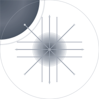</td>
<td align="center"><strong>⚡ Orage</strong><br/>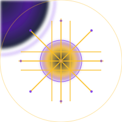</td>
<td align="center"><strong>💥 Explosive</strong><br/></td>
<td align="center"><strong>☀️ Ensoleillé</strong><br/>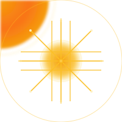</td>
<td align="center"><strong>❄️ Neige</strong><br/></td>
</tr>
</table>

</div>

### **🌙 Style AI-Moon - Toutes les Variantes**

<div align="center">

<table>
<tr>
<td align="center"><strong>🌙 Sérénité</strong><br/></td>
<td align="center"><strong>⚡ Puissance</strong><br/>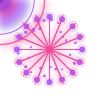</td>
<td align="center"><strong>🔮 Mystère</strong><br/></td>
<td align="center"><strong>✨ Éveil</strong><br/>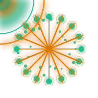</td>
<td align="center"><strong>🎇 Créative</strong><br/>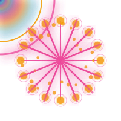</td>
</tr>
<tr>
<td align="center"><strong>🌧️ Pluie</strong><br/>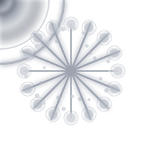</td>
<td align="center"><strong>⚡ Orage</strong><br/>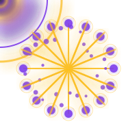</td>
<td align="center"><strong>💥 Explosive</strong><br/>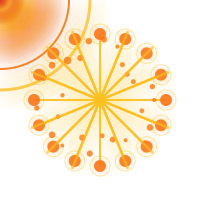</td>
<td align="center"><strong>☀️ Ensoleillé</strong><br/>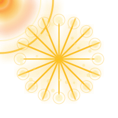</td>
<td align="center"><strong>❄️ Neige</strong><br/></td>
</tr>
</table>

</div>

### **🌟 Style Ultimate - Toutes les Variantes**

<div align="center">

<table>
<tr>
<td align="center"><strong>🌙 Sérénité</strong><br/></td>
<td align="center"><strong>⚡ Puissance</strong><br/></td>
<td align="center"><strong>🔮 Mystère</strong><br/>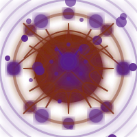</td>
<td align="center"><strong>✨ Éveil</strong><br/>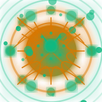</td>
<td align="center"><strong>🎇 Créative</strong><br/>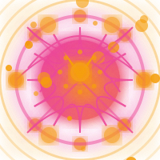</td>
</tr>
<tr>
<td align="center"><strong>🌧️ Pluie</strong><br/>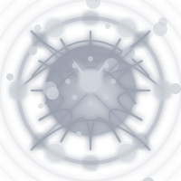</td>
<td align="center"><strong>⚡ Orage</strong><br/>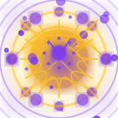</td>
<td align="center"><strong>💥 Explosive</strong><br/>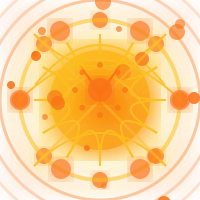</td>
<td align="center"><strong>☀️ Ensoleillé</strong><br/>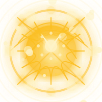</td>
<td align="center"><strong>❄️ Neige</strong><br/>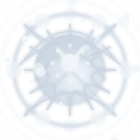</td>
</tr>
</table>

</div>

### **🚀 Style Ultra-Max - Toutes les Variantes**

<div align="center">

<table>
<tr>
<td align="center"><strong>🌙 Sérénité</strong><br/></td>
<td align="center"><strong>⚡ Puissance</strong><br/></td>
<td align="center"><strong>🔮 Mystère</strong><br/></td>
<td align="center"><strong>✨ Éveil</strong><br/>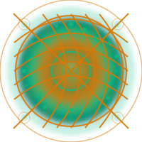</td>
<td align="center"><strong>🎇 Créative</strong><br/>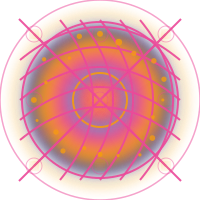</td>
</tr>
<tr>
<td align="center"><strong>🌧️ Pluie</strong><br/>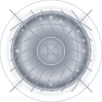</td>
<td align="center"><strong>⚡ Orage</strong><br/>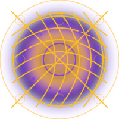</td>
<td align="center"><strong>💥 Explosive</strong><br/>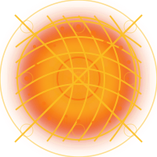</td>
<td align="center"><strong>☀️ Ensoleillé</strong><br/>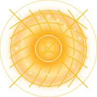</td>
<td align="center"><strong>❄️ Neige</strong><br/>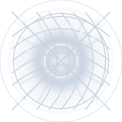</td>
</tr>
</table>

</div>

### **🌍 Style Realism Max - Toutes les Variantes**

<div align="center">

<table>
<tr>
<td align="center"><strong>🌙 Sérénité</strong><br/></td>
<td align="center"><strong>⚡ Puissance</strong><br/>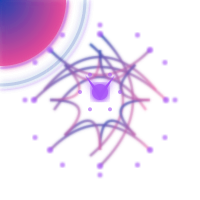</td>
<td align="center"><strong>🔮 Mystère</strong><br/></td>
<td align="center"><strong>✨ Éveil</strong><br/></td>
<td align="center"><strong>🎇 Créative</strong><br/>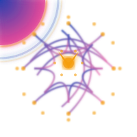</td>
</tr>
<tr>
<td align="center"><strong>🌧️ Pluie</strong><br/></td>
<td align="center"><strong>⚡ Orage</strong><br/>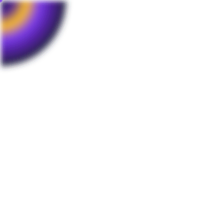</td>
<td align="center"><strong>💥 Explosive</strong><br/></td>
<td align="center"><strong>☀️ Ensoleillé</strong><br/></td>
<td align="center"><strong>❄️ Neige</strong><br/></td>
</tr>
</table>

</div>

### **🎨 Style Advanced - Toutes les Variantes**

<div align="center">

<table>
<tr>
<td align="center"><strong>🌙 Sérénité</strong><br/></td>
<td align="center"><strong>⚡ Puissance</strong><br/></td>
<td align="center"><strong>🔮 Mystère</strong><br/>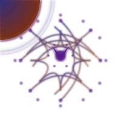</td>
<td align="center"><strong>✨ Éveil</strong><br/></td>
<td align="center"><strong>🎇 Créative</strong><br/></td>
</tr>
<tr>
<td align="center"><strong>🌧️ Pluie</strong><br/></td>
<td align="center"><strong>⚡ Orage</strong><br/></td>
<td align="center"><strong>💥 Explosive</strong><br/>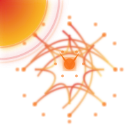</td>
<td align="center"><strong>☀️ Ensoleillé</strong><br/>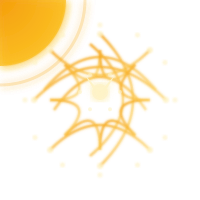</td>
<td align="center"><strong>❄️ Neige</strong><br/></td>
</tr>
</table>

</div>

### **⚡ Style Simple-Advanced - Toutes les Variantes**

<div align="center">

<table>
<tr>
<td align="center"><strong>🌙 Sérénité</strong><br/></td>
<td align="center"><strong>⚡ Puissance</strong><br/>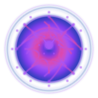</td>
<td align="center"><strong>🔮 Mystère</strong><br/>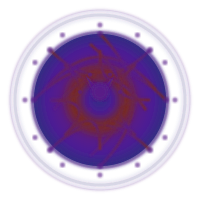</td>
<td align="center"><strong>✨ Éveil</strong><br/>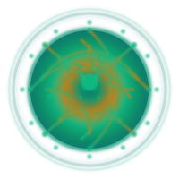</td>
<td align="center"><strong>🎇 Créative</strong><br/>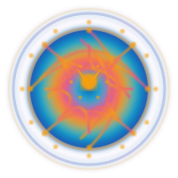</td>
</tr>
<tr>
<td align="center"><strong>🌧️ Pluie</strong><br/>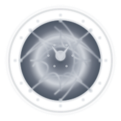</td>
<td align="center"><strong>⚡ Orage</strong><br/>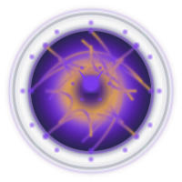</td>
<td align="center"><strong>💥 Explosive</strong><br/>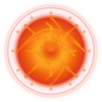</td>
<td align="center"><strong>☀️ Ensoleillé</strong><br/>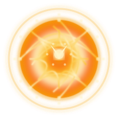</td>
<td align="center"><strong>❄️ Neige</strong><br/></td>
</tr>
</table>

</div>

### **🌙 Style Base (Simple) - Toutes les Variantes**

<div align="center">

<table>
<tr>
<td align="center"><strong>🌙 Sérénité</strong><br/></td>
<td align="center"><strong>⚡ Puissance</strong><br/></td>
<td align="center"><strong>🔮 Mystère</strong><br/></td>
<td align="center"><strong>✨ Éveil</strong><br/>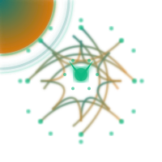</td>
<td align="center"><strong>🎇 Créative</strong><br/></td>
</tr>
<tr>
<td align="center"><strong>🌧️ Pluie</strong><br/></td>
<td align="center"><strong>⚡ Orage</strong><br/>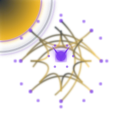</td>
<td align="center"><strong>💥 Explosive</strong><br/></td>
<td align="center"><strong>☀️ Ensoleillé</strong><br/></td>
<td align="center"><strong>❄️ Neige</strong><br/></td>
</tr>
</table>

</div>

---

## 🤖 **Génération IA Avancée**

<div align="center">

### **3 Générateurs IA Professionnels - Intelligence Artificielle Intégrée**

Le projet intègre **3 générateurs IA** pour créer des logos avec intelligence artificielle, en plus des 8 générateurs vectoriels SVG.

</div>

### **🧠 Hyper-AI Generator (ComfyUI + SDXL + ControlNet)**

<div align="center">

**Générateur Ultra-Intelligent avec ComfyUI**

| Caractéristique | Détails |
|:---------------:|:--------|
| **Technologie** | ComfyUI + SDXL + ControlNet |
| **Qualité** | Professionnelle (résolution jusqu'à 1024x1024) |
| **Modèles** | SDXL Base, ControlNet Canny, RealESRGAN |
| **Workflows** | 3 templates pré-configurés (cosmic_sphere, neural_network, crystal_core) |
| **Statut** | ✅ Fonctionnel - ComfyUI opérationnel, modèles installés |

</div>

**Utilisation :**

```python
from src.hyper_ai_generator import HyperAIGenerator

generator = HyperAIGenerator()

# Génération automatique avec IA
logo_path = generator.generate_svg_logo("serenity", size=512)
```

**Documentation complète** : [COMFYUI.md](docs/COMFYUI.md)

### **🤖 AI Generator (Stable Diffusion Local)**

<div align="center">

**Génération IA avec Stable Diffusion**

| Caractéristique | Détails |
|:---------------:|:--------|
| **Technologie** | Stable Diffusion v1.5 (local) |
| **Format** | PNG haute qualité |
| **Device** | CUDA (GPU) ou CPU |
| **Modèle** | runwayml/stable-diffusion-v1-5 |
| **Performance** | Génération IA en quelques secondes |

</div>

**Utilisation :**

```python
from src.ai_logo_generator import AILogoGenerator

generator = AILogoGenerator()

# Génération IA avec Stable Diffusion
logo_path = generator.generate_svg_logo("serenity", size=512)
```

### **🌌 Cosmic Generator (Sphères Cosmiques)**

<div align="center">

**Générateur de Sphères Cosmiques avec Réseaux Neuronaux**

| Caractéristique | Détails |
|:---------------:|:--------|
| **Style** | Sphères cosmiques lumineuses |
| **Effets** | Réseaux neuronaux internes, cristaux centraux |
| **Dégradés** | Bleu/violet/cyan fluides |
| **Particules** | Cosmiques flottantes |
| **Qualité** | Haute qualité vectorielle |

</div>

**Utilisation :**

```python
from src.cosmic_logo_generator import CosmicLogoGenerator

generator = CosmicLogoGenerator()

# Génération cosmique
logo_path = generator.generate_svg_logo("serenity", size=200)
```

### **📊 Comparaison : Générateurs Vectoriels vs IA**

<div align="center">

| Type | Générateurs | Format | Performance | Usage |
|:----:|:-----------:|:------:|:-----------:|:-----:|
| **Vectoriels SVG** | 8 styles (default, dashboard, ai_moon, advanced, simple_advanced, ultra_max, realism_max, ultimate) | SVG | ⚡ 0.002s - 0.008s | Génération rapide, vectoriel |
| **IA Stable Diffusion** | 1 style (ai) | PNG | 🤖 ~5-10s | Génération IA locale |
| **IA ComfyUI** | 1 style (hyper_ai) | PNG | 🤖 ~10-30s | Génération IA avancée (SDXL) |
| **Cosmic** | 1 style (cosmic) | SVG | ⚡ ~0.005s | Sphères cosmiques vectorielles |

</div>

---

## 🎬 **Démonstration - Tous les Styles en Action**

<div align="center">

### **⚡ Comparaison Rapide : 8 Styles Vectoriels × Variante Sérénité**

<table>
<tr>
<td align="center"><strong>🌙 Base</strong><br/></td>
<td align="center"><strong>📊 Dashboard</strong><br/></td>
<td align="center"><strong>🌙 AI-Moon</strong><br/></td>
<td align="center"><strong>🎨 Advanced</strong><br/></td>
</tr>
<tr>
<td align="center"><strong>⚡ Simple-Advanced</strong><br/></td>
<td align="center"><strong>🚀 Ultra-Max</strong><br/></td>
<td align="center"><strong>🌍 Realism Max</strong><br/></td>
<td align="center"><strong>🌟 Ultimate</strong><br/></td>
</tr>
</table>

**⚡ Génération en 0.002s à 0.008s selon le style**

</div>

---

## 💻 **Exemples de Code avec Résultats Visuels**

### **Exemple 1 : Génération Vectorielle Simple**

```python
from src.generator_factory import LogoGeneratorFactory

# Créer un générateur Ultimate
generator = LogoGeneratorFactory.create_generator("ultimate")

# Générer un logo
logo_path = generator.generate_svg_logo("serenity", size=200)
print(f"✅ Logo généré : {logo_path}")
```

<div align="center">

**Résultat :**


</div>

### **Exemple 2 : Génération IA avec Stable Diffusion**

```python
from src.ai_logo_generator import AILogoGenerator

generator = AILogoGenerator()

# Génération IA avec Stable Diffusion
logo_path = generator.generate_svg_logo("serenity", size=512)
print(f"✅ Logo IA généré : {logo_path}")
```

<div align="center">

**Résultat : Logo PNG généré avec IA (Stable Diffusion)**

</div>

### **Exemple 3 : Génération IA Avancée avec ComfyUI**

```python
from src.hyper_ai_generator import HyperAIGenerator

generator = HyperAIGenerator()

# Génération IA avec ComfyUI + SDXL
logo_path = generator.generate_svg_logo("serenity", size=512)
print(f"✅ Logo Hyper-IA généré : {logo_path}")
```

<div align="center">

**Résultat : Logo PNG haute qualité généré avec ComfyUI + SDXL**

</div>

### **Exemple 4 : Génération Multiple**

```python
from src.generator_factory import LogoGeneratorFactory

generator = LogoGeneratorFactory.create_generator("ai_moon")

# Générer toutes les variantes
variants = ["serenity", "power", "mystery", "awakening", "creative"]
for variant in variants:
    logo_path = generator.generate_svg_logo(variant, size=200)
    print(f"✅ {variant}: {logo_path}")
```

<div align="center">

**Résultats :**

<table>
<tr>
<td align="center"></td>
<td align="center"></td>
<td align="center"></td>
<td align="center"></td>
<td align="center"></td>
</tr>
</table>

</div>

### **Exemple 5 : API REST**

```bash
# Démarrer l'API
python main.py

# Générer via API
curl -X POST "http://localhost:8000/generate" \
  -H "Content-Type: application/json" \
  -d '{"variant": "serenity", "size": 200, "generator": "ultimate"}'
```

<div align="center">

**Réponse JSON :**

```json
{
  "status": "success",
  "logo_path": "exports/arkalia-luna-ultimate-serenity-200.svg",
  "variant": "serenity",
  "generator": "ultimate",
  "size": 200,
  "generation_time": 0.007
}
```

**Logo généré :**


</div>

---

## 🚀 **Installation**

### **Option 1 : Configuration Automatique (Recommandée)**

```bash
git clone https://github.com/arkalia-luna-system/Arkalia-luna-logo.git
cd arkalia-luna-logo
make quick-start
```

### **Option 2 : Installation Manuelle**

```bash
# Créer l'environnement virtuel
python3 -m venv arkalia-luna-env

# L'activer
source arkalia-luna-env/bin/activate  # Linux/Mac
# ou
arkalia-luna-env\Scripts\activate     # Windows

# Installer les dépendances
pip install -e ".[dev]"
```

### **Option 3 : Docker (Production-Ready)**

```bash
# Démarrer toute l'infrastructure
docker-compose -f docker-compose.prod.yml up -d

# Services disponibles :
# 🌐 API : http://localhost:8000
# 📊 Prometheus : http://localhost:9090
# 📈 Grafana : http://localhost:3000
# 🔄 Nginx : http://localhost:80
```

### **Option 4 : Installation avec IA (Stable Diffusion)**

```bash
# Installation standard
pip install -e ".[dev]"

# Installation des dépendances IA (optionnel)
pip install torch diffusers transformers accelerate
```

### **Option 5 : Installation avec ComfyUI (Hyper-AI)**

```bash
# Installation standard
pip install -e ".[dev]"

# Installation ComfyUI
bash scripts/install_comfyui.sh

# Démarrage ComfyUI
bash scripts/start_comfyui.sh
```

---

## 💻 **Utilisation**

### **Interface CLI Principale**

```bash
# Activer l'environnement virtuel
source arkalia-luna-env/bin/activate

# Voir toutes les variantes
python -m src.cli info

# Voir tous les générateurs disponibles
python -m src.cli generators

# Générer un logo spécifique (vectoriel)
python -m src.cli generate -v serenity -s 200 -g ultimate

# Générer un logo avec IA (Stable Diffusion)
python -m src.cli generate -v serenity -s 512 -g ai

# Générer un logo avec Hyper-IA (ComfyUI)
python -m src.cli generate -v serenity -s 512 -g hyper_ai

# Générer un logo cosmique
python -m src.cli generate -v serenity -s 200 -g cosmic

# Générer toutes les variantes
python -m src.cli generate-all -s 200

# Créer des favicons
python -m src.cli favicon-all -s 32

# Voir les statistiques
python -m src.cli stats
```

### **🚀 API FastAPI (Utilisation Complète)**

```bash
# Démarrer l'API
python main.py

# Accéder à Swagger UI
# http://localhost:8000/docs

# Générer un logo via API
curl -X POST "http://localhost:8000/generate" \
  -H "Content-Type: application/json" \
  -d '{"variant": "serenity", "size": 200, "generator": "ultimate"}'
```

### **🎨 Utilisation Complète du Potentiel**

```bash
# Explorer toutes les fonctionnalités
./scripts/quick_explore.sh

# Générer avec tous les générateurs vectoriels
python -m src.cli generate -v serenity -g ultimate    # Cosmique extrême
python -m src.cli generate -v power -g cosmic          # Sphères lumineuses
python -m src.cli generate -v mystery -g ai_moon       # IA réaliste
python -m src.cli generate -v awakening -g dashboard   # Interface optimisée

# Générer avec les générateurs IA
python -m src.cli generate -v serenity -g ai           # Stable Diffusion
python -m src.cli generate -v power -g hyper_ai        # ComfyUI + SDXL

# Tester toutes les variantes dynamiques
for variant in rainy stormy explosive sunny snowy; do
  python -m src.cli generate -v $variant -g ultimate
done
```

---

## 🎯 **Cas d'Usage - Dans Quel Projet Utiliser Ce Générateur ?**

<div align="center">

| Type de Projet | Usage Recommandé | Bénéfice | Intégration |
|----------------|------------------|----------|-------------|
| **🌐 Applications Web** | Logos dynamiques selon le thème | Cohérence visuelle | API REST + Frontend |
| **📱 Apps Mobiles** | Favicons et icônes adaptatives | Multi-résolution automatique | CLI dans CI/CD |
| **📊 Dashboards Business** | Branding personnalisé | Identité professionnelle | Docker + monitoring |
| **🎮 Plateformes Gaming** | Logos émotionnels immersifs | Engagement utilisateur | API temps réel |
| **🤖 Projets IA/ML** | Visualisation d'émotions | Interface intuitive | Python natif + IA |
| **🏢 Solutions Entreprise** | Multi-tenant branding | Personnalisation client | API scalable |
| **📚 Projets Open Source** | Branding cohérent | Identité communautaire | GitHub Actions |
| **🎨 Outils Créatifs** | Assets vectoriels de qualité | Export professionnel | CLI + batch processing |
| **🧠 Projets IA Avancés** | Génération IA de logos | Qualité professionnelle | ComfyUI + SDXL |

</div>

---

## 📊 **Performance**

<div align="center">

### ⚡ **Benchmark des Générateurs Vectoriels**

| Générateur | Temps | Performance | Logo Exemple |
|:----------:|:-----:|:-----------:|:------------:|
| **Realism Max** | ~0.002s | 🏆 Le plus rapide |  |
| **Dashboard** | ~0.004s | ⚡ Rapide |  |
| **AI-Moon** | ~0.007s | ✅ Bon |  |
| **Ultra-Max** | ~0.008s | ✅ Bon |  |
| **Ultimate** | ~0.007s | ✅ Bon |  |
| **Simple-Advanced** | ~0.008s | ✅ Bon |  |
| **Advanced** | ~0.008s | ✅ Bon |  |
| **Base** | ~0.013s | ⚠️ Plus lent |  |

### 🤖 **Performance des Générateurs IA**

| Générateur | Temps | Performance | Technologie |
|:----------:|:-----:|:-----------:|:-----------:|
| **Cosmic** | ~0.005s | ⚡ Rapide | SVG vectoriel |
| **AI (Stable Diffusion)** | ~5-10s | ✅ Bon | Stable Diffusion v1.5 |
| **Hyper-AI (ComfyUI)** | ~10-30s | ✅ Excellent | SDXL + ControlNet |

> **Note** : Les temps varient selon la taille, la complexité et le device (GPU/CPU)

</div>

---

## 🏗️ **Architecture du Projet**

```
arkalia-luna-logo/
├── src/                          # Code source principal
│   ├── __init__.py              # Configuration du package
│   ├── variants.py              # Gestion des variantes émotionnelles
│   ├── svg_builder.py           # Classe abstraite pour les builders SVG
│   ├── logo_generator.py        # Générateur de base
│   ├── generator_factory.py     # Factory Pattern pour les générateurs
│   ├── cli.py                   # Interface CLI professionnelle
│   │
│   ├── **8 Générateurs Vectoriels SVG** :
│   │   ├── logo_generator.py              # Base (default)
│   │   ├── dashboard_generator.py         # Interface optimisée
│   │   ├── ai_moon_generator.py           # IA réaliste (vectoriel)
│   │   ├── advanced_logo_generator.py      # Techno-mystique
│   │   ├── simple_advanced_generator.py  # Équilibré
│   │   ├── ultra_max_generator.py         # Effets exceptionnels
│   │   ├── realism_max_generator.py       # Ultra-réaliste
│   │   └── ultimate_generator.py          # Cosmique extrême
│   │
│   ├── **3 Générateurs IA** :
│   │   ├── ai_logo_generator.py           # 🤖 Stable Diffusion local
│   │   ├── cosmic_logo_generator.py       # 🌌 Sphères cosmiques (vectoriel)
│   │   └── hyper_ai_generator.py          # 🧠 ComfyUI + SDXL + ControlNet
│   │
│   └── **Builders SVG Spécialisés** :
│       ├── svg_builder.py                 # Base abstraite
│       ├── svg_builder_dashboard.py       # Dashboard
│       ├── svg_builder_ai_moon.py         # AI-Moon
│       ├── svg_builder_advanced.py        # Advanced
│       ├── svg_builder_simple_advanced.py # Simple-Advanced
│       ├── svg_builder_ultra_max.py       # Ultra-Max
│       ├── svg_builder_realism_max.py     # Realism Max
│       ├── svg_builder_ultimate.py        # Ultimate
│       └── cosmic_sphere_builder.py        # Cosmic
│
├── tests/                       # Tests automatisés (297 tests)
├── docs/                        # Documentation complète
│   ├── COMFYUI.md              # 🧠 Guide ComfyUI + Hyper-AI
│   ├── QUICKSTART.md           # Guide de démarrage rapide
│   ├── API.md                  # Documentation API complète
│   ├── ARCHITECTURE.md         # Architecture technique
│   └── INDEX.md                # Index de documentation
├── exports/                     # Exports générés
│   ├── *.svg                   # Logos SVG (tous styles et variantes)
│   ├── *.png                   # Favicons PNG + logos IA
│   ├── exports-ai/             # Logos générés avec Stable Diffusion
│   ├── exports-hyper-ai/       # Logos générés avec ComfyUI
│   ├── exports-cosmic/         # Logos cosmiques
│   ├── demo-gif/               # Démonstrations animées
│   └── screenshots/            # Captures d'écran
└── .github/                     # CI/CD GitHub Actions
```

---

## 🌐 **API Web & Déploiement**

### **🚀 API FastAPI Production-Ready**

- **API REST** complète avec FastAPI
- **9 Endpoints** : `/`, `/health`, `/generate`, `/download`, `/stats`, `/metrics`, `/variants`, `/generators`, `/cleanup`
- **Performance** : Génération de logo en 0.03 secondes (vectoriel)
- **Documentation** : Swagger UI automatique (`/docs`)
- **Sécurité** : CORS, validation, gestion d'erreurs, rate limiting
- **Monitoring** : Métriques Prometheus enrichies (compteurs par route/labels, histogramme de durées)

### **🐳 Docker & Orchestration**

- **Dockerfile.prod** optimisé pour la production
- **Docker Compose** avec 5 services (app, redis, nginx, prometheus, grafana)
- **Monitoring** : Prometheus + Grafana intégrés (panels p95/p99, erreurs/min, statut par route)
- **Sécurité** : Utilisateur non-root, health checks
- **Scalabilité** : Prêt pour déploiement en production

### **🏗️ Architecture Infrastructure**

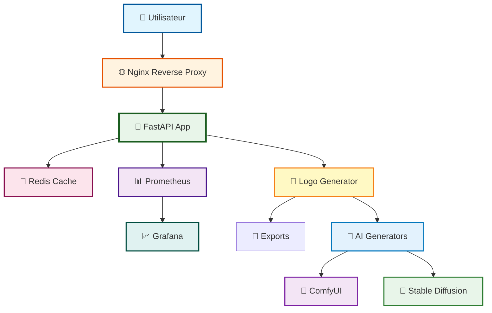

---

## 🧪 **Tests et Qualité**

### **Tests Automatisés**

```bash
# Tests complets
pytest tests/ -v

# Tests avec couverture
pytest tests/ --cov=src --cov-report=html

# Tests rapides
pytest tests/ -x
```

### **Qualité du Code**

```bash
# Formatage
black src/ --line-length=88

# Linting
ruff check src/

# Vérification des types
mypy src/ --strict
```

---

## 📝 **Conventions de Commit et PR**

### **Format des Titres de PR**

Tous les titres de PR doivent suivre le format : `type(scope): description`

**Types acceptés :**
- `feat` : Nouvelle fonctionnalité
- `fix` : Correction de bug
- `docs` : Documentation
- `style` : Formatage du code
- `refactor` : Refactoring
- `test` : Tests
- `chore` : Maintenance
- `perf` : Performance
- `ci` : CI/CD
- `build` : Build
- `revert` : Annulation

**Exemples valides :**
- ✅ `feat(logo): ajouter nouveau style mystique`
- ✅ `fix(tests): corriger erreur de validation`
- ✅ `docs: mise à jour README avec exemples`
- ✅ `style: reformater le code avec ruff`
- ✅ `ci: corriger workflow GitHub Actions`

---

## 🤝 **Contribution**

1. Fork le projet
2. Créer une branche feature (`git checkout -b feature/AmazingFeature`)
3. Commit les changements (`git commit -m 'feat(scope): Add AmazingFeature'`)
4. Push vers la branche (`git push origin feature/AmazingFeature`)
5. Ouvrir une Pull Request

---

## 📚 **Documentation**

<div align="center">

| Document | Description | Lien |
|:--------:|:-----------:|:----:|
| **📘 Index** | Navigation complète | [Voir](docs/INDEX.md) |
| **🚀 Quickstart** | Démarrage rapide | [Voir](docs/QUICKSTART.md) |
| **🧠 ComfyUI** | Génération IA avancée | [Voir](docs/COMFYUI.md) |
| **📋 API** | Documentation API | [Voir](docs/API.md) |
| **🏗️ Architecture** | Architecture technique | [Voir](docs/ARCHITECTURE.md) |
| **🤝 Contributing** | Guide de contribution | [Voir](docs/CONTRIBUTING.md) |

</div>

---

## 🌟 **Statut du Projet**

<div align="center">

| Métrique | Valeur | Statut | Objectif |
|:--------:|:------:|:------:|:--------:|
| **Version** | 2.0.0 | ✅ | - |
| **Statut** | Production/Stable | ✅ | - |
| **Python** | 3.8+ | ✅ | - |
| **Tests** | 297 tests passent | ✅ | - |
| **Couverture** | 75% | ✅ | 90%+ |
| **CI/CD** | GitHub Actions | ✅ | Automatisé |
| **Qualité** | Black + Ruff + MyPy | ✅ | - |
| **Benchmarks** | 7/7 tests | ✅ | - |
| **Générateurs** | 11 styles (8 vectoriels + 3 IA) | ✅ | - |
| **Variantes** | 10 émotionnelles | ✅ | - |

</div>

---

## 📄 **Licence**

Ce projet est sous licence MIT. Voir le fichier `LICENSE` pour plus de détails.

---

<div align="center">

**🌙 Arkalia-LUNA Logo Generator** - Créé avec ❤️ par l'équipe Arkalia-LUNA

*Dernière mise à jour : Novembre 2025*

[⬆ Retour en haut](#-arkalia-luna-logo-generator)

</div>
