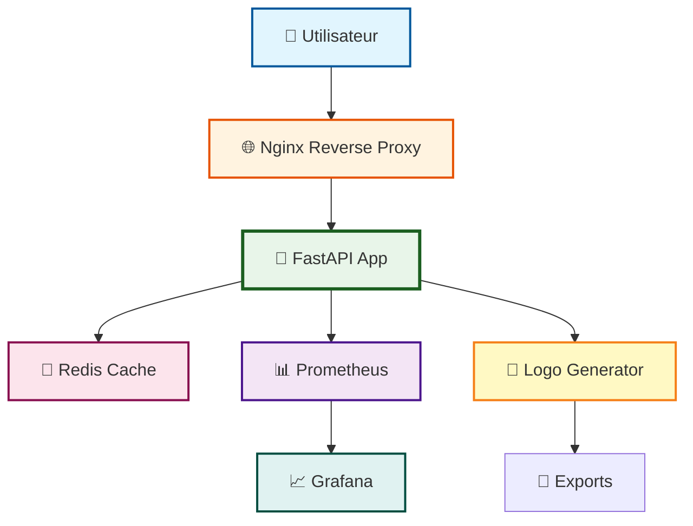

<div align="center">

# 🌙⚡️🤖 Arkalia-LUNA Logo Generator

**Générateur Professionnel de Logos Vectoriels avec IA**

*11 Styles Uniques • 10 Variantes Émotionnelles • API FastAPI • Monitoring Intégré*

[](https://python.org)
[](LICENSE)
[](CHANGELOG.md)
[](tests/)
[](htmlcov/)
[](Dockerfile.prod)


**⚡ Génération Ultra-Rapide • 🎨 Qualité Professionnelle • 🚀 Production-Ready**

[🚀 Quick Start](#-quick-start-30-secondes) • [📖 Documentation](#-documentation) • [💻 Utilisation](#-utilisation) • [🤝 Contribution](#-contribution)

</div>

---

## 🚀 **Quick Start (30 secondes)**

<div align="center">

### **Générez votre premier logo en 3 étapes simples**

</div>

### **Étape 1 : Installation** ⚙️

```bash
git clone https://github.com/arkalia-luna-system/Arkalia-luna-logo.git
cd arkalia-luna-logo
python3 -m venv arkalia-luna-env
source arkalia-luna-env/bin/activate  # Linux/Mac
pip install -e ".[dev]"
```

### **Étape 2 : Génération** 🎨

```bash
# Générer un logo Ultimate en variante Sérénité
python -m src.cli generate -v serenity -s 200 -g ultimate
```

**Résultat :**

<div align="center">

| Commande | Logo Généré |
|:--------:|:-----------:|
| `generate -v serenity -g ultimate` |  |
| `generate -v power -g ultimate` |  |
| `generate -v mystery -g ai_moon` |  |

</div>

### **Étape 3 : Utilisation** 💻

```bash
# Voir toutes les variantes disponibles
python -m src.cli info

# Générer tous les logos
python -m src.cli generate-all -s 200
```

<div align="center">

**✅ C'est tout ! Votre logo est dans `exports/`**

</div>

---

## 🎯 **Vue d'Ensemble**

<div align="center">

### **Un Système Complet de Génération de Logos Vectoriels**

Arkalia-LUNA Logo Generator est un générateur professionnel de logos SVG/PNG avec **11 styles uniques** et **10 variantes émotionnelles**. Architecture modulaire, API FastAPI, monitoring Prometheus/Grafana, et infrastructure Docker complète.

**🌍 English**: Professional SVG/PNG logo generator with 11 unique styles, 10 emotional variants, FastAPI integration, monitoring & CI/CD - like Figma/Canva but for developers.

**🇫🇷 Français**: Générateur professionnel de logos SVG/PNG multi-styles avec 11 styles uniques, 10 variantes émotionnelles, API FastAPI, monitoring & CI/CD inclus - comme Figma/Canva mais pour développeurs.

</div>

---

## ✨ **Galerie Interactive - Tous les Styles**

<div align="center">

### 🌟 **Variante Sérénité** - Comparaison des 8 Styles Principaux

| Style | Logo | Performance | Complexité | Description |
|:-----:|:----:|:-----------:|:----------:|:------------|
| **🌙 Base** |  | ⚡ ~0.002s | ⭐ Simple | Logo de base Arkalia-LUNA |
| **📊 Dashboard** |  | ⚡ ~0.004s | ⭐⭐ Modéré | Interface optimisée et épurée |
| **🌙 AI-Moon** |  | ✅ ~0.007s | ⭐⭐⭐ Avancé | IA réaliste avec lune vivante |
| **🎨 Advanced** |  | ✅ ~0.006s | ⭐⭐⭐ Avancé | Techno-mystique avancé |
| **⚡ Simple-Advanced** |  | ⚡ ~0.005s | ⭐⭐ Modéré | Équilibré et configurable |
| **🚀 Ultra-Max** |  | ✅ ~0.008s | ⭐⭐⭐⭐ Complexe | Effets exceptionnels et performance |
| **🌍 Realism Max** |  | 🏆 ~0.002s | ⭐⭐⭐ Avancé | Ultra-réaliste avec effets organiques |
| **🌟 Ultimate** |  | ✅ ~0.007s | ⭐⭐⭐⭐⭐ Extrême | Cosmique extrême (100+ stops, holographie) |

</div>

---

## 🎨 **Variantes Émotionnelles - Showcase Complet**

<div align="center">

### **5 Variantes de Base - Style Ultimate**

<table>
<tr>
<td align="center"><strong>🌙 Sérénité</strong><br/><br/>Halo doux, pulsations lentes</td>
<td align="center"><strong>⚡ Puissance</strong><br/><br/>Halo vibrant, réseau accéléré</td>
<td align="center"><strong>🔮 Mystère</strong><br/><br/>Brumes mouvantes, réseau irrégulier</td>
</tr>
<tr>
<td align="center"><strong>✨ Éveil</strong><br/><br/>Halo rayonnant, Λ-core clair</td>
<td align="center"><strong>🎇 Créative</strong><br/><br/>Flux rapides, reflets multicolores</td>
<td align="center"><strong>🌧️ Pluie</strong><br/><br/>Gouttes de pluie, nuages gris</td>
</tr>
<tr>
<td align="center"><strong>⚡ Orage</strong><br/><br/>Éclairs zigzagants, nuages sombres</td>
<td align="center"><strong>💥 Explosive</strong><br/><br/>Particules explosives, feux d'artifice</td>
<td align="center"><strong>☀️ Ensoleillé</strong><br/><br/>Rayons de soleil, chaleur et luminosité</td>
</tr>
<tr>
<td colspan="3" align="center"><strong>❄️ Neige</strong><br/><br/>Flocons qui tombent, froid et pureté</td>
</tr>
</table>

</div>

---

## 💻 **Exemples de Code avec Résultats Visuels**

### **Exemple 1 : Génération Simple**

```python
from src.generator_factory import LogoGeneratorFactory

# Créer un générateur Ultimate
generator = LogoGeneratorFactory.create_generator("ultimate")

# Générer un logo
logo_path = generator.generate_svg_logo("serenity", size=200)
print(f"✅ Logo généré : {logo_path}")
```

<div align="center">

**Résultat :**


</div>

### **Exemple 2 : Génération Multiple**

```python
from src.generator_factory import LogoGeneratorFactory

generator = LogoGeneratorFactory.create_generator("ai_moon")

# Générer toutes les variantes
variants = ["serenity", "power", "mystery", "awakening", "creative"]
for variant in variants:
    logo_path = generator.generate_svg_logo(variant, size=200)
    print(f"✅ {variant}: {logo_path}")
```

<div align="center">

**Résultats :**

<table>
<tr>
<td align="center"></td>
<td align="center"></td>
<td align="center"></td>
<td align="center"></td>
<td align="center"></td>
</tr>
</table>

</div>

### **Exemple 3 : API REST**

```bash
# Démarrer l'API
python main.py

# Générer via API
curl -X POST "http://localhost:8000/generate" \
  -H "Content-Type: application/json" \
  -d '{"variant": "serenity", "size": 200, "generator": "ultimate"}'
```

<div align="center">

**Réponse JSON :**

```json
{
  "status": "success",
  "logo_path": "exports/arkalia-luna-ultimate-serenity-200.svg",
  "variant": "serenity",
  "generator": "ultimate",
  "size": 200,
  "generation_time": 0.007
}
```

**Logo généré :**


</div>

---

## 🎬 **Démonstration en Temps Réel**

<div align="center">


**⚡ Génération de 5 logos en 0.1 seconde - 10 variantes émotionnelles disponibles**

</div>

---

## 🚀 **Installation**

### **Option 1 : Configuration Automatique (Recommandée)**

```bash
git clone https://github.com/arkalia-luna-system/Arkalia-luna-logo.git
cd arkalia-luna-logo
make quick-start
```

### **Option 2 : Installation Manuelle**

```bash
# Créer l'environnement virtuel
python3 -m venv arkalia-luna-env

# L'activer
source arkalia-luna-env/bin/activate  # Linux/Mac
# ou
arkalia-luna-env\Scripts\activate     # Windows

# Installer les dépendances
pip install -e ".[dev]"
```

### **Option 3 : Docker (Production-Ready)**

```bash
# Démarrer toute l'infrastructure
docker-compose -f docker-compose.prod.yml up -d

# Services disponibles :
# 🌐 API : http://localhost:8000
# 📊 Prometheus : http://localhost:9090
# 📈 Grafana : http://localhost:3000
# 🔄 Nginx : http://localhost:80
```

---

## 💻 **Utilisation**

### **Interface CLI Principale**

```bash
# Activer l'environnement virtuel
source arkalia-luna-env/bin/activate

# Voir toutes les variantes
python -m src.cli info

# Voir tous les générateurs disponibles
python -m src.cli generators

# Générer un logo spécifique
python -m src.cli generate -v serenity -s 200 -g ultimate

# Générer toutes les variantes
python -m src.cli generate-all -s 200

# Créer des favicons
python -m src.cli favicon-all -s 32

# Voir les statistiques
python -m src.cli stats
```

### **🚀 API FastAPI (Utilisation Complète)**

```bash
# Démarrer l'API
python main.py

# Accéder à Swagger UI
# http://localhost:8000/docs

# Générer un logo via API
curl -X POST "http://localhost:8000/generate" \
  -H "Content-Type: application/json" \
  -d '{"variant": "serenity", "size": 200, "generator": "ultimate"}'
```

### **🎨 Utilisation Complète du Potentiel**

```bash
# Explorer toutes les fonctionnalités
./scripts/quick_explore.sh

# Générer avec tous les générateurs avancés
python -m src.cli generate -v serenity -g ultimate    # Cosmique extrême
python -m src.cli generate -v power -g cosmic          # Sphères lumineuses
python -m src.cli generate -v mystery -g hyper_ai      # Hyper-IA
python -m src.cli generate -v awakening -g ai           # Stable Diffusion

# Tester toutes les variantes dynamiques
for variant in rainy stormy explosive sunny snowy; do
  python -m src.cli generate -v $variant -g ultimate
done
```

---

## 🎯 **Cas d'Usage - Dans Quel Projet Utiliser Ce Générateur ?**

<div align="center">

| Type de Projet | Usage Recommandé | Bénéfice | Intégration |
|----------------|------------------|----------|-------------|
| **🌐 Applications Web** | Logos dynamiques selon le thème | Cohérence visuelle | API REST + Frontend |
| **📱 Apps Mobiles** | Favicons et icônes adaptatives | Multi-résolution automatique | CLI dans CI/CD |
| **📊 Dashboards Business** | Branding personnalisé | Identité professionnelle | Docker + monitoring |
| **🎮 Plateformes Gaming** | Logos émotionnels immersifs | Engagement utilisateur | API temps réel |
| **🤖 Projets IA/ML** | Visualisation d'émotions | Interface intuitive | Python natif |
| **🏢 Solutions Entreprise** | Multi-tenant branding | Personnalisation client | API scalable |
| **📚 Projets Open Source** | Branding cohérent | Identité communautaire | GitHub Actions |
| **🎨 Outils Créatifs** | Assets vectoriels de qualité | Export professionnel | CLI + batch processing |

</div>

---

## 📊 **Performance**

<div align="center">

### ⚡ **Benchmark des Générateurs**

| Générateur | Temps | Performance | Logo Exemple |
|:----------:|:-----:|:-----------:|:------------:|
| **Realism Max** | ~0.002s | 🏆 Le plus rapide |  |
| **Dashboard** | ~0.004s | ⚡ Rapide |  |
| **AI-Moon** | ~0.007s | ✅ Bon |  |
| **Ultra-Max** | ~0.008s | ✅ Bon |  |
| **Ultimate** | ~0.007s | ✅ Bon |  |
| **Simple-Advanced** | ~0.008s | ✅ Bon |  |
| **Advanced** | ~0.008s | ✅ Bon |  |
| **Base** | ~0.013s | ⚠️ Plus lent |  |

> **Note** : Les temps varient selon la taille et la complexité du logo

</div>

---

## 🏗️ **Architecture du Projet**

```
arkalia-luna-logo/
├── src/                          # Code source principal
│   ├── __init__.py              # Configuration du package
│   ├── variants.py              # Gestion des variantes émotionnelles
│   ├── svg_builder.py           # Classe abstraite pour les builders SVG
│   ├── logo_generator.py        # Générateur de base
│   ├── generator_factory.py     # Factory Pattern pour les générateurs
│   ├── cli.py                   # Interface CLI professionnelle
│   │
│   ├── **11 Générateurs Uniques** :
│   │   ├── logo_generator.py              # Base (default)
│   │   ├── dashboard_generator.py         # Interface optimisée
│   │   ├── ai_moon_generator.py           # IA réaliste
│   │   ├── advanced_logo_generator.py      # Techno-mystique
│   │   ├── simple_advanced_generator.py  # Équilibré
│   │   ├── ultra_max_generator.py         # Effets exceptionnels
│   │   ├── realism_max_generator.py       # Ultra-réaliste
│   │   ├── ultimate_generator.py          # Cosmique extrême
│   │   ├── ai_logo_generator.py           # Génération IA (Stable Diffusion)
│   │   ├── cosmic_logo_generator.py       # Sphères cosmiques
│   │   └── hyper_ai_generator.py          # Hyper-IA (ComfyUI + SDXL)
│   │
│   └── **Builders SVG Spécialisés** :
│       ├── svg_builder.py                 # Base abstraite
│       ├── svg_builder_dashboard.py       # Dashboard
│       ├── svg_builder_ai_moon.py         # AI-Moon
│       ├── svg_builder_advanced.py        # Advanced
│       ├── svg_builder_simple_advanced.py # Simple-Advanced
│       ├── svg_builder_ultra_max.py       # Ultra-Max
│       ├── svg_builder_realism_max.py     # Realism Max
│       ├── svg_builder_ultimate.py        # Ultimate
│       └── cosmic_sphere_builder.py       # Cosmic
│
├── tests/                       # Tests automatisés (297 tests)
├── docs/                        # Documentation complète
│   ├── COMFYUI.md              # 🧠 Guide ComfyUI + Hyper-AI
│   ├── QUICKSTART.md           # Guide de démarrage rapide
│   ├── API.md                  # Documentation API complète
│   ├── ARCHITECTURE.md         # Architecture technique
│   └── INDEX.md                # Index de documentation
├── exports/                     # Exports générés
│   ├── *.svg                   # Logos SVG (tous styles et variantes)
│   ├── *.png                   # Favicons PNG
│   ├── demo-gif/               # Démonstrations animées
│   └── screenshots/            # Captures d'écran
└── .github/                     # CI/CD GitHub Actions
```

---

## 🌐 **API Web & Déploiement**

### **🚀 API FastAPI Production-Ready**

- **API REST** complète avec FastAPI
- **Endpoints** : `/health`, `/generate`, `/download`, `/stats`, `/metrics`
- **Performance** : Génération de logo en 0.03 secondes
- **Documentation** : Swagger UI automatique (`/docs`)
- **Sécurité** : CORS, validation, gestion d'erreurs
- **Monitoring** : Métriques Prometheus enrichies (compteurs par route/labels, histogramme de durées)

### **🐳 Docker & Orchestration**

- **Dockerfile.prod** optimisé pour la production
- **Docker Compose** avec 5 services (app, redis, nginx, prometheus, grafana)
- **Monitoring** : Prometheus + Grafana intégrés (panels p95/p99, erreurs/min, statut par route)
- **Sécurité** : Utilisateur non-root, health checks
- **Scalabilité** : Prêt pour déploiement en production

### **🏗️ Architecture Infrastructure**



---

## 🧪 **Tests et Qualité**

### **Tests Automatisés**

```bash
# Tests complets
pytest tests/ -v

# Tests avec couverture
pytest tests/ --cov=src --cov-report=html

# Tests rapides
pytest tests/ -x
```

### **Qualité du Code**

```bash
# Formatage
black src/ --line-length=88

# Linting
ruff check src/

# Vérification des types
mypy src/ --strict
```

---

## 📝 **Conventions de Commit et PR**

### **Format des Titres de PR**

Tous les titres de PR doivent suivre le format : `type(scope): description`

**Types acceptés :**
- `feat` : Nouvelle fonctionnalité
- `fix` : Correction de bug
- `docs` : Documentation
- `style` : Formatage du code
- `refactor` : Refactoring
- `test` : Tests
- `chore` : Maintenance
- `perf` : Performance
- `ci` : CI/CD
- `build` : Build
- `revert` : Annulation

**Exemples valides :**
- ✅ `feat(logo): ajouter nouveau style mystique`
- ✅ `fix(tests): corriger erreur de validation`
- ✅ `docs: mise à jour README avec exemples`
- ✅ `style: reformater le code avec ruff`
- ✅ `ci: corriger workflow GitHub Actions`

---

## 🤝 **Contribution**

1. Fork le projet
2. Créer une branche feature (`git checkout -b feature/AmazingFeature`)
3. Commit les changements (`git commit -m 'feat(scope): Add AmazingFeature'`)
4. Push vers la branche (`git push origin feature/AmazingFeature`)
5. Ouvrir une Pull Request

---

## 📚 **Documentation**

<div align="center">

| Document | Description | Lien |
|:--------:|:-----------:|:----:|
| **📘 Index** | Navigation complète | [Voir](docs/INDEX.md) |
| **🚀 Quickstart** | Démarrage rapide | [Voir](docs/QUICKSTART.md) |
| **🧠 ComfyUI** | Génération IA avancée | [Voir](docs/COMFYUI.md) |
| **📋 API** | Documentation API | [Voir](docs/API.md) |
| **🏗️ Architecture** | Architecture technique | [Voir](docs/ARCHITECTURE.md) |
| **🤝 Contributing** | Guide de contribution | [Voir](docs/CONTRIBUTING.md) |

</div>

---

## 🌟 **Statut du Projet**

<div align="center">

| Métrique | Valeur | Statut | Objectif |
|:--------:|:------:|:------:|:--------:|
| **Version** | 2.0.0 | ✅ | - |
| **Statut** | Production/Stable | ✅ | - |
| **Python** | 3.8+ | ✅ | - |
| **Tests** | 297 tests passent | ✅ | - |
| **Couverture** | 75% | ✅ | 90%+ |
| **CI/CD** | GitHub Actions | ✅ | Automatisé |
| **Qualité** | Black + Ruff + MyPy | ✅ | - |
| **Benchmarks** | 7/7 tests | ✅ | - |

</div>

---

## 📄 **Licence**

Ce projet est sous licence MIT. Voir le fichier `LICENSE` pour plus de détails.

---

<div align="center">

**🌙 Arkalia-LUNA Logo Generator** - Créé avec ❤️ par l'équipe Arkalia-LUNA

*Dernière mise à jour : Novembre 2025*

[⬆ Retour en haut](#-arkalia-luna-logo-generator)

</div>
