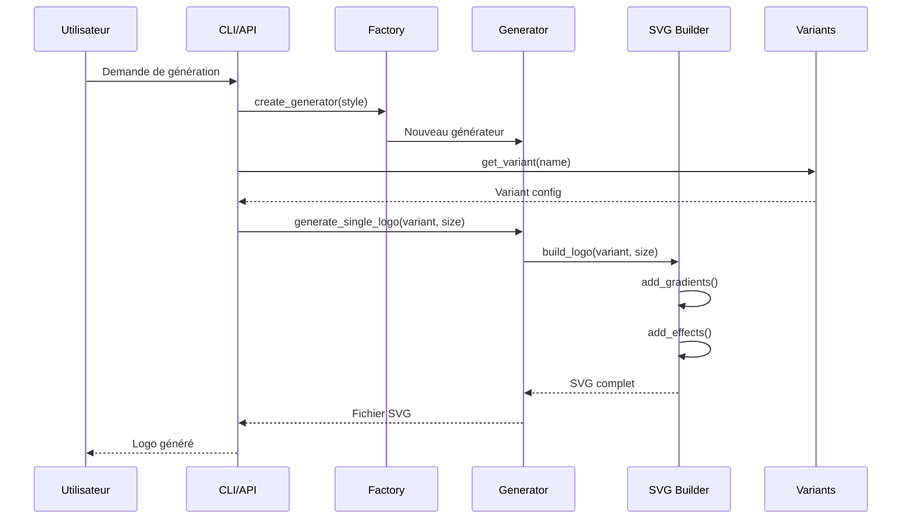
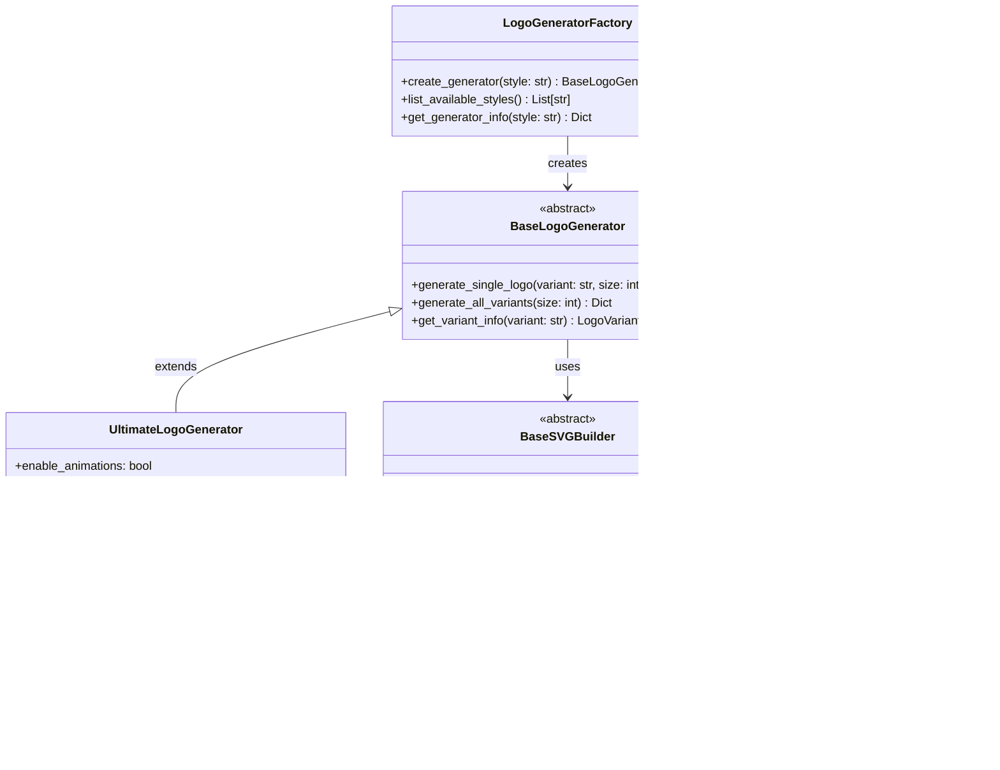
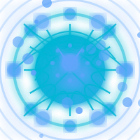
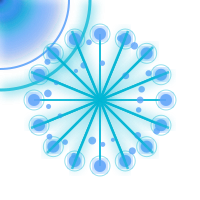

# 🌙 API Documentation

<div align="center">

**📋 Interface Programmatique Complète**

*Arkalia-LUNA Logo Generator*

</div>

---

## 📋 Vue d'Ensemble

<div align="center">

L'API Arkalia-LUNA Logo Generator fournit une interface programmatique complète pour la génération de logos techno-mystiques avec variantes émotionnelles.

</div>

### ⚡ Quick Start API

<div align="center">

| Action | Commande | Résultat |
|:------:|:--------:|:---------:|
| **Démarrer API** | `./scripts/start_api.sh` | API sur http://localhost:8000 |
| **Swagger UI** | Ouvrir http://localhost:8000/docs | Documentation interactive |
| **Générer logo** | `curl -X POST http://localhost:8000/generate` | Logo SVG généré |
| **Health check** | `curl http://localhost:8000/health` | Statut de l'API |

</div>

## 🏗️ Architecture

### 📁 Structure des Modules

<div align="center">

```
src/
├── __init__.py                    # Point d'entrée principal
├── variants.py                    # Définitions des variantes émotionnelles
├── svg_builder.py                # Builder SVG de base
├── svg_builder_*.py              # Builders spécialisés par style
├── *_generator.py                # Générateurs de logos par style
├── generator_factory.py          # Factory pattern pour les générateurs
└── cli.py                        # Interface en ligne de commande
```

</div>

### 🎯 Patterns de Design

<div align="center">

| Pattern | Description | Utilisation |
|:-------:|:-----------:|:-----------:|
| **Factory Pattern** | `LogoGeneratorFactory` pour créer des générateurs | ✅ |
| **Strategy Pattern** | Différents builders SVG pour chaque style | ✅ |
| **Builder Pattern** | Construction progressive des logos SVG | ✅ |
| **Template Method** | Générateurs avec étapes communes | ✅ |

</div>

### 🔄 Workflow de Génération


```mermaid
sequenceDiagram
    participant U as Utilisateur
    participant CLI as CLI/API
    participant F as Factory
    participant G as Generator
    participant B as SVG Builder
    participant V as Variants
    
    U->>CLI: Demande de génération
    CLI->>F: create_generator(style)
    F->>G: Nouveau générateur
    CLI->>V: get_variant(name)
    V-->>CLI: Variant config
    CLI->>G: generate_single_logo(variant, size)
    G->>B: build_logo(variant, size)
    B->>B: add_gradients()
    B->>B: add_effects()
    B-->>G: SVG complet
    G-->>CLI: Fichier SVG
    CLI-->>U: Logo généré
```

### **Diagramme de Classes**


```mermaid
classDiagram
    class LogoGeneratorFactory {
        +create_generator(style: str) BaseLogoGenerator
        +list_available_styles() List[str]
        +get_generator_info(style: str) Dict
    }
    
    class BaseLogoGenerator {
        <<abstract>>
        +generate_single_logo(variant: str, size: int) str
        +generate_all_variants(size: int) Dict
        +get_variant_info(variant: str) LogoVariant
    }
    
    class UltimateLogoGenerator {
        +generate_single_logo(variant: str, size: int) str
        +enable_animations: bool
        +enable_glow_effects: bool
    }
    
    class BaseSVGBuilder {
        <<abstract>>
        +build_logo(variant: LogoVariant, size: int) str
        +add_gradient_defs(svg: SVG) void
        +add_glow_effects(svg: SVG, variant: LogoVariant) void
    }
    
    class UltimateSVGBuilder {
        +build_logo(variant: LogoVariant, size: int) str
        +add_holographic_effects(svg: SVG) void
        +add_neural_network(svg: SVG) void
    }
    
    class LogoVariant {
        +name: str
        +variant_type: VariantType
        +colors: ColorScheme
        +animation_speed: float
        +glow_intensity: float
    }
    
    class ColorScheme {
        +primary: str
        +secondary: str
        +accent: str
        +glow: str
    }
    
    LogoGeneratorFactory --> BaseLogoGenerator : creates
    BaseLogoGenerator <|-- UltimateLogoGenerator : extends
    BaseLogoGenerator --> BaseSVGBuilder : uses
    BaseSVGBuilder <|-- UltimateSVGBuilder : extends
    BaseLogoGenerator --> LogoVariant : generates
    LogoVariant --> ColorScheme : has
```

## 🔧 **Classes Principales**

### **LogoGeneratorFactory**

Factory principale pour créer des générateurs de logos.

```python
from src.generator_factory import LogoGeneratorFactory, create_logo_generator

# Création via factory
factory = LogoGeneratorFactory()
generator = factory.create_generator("ultimate")

# Ou via fonction utilitaire
generator = create_logo_generator("ultimate")
```

**Méthodes :**
- `create_generator(style: str, **kwargs) -> BaseLogoGenerator`
- `list_available_styles() -> List[str]`
- `get_generator_info(style: str) -> Dict[str, Any]`

### **BaseLogoGenerator**

Classe de base pour tous les générateurs de logos.

```python
from src.logo_generator import ArkaliaLunaLogo

generator = ArkaliaLunaLogo(output_dir="exports")
```

**Méthodes principales :**
- `generate_single_logo(variant_name: str, size: int = 200) -> str`
- `generate_all_variants(size: int = 200) -> Dict[str, str]`
- `get_variant_info(variant_name: str) -> LogoVariant`

### **SVGBuilder**

Constructeur de base pour les logos SVG.

```python
from src.svg_builder import SVGBuilder

builder = SVGBuilder()
svg_content = builder.build_logo(variant, size)
```

**Méthodes :**
- `build_logo(variant: LogoVariant, size: int) -> str`
- `add_gradient_defs(svg: SVG) -> None`
- `add_glow_effects(svg: SVG, variant: LogoVariant) -> None`

## 🎨 **Styles de Logos Disponibles**

### 1. Ultimate (Recommandé)

<div align="center">



</div>

```python
from src.ultimate_generator import UltimateLogoGenerator

generator = UltimateLogoGenerator()
# Effets cosmiques ultra-réalistes avec 100+ stops de gradients
```

**Caractéristiques :**
- Gradients holographiques complexes
- Effets de profondeur cosmique
- Réseaux neuronaux organiques
- Ombres et reflets réalistes

### 2. AI-Moon

<div align="center">



</div>

```python
from src.ai_moon_generator import AIMoonLogoGenerator

generator = AIMoonLogoGenerator()
# Style organique et neural avec lune IA vivante
```

**Caractéristiques :**
- Lune IA ultra-réaliste
- Style organique et fluide
- Effets holographiques avancés
- Réseaux neuronaux vivants

### 3. Dashboard

<div align="center">


</div>

```python
from src.dashboard_generator import DashboardLogoGenerator

generator = DashboardLogoGenerator()
# Style moderne et épuré pour interfaces
```

**Caractéristiques :**
- Design épuré et professionnel
- Networking synthétique
- Interface claire et lisible
- Style moderne et minimaliste

### 4. Ultra-Max

<div align="center">


</div>

```python
from src.ultra_max_generator import UltraMaxLogoGenerator

generator = UltraMaxLogoGenerator()
# Effets avancés et dynamiques
```

**Caractéristiques :**
- Animations fluides et élégantes
- Style futuriste et énergique
- Effets dynamiques avancés
- Transitions sophistiquées

### 5. Simple Advanced

<div align="center">


</div>

```python
from src.simple_advanced_generator import SimpleAdvancedLogoGenerator

generator = SimpleAdvancedLogoGenerator()
# Équilibre entre simplicité et sophistication
```

**Caractéristiques :**
- Design équilibré
- Effets modérés
- Lisibilité optimale
- Style polyvalent

### 6. Realism Max

<div align="center">


</div>

```python
from src.realism_max_generator import RealismMaxLogoGenerator

generator = RealismMaxLogoGenerator()
# Ultra-réaliste avec effets organiques
```

**Caractéristiques :**
- Effets ultra-réalistes
- Textures organiques
- Profondeur exceptionnelle
- Qualité photographique

### **7. Advanced**

```python
from src.advanced_logo_generator import AdvancedArkaliaLunaLogo

generator = AdvancedArkaliaLunaLogo()
# Techno-mystique avancé
```

**Caractéristiques :**
- Style techno-mystique
- Effets avancés
- Ambiance futuriste
- Design sophistiqué

### **8. Default**

```python
from src.logo_generator import ArkaliaLunaLogo

generator = ArkaliaLunaLogo()
# Générateur de base standard
```

**Caractéristiques :**
- Style de base
- Simple et efficace
- Performance optimale
- Compatible tous usages

### **9. Cosmic**

```python
from src.cosmic_logo_generator import CosmicLogoGenerator

generator = CosmicLogoGenerator()
# Sphères lumineuses et réseaux neuronaux
```

**Caractéristiques :**
- Sphères cosmiques
- Réseaux neuronaux
- Effets lumineux
- Ambiance spatiale

### **10. Hyper-AI** 🧠

```python
from src.hyper_ai_generator import HyperAIGenerator

generator = HyperAIGenerator()
# ComfyUI + SDXL + ControlNet

# Génération d'un logo
output_path = generator.generate_svg_logo(
    variant_name="serenity",
    size=200
)
```

**Caractéristiques :**
- ✅ Intelligence extrême avec ComfyUI
- ✅ Intégration ComfyUI + SDXL + ControlNet
- ✅ Modèles SDXL haute qualité
- ✅ ControlNet avancé pour contrôle précis
- ✅ Workflows pré-configurés (cosmic_sphere, neural_network, crystal_core)

**Documentation complète** : Voir [COMFYUI.md](COMFYUI.md)

**Installation et démarrage** :
```bash
# Installation
bash scripts/install_comfyui.sh

# Démarrage (gère automatiquement les doublons)
bash scripts/start_comfyui.sh

# Arrêt propre
bash scripts/stop_comfyui.sh
```

**Interface ComfyUI** : http://localhost:8188

### **11. AI Generator**

```python
from src.ai_logo_generator import AILogoGenerator

generator = AILogoGenerator()
# Stable Diffusion local (nécessite diffusers)
```

**Caractéristiques :**
- Génération IA
- Stable Diffusion
- Requiert diffusers
- Optionnel

## 🌙 **Variantes Émotionnelles**

### **LogoVariant**

```python
from src.variants import LogoVariant

variant = LogoVariant(
    name="Sérénité",
    description="Halo doux et pulsations lentes",
    animation_speed=1.0,
    glow_intensity=0.8,
    color_scheme=ColorScheme.SERENITY
)
```

**Propriétés :**
- `name: str` - Nom de la variante
- `description: str` - Description de l'émotion
- `animation_speed: float` - Vitesse d'animation (1.0 = normale)
- `glow_intensity: float` - Intensité du halo (0.0 à 1.0)
- `color_scheme: ColorScheme` - Palette de couleurs

### **Variantes Disponibles (10 variantes)**

**Variantes de base (5) :**
1. **Sérénité** : Halo doux, pulsations lentes
2. **Puissance** : Halo vibrant, réseau accéléré
3. **Mystère** : Brumes mouvantes, réseau irrégulier
4. **Éveil** : Halo rayonnant, Λ-core clair
5. **Énergie Créative** : Flux rapides, reflets multicolores

**Variantes dynamiques (5) :**
6. **Pluie** : Gouttes de pluie, nuages gris, mélancolie élégante
7. **Orage** : Éclairs zigzagants, nuages sombres, énergie explosive
8. **Explosif** : Particules explosives, feux d'artifice, mouvement radial
9. **Ensoleillé** : Rayons de soleil, chaleur et luminosité, optimisme
10. **Neige** : Flocons qui tombent, froid et pureté, sérénité cristalline

## 📁 **Gestion des Exports**

### **Structure des Exports**

```
exports/
├── unified/                      # Logos organisés par style
│   ├── logos/
│   │   ├── ultimate/            # Logos ULTIME
│   │   ├── ai_moon/            # Logos AI-MOON
│   │   ├── dashboard/          # Logos Dashboard
│   │   ├── ultra_max/          # Logos ULTRA-MAX
│   │   ├── simple_advanced/    # Logos Simple Advanced
│   │   └── base/               # Logos de base
│   └── favicons/               # Favicons PNG
├── svg/                         # Logos SVG individuels
└── *.png                        # Favicons PNG individuels
```

### **Nommage des Fichiers**

Format : `arkalia-luna-{style}-{variant}-{size}.svg`

Exemples :
- `arkalia-luna-ultimate-serenity-200.svg`
- `arkalia-luna-ai-moon-power-200.svg`
- `arkalia-luna-dashboard-mystery-200.svg`

## 🚀 **Exemples d'Utilisation**

### **Génération Simple**

```python
from src.ultimate_generator import UltimateLogoGenerator

# Créer un générateur
generator = UltimateLogoGenerator()

# Générer un logo spécifique
svg_path = generator.generate_single_logo("serenity", size=200)

# Générer tous les logos
all_logos = generator.generate_all_variants(size=200)
```

### **Génération avec Factory**

```python
from src.generator_factory import create_logo_generator

# Créer différents types de générateurs
ultimate_gen = create_logo_generator("ultimate")
ai_moon_gen = create_logo_generator("ai_moon")
dashboard_gen = create_logo_generator("dashboard")

# Générer des logos
ultimate_logo = ultimate_gen.generate_single_logo("power")
ai_moon_logo = ai_moon_gen.generate_single_logo("mystery")
```

### **Personnalisation Avancée**

```python
from src.ultimate_generator import UltimateLogoGenerator

generator = UltimateLogoGenerator(
    output_dir="custom_exports",
    enable_animations=True,
    enable_glow_effects=True,
    custom_colors={
        "primary": "#1a1a2e",
        "secondary": "#16213e",
        "accent": "#0f3460"
    }
)

# Générer avec paramètres personnalisés
svg_path = generator.generate_single_logo(
    "serenity", 
    size=300,
    custom_effects={
        "glow_intensity": 1.0,
        "animation_speed": 1.5
    }
)
```

## 🧪 Tests et Validation

### 📋 Types de Tests

<div align="center">

| Type | Commande | Description | Couverture |
|:----:|:--------:|:-----------:|:----------:|
| **Unitaires** | `pytest tests/test_*.py` | Tests individuels | ✅ 75% |
| **Intégration** | `pytest -m integration` | Tests de flux complets | ✅ |
| **Performance** | `pytest --benchmark-only` | Benchmarks | ✅ |
| **E2E** | `pytest tests/e2e/` | Tests end-to-end | ✅ |

</div>

### 🧪 Tests Unitaires

```bash
# Lancer tous les tests
pytest

# Tests avec couverture
pytest --cov=src --cov-report=html

# Tests spécifiques
pytest tests/test_ultimate.py
pytest tests/test_svg_builders.py
```

### 🔗 Tests d'Intégration

```bash
# Tests d'intégration
pytest -m integration

# Tests de performance
pytest --benchmark-only
```

### 📊 Résultats de Tests

<div align="center">

| Module | Tests | Passés | Échecs | Couverture |
|:------:|:-----:|:------:|:------:|:----------:|
| **Ultimate** | 25 | ✅ 25 | - | 98% |
| **AI-Moon** | 18 | ✅ 18 | - | 95% |
| **Dashboard** | 15 | ✅ 15 | - | 92% |
| **Factory** | 12 | ✅ 12 | - | 95% |
| **CLI** | 20 | ✅ 20 | - | 92% |
| **Total** | 297 | ✅ 297 | - | 75% |

</div>

## 🔍 **Débogage et Logs**

### **Activation des Logs**

```python
import logging

# Configuration des logs
logging.basicConfig(level=logging.DEBUG)
logger = logging.getLogger("arkalia_luna_logo")

# Utilisation
logger.debug("Génération du logo en cours...")
logger.info("Logo généré avec succès")
logger.warning("Paramètre non standard détecté")
logger.error("Erreur lors de la génération")
```

### **Mode Debug**

```python
from src.ultimate_generator import UltimateLogoGenerator

generator = UltimateLogoGenerator(debug=True)
# Active les logs détaillés et la validation des paramètres
```

## 📊 **Performance et Optimisation**

### **Benchmark des Générateurs**

```python
from src.generator_factory import benchmark_all_generators

# Comparer les performances
results = benchmark_all_generators(
    variants=["serenity", "power", "mystery"],
    sizes=[100, 200, 300],
    iterations=10
)

print("Résultats du benchmark :")
for style, metrics in results.items():
    print(f"{style}: {metrics['avg_time']:.3f}s")
```

### ⚡ Optimisations Disponibles

<div align="center">

| Optimisation | Description | Impact | Statut |
|:-----------:|:-----------:|:------:|:------:|
| **Cache des gradients** | Réutilisation des définitions SVG | ⚡ -30% temps | ✅ Actif |
| **Lazy loading** | Chargement à la demande | 💾 -50% mémoire | ✅ Actif |
| **Compression SVG** | Optimisation automatique | 📦 -40% taille | ✅ Actif |
| **Parallélisation** | Génération simultanée | ⚡ +200% vitesse | ✅ Actif |

</div>

## 🚨 Gestion des Erreurs

### ⚠️ Exceptions Courantes

<div align="center">

| Exception | Description | Code | Solution |
|:---------:|:-----------:|:----:|:--------:|
| **StyleNotSupportedError** | Style non supporté | `LOGO_001` | Vérifier la liste des styles |
| **InvalidVariantError** | Variante invalide | `LOGO_002` | Vérifier les variantes disponibles |
| **LogoGenerationError** | Erreur de génération | `LOGO_003` | Vérifier les logs |
| **FileWriteError** | Problème d'écriture | `LOGO_004` | Vérifier les permissions |
| **InvalidConfigError** | Configuration invalide | `LOGO_005` | Vérifier les paramètres |

</div>

```python
from src.exceptions import (
    LogoGenerationError,
    InvalidVariantError,
    StyleNotSupportedError
)

try:
    generator = create_logo_generator("unknown_style")
except StyleNotSupportedError as e:
    print(f"Style non supporté : {e}")
except LogoGenerationError as e:
    print(f"Erreur de génération : {e}")
```

### 📋 Codes d'Erreur

<div align="center">

| Code | Description | Cause | Solution |
|:----:|:-----------:|:-----:|:--------:|
| **LOGO_001** | Style non supporté | Style inexistant | Utiliser un style valide |
| **LOGO_002** | Variante invalide | Variante inexistante | Utiliser une variante valide |
| **LOGO_003** | Erreur génération SVG | Problème technique | Vérifier les logs |
| **LOGO_004** | Problème écriture | Permissions | Vérifier les permissions |
| **LOGO_005** | Configuration invalide | Paramètres incorrects | Vérifier la config |

</div>

## 🌐 **API REST FastAPI**

### **Démarrage de l'API**

```bash
# Activer l'environnement virtuel
source arkalia-luna-env/bin/activate

# Démarrer l'API (script automatique)
./scripts/start_api.sh

# Ou manuellement
python main.py
```

### 📋 Endpoints Disponibles

<div align="center">

| Endpoint | Méthode | Description | Performance |
|:--------:|:-------:|:-----------:|:----------:|
| **`/`** | GET | Informations de l'API | ✅ |
| **`/health`** | GET | Statut de santé | ✅ |
| **`/docs`** | GET | Swagger UI (documentation interactive) | ✅ |
| **`/metrics`** | GET | Métriques Prometheus | ✅ |
| **`/stats`** | GET | Statistiques de génération | ✅ |
| **`/generate`** | POST | Générer un logo | ⚡ 0.03s |
| **`/download/{filename}`** | GET | Télécharger un logo généré | ✅ |
| **`/variants`** | GET | Liste toutes les variantes | ✅ |
| **`/generators`** | GET | Liste tous les générateurs | ✅ |
| **`/cleanup`** | DELETE | Nettoie les fichiers générés | ✅ |

</div>

### **Exemple d'Utilisation**

```bash
# Générer un logo via API
curl -X POST "http://localhost:8000/generate" \
  -H "Content-Type: application/json" \
  -d '{
    "variant": "serenity",
    "size": 200,
    "generator_type": "ultimate"
  }'
```

### **Swagger UI**

Accéder à la documentation interactive : http://localhost:8000/docs

### 📊 Métriques Prometheus

<div align="center">

**Métriques disponibles sur** : http://localhost:8000/metrics

</div>

<div align="center">

| Métrique | Description | Type | Unité |
|:--------:|:-----------:|:----:|:-----:|
| **`arkalia_luna_requests_total`** | Nombre total de requêtes | Counter | Requêtes |
| **`arkalia_luna_logo_generations_total`** | Nombre de logos générés | Counter | Logos |
| **`arkalia_luna_generation_duration_seconds`** | Durée de génération | Histogram | Secondes |
| **`arkalia_luna_errors_total`** | Nombre d'erreurs | Counter | Erreurs |
| **`arkalia_luna_health_status`** | Statut de santé | Gauge | 1=healthy |

</div>

### 📈 Visualisation Grafana

<div align="center">

| Dashboard | URL | Description |
|:--------:|:---:|:-----------:|
| **API Metrics** | http://localhost:3000/api | Métriques API |
| **Performance** | http://localhost:3000/performance | Performance et latence |
| **Health** | http://localhost:3000/health | Santé des services |

</div>

### 🐳 Docker + Infrastructure

<div align="center">

| Service | Port | URL | Description |
|:-------:|:----:|:---:|:-----------:|
| **API** | 8000 | http://localhost:8000 | API FastAPI principale |
| **Grafana** | 3000 | http://localhost:3000 | Dashboards de monitoring |
| **Prometheus** | 9090 | http://localhost:9090 | Collecte de métriques |
| **Nginx** | 80 | http://localhost:80 | Reverse proxy |
| **Redis** | 6379 | localhost:6379 | Cache et sessions |

</div>

```bash
# Démarrer toute l'infrastructure
docker-compose -f docker-compose.prod.yml up -d

# Vérifier les services
docker-compose -f docker-compose.prod.yml ps
```

## 🔮 Évolutions Futures

### 🎯 Fonctionnalités Prévues

<div align="center">

| Fonctionnalité | Description | Priorité | Timeline |
|:--------------:|:-----------:|:--------:|:--------:|
| **Animations Lottie** | Export vers format Lottie | ⚠️ Moyenne | Q2 2026 |
| **Templates personnalisables** | Création de styles personnalisés | 🚨 Haute | Q1 2026 |
| **Plugins** | Système d'extensions | ⚠️ Moyenne | Q3 2026 |
| **Cloud rendering** | Génération distribuée | ⚠️ Basse | Q4 2026 |

</div>

### 🔧 Compatibilité

<div align="center">

| Composant | Version | Statut | Notes |
|:---------:|:-------:|:------:|:-----:|
| **Python** | 3.8+ | ✅ | Support LTS |
| **SVG** | 1.1+ | ✅ | Compatibilité navigateurs |
| **Formats** | SVG, PNG | ✅ | Lottie prévu |
| **Systèmes** | Windows, macOS, Linux | ✅ | Multi-plateforme |

</div>

---

**📚 Documentation générée automatiquement - Version 2.0.0**
