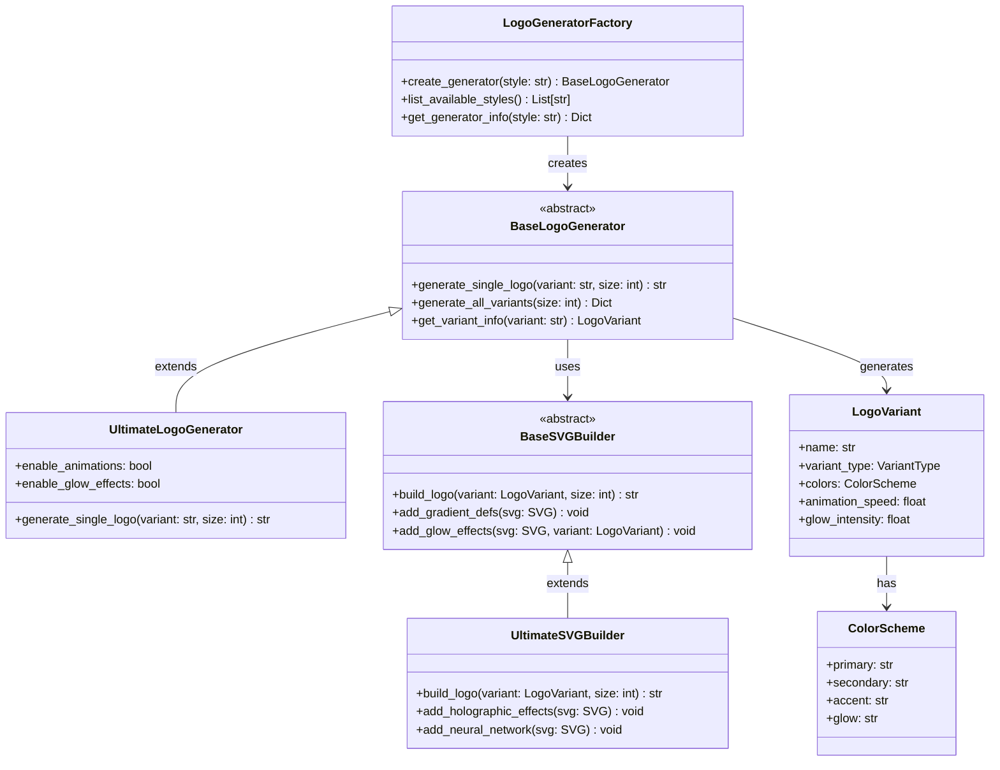

# 🌙 API Documentation - Arkalia-LUNA Logo Generator

## 📋 **Vue d'Ensemble**

L'API Arkalia-LUNA Logo Generator fournit une interface programmatique complète pour la génération de logos techno-mystiques avec variantes émotionnelles.

## 🏗️ **Architecture**

### **Structure des Modules**

```
src/
├── __init__.py                    # Point d'entrée principal
├── variants.py                    # Définitions des variantes émotionnelles
├── svg_builder.py                # Builder SVG de base
├── svg_builder_*.py              # Builders spécialisés par style
├── *_generator.py                # Générateurs de logos par style
├── generator_factory.py          # Factory pattern pour les générateurs
└── cli.py                        # Interface en ligne de commande
```

### **Patterns de Design**

- **Factory Pattern** : `LogoGeneratorFactory` pour créer des générateurs
- **Strategy Pattern** : Différents builders SVG pour chaque style
- **Builder Pattern** : Construction progressive des logos SVG
- **Template Method** : Générateurs avec étapes communes

### **Diagramme de Classes**



## 🔧 **Classes Principales**

### **LogoGeneratorFactory**

Factory principale pour créer des générateurs de logos.

```python
from src.generator_factory import LogoGeneratorFactory, create_logo_generator

# Création via factory
factory = LogoGeneratorFactory()
generator = factory.create_generator("ultimate")

# Ou via fonction utilitaire
generator = create_logo_generator("ultimate")
```

**Méthodes :**
- `create_generator(style: str, **kwargs) -> BaseLogoGenerator`
- `list_available_styles() -> List[str]`
- `get_generator_info(style: str) -> Dict[str, Any]`

### **BaseLogoGenerator**

Classe de base pour tous les générateurs de logos.

```python
from src.logo_generator import ArkaliaLunaLogo

generator = ArkaliaLunaLogo(output_dir="exports")
```

**Méthodes principales :**
- `generate_single_logo(variant_name: str, size: int = 200) -> str`
- `generate_all_variants(size: int = 200) -> Dict[str, str]`
- `get_variant_info(variant_name: str) -> LogoVariant`

### **SVGBuilder**

Constructeur de base pour les logos SVG.

```python
from src.svg_builder import SVGBuilder

builder = SVGBuilder()
svg_content = builder.build_logo(variant, size)
```

**Méthodes :**
- `build_logo(variant: LogoVariant, size: int) -> str`
- `add_gradient_defs(svg: SVG) -> None`
- `add_glow_effects(svg: SVG, variant: LogoVariant) -> None`

## 🎨 **Styles de Logos Disponibles**

### **1. Ultimate (Recommandé)**

```python
from src.ultimate_generator import UltimateLogoGenerator

generator = UltimateLogoGenerator()
# Effets cosmiques ultra-réalistes avec 100+ stops de gradients
```

**Caractéristiques :**
- Gradients holographiques complexes
- Effets de profondeur cosmique
- Réseaux neuronaux organiques
- Ombres et reflets réalistes

### **2. AI-Moon**

```python
from src.ai_moon_generator import AIMoonLogoGenerator

generator = AIMoonLogoGenerator()
# Style organique et neural avec lune IA vivante
```

**Caractéristiques :**
- Lune IA ultra-réaliste
- Style organique et fluide
- Effets holographiques avancés
- Réseaux neuronaux vivants

### **3. Dashboard**

```python
from src.dashboard_generator import DashboardLogoGenerator

generator = DashboardLogoGenerator()
# Style moderne et épuré pour interfaces
```

**Caractéristiques :**
- Design épuré et professionnel
- Networking synthétique
- Interface claire et lisible
- Style moderne et minimaliste

### **4. Ultra-Max**

```python
from src.ultra_max_generator import UltraMaxLogoGenerator

generator = UltraMaxLogoGenerator()
# Effets avancés et dynamiques
```

**Caractéristiques :**
- Animations fluides et élégantes
- Style futuriste et énergique
- Effets dynamiques avancés
- Transitions sophistiquées

### **5. Simple Advanced**

```python
from src.simple_advanced_generator import SimpleAdvancedLogoGenerator

generator = SimpleAdvancedLogoGenerator()
# Équilibre entre simplicité et sophistication
```

**Caractéristiques :**
- Design équilibré
- Effets modérés
- Lisibilité optimale
- Style polyvalent

## 🌙 **Variantes Émotionnelles**

### **LogoVariant**

```python
from src.variants import LogoVariant

variant = LogoVariant(
    name="Sérénité",
    description="Halo doux et pulsations lentes",
    animation_speed=1.0,
    glow_intensity=0.8,
    color_scheme=ColorScheme.SERENITY
)
```

**Propriétés :**
- `name: str` - Nom de la variante
- `description: str` - Description de l'émotion
- `animation_speed: float` - Vitesse d'animation (1.0 = normale)
- `glow_intensity: float` - Intensité du halo (0.0 à 1.0)
- `color_scheme: ColorScheme` - Palette de couleurs

### **Variantes Disponibles**

1. **Sérénité** : Halo doux, pulsations lentes
2. **Puissance** : Halo vibrant, réseau accéléré
3. **Mystère** : Brumes mouvantes, réseau irrégulier
4. **Éveil** : Halo rayonnant, Λ-core clair
5. **Énergie Créative** : Flux rapides, reflets multicolores

## 📁 **Gestion des Exports**

### **Structure des Exports**

```
exports/
├── unified/                      # Logos organisés par style
│   ├── logos/
│   │   ├── ultimate/            # Logos ULTIME
│   │   ├── ai_moon/            # Logos AI-MOON
│   │   ├── dashboard/          # Logos Dashboard
│   │   ├── ultra_max/          # Logos ULTRA-MAX
│   │   ├── simple_advanced/    # Logos Simple Advanced
│   │   └── base/               # Logos de base
│   └── favicons/               # Favicons PNG
├── svg/                         # Logos SVG individuels
└── *.png                        # Favicons PNG individuels
```

### **Nommage des Fichiers**

Format : `arkalia-luna-{style}-{variant}-{size}.svg`

Exemples :
- `arkalia-luna-ultimate-serenity-200.svg`
- `arkalia-luna-ai-moon-power-200.svg`
- `arkalia-luna-dashboard-mystery-200.svg`

## 🚀 **Exemples d'Utilisation**

### **Génération Simple**

```python
from src.ultimate_generator import UltimateLogoGenerator

# Créer un générateur
generator = UltimateLogoGenerator()

# Générer un logo spécifique
svg_path = generator.generate_single_logo("serenity", size=200)

# Générer tous les logos
all_logos = generator.generate_all_variants(size=200)
```

### **Génération avec Factory**

```python
from src.generator_factory import create_logo_generator

# Créer différents types de générateurs
ultimate_gen = create_logo_generator("ultimate")
ai_moon_gen = create_logo_generator("ai_moon")
dashboard_gen = create_logo_generator("dashboard")

# Générer des logos
ultimate_logo = ultimate_gen.generate_single_logo("power")
ai_moon_logo = ai_moon_gen.generate_single_logo("mystery")
```

### **Personnalisation Avancée**

```python
from src.ultimate_generator import UltimateLogoGenerator

generator = UltimateLogoGenerator(
    output_dir="custom_exports",
    enable_animations=True,
    enable_glow_effects=True,
    custom_colors={
        "primary": "#1a1a2e",
        "secondary": "#16213e",
        "accent": "#0f3460"
    }
)

# Générer avec paramètres personnalisés
svg_path = generator.generate_single_logo(
    "serenity", 
    size=300,
    custom_effects={
        "glow_intensity": 1.0,
        "animation_speed": 1.5
    }
)
```

## 🧪 **Tests et Validation**

### **Tests Unitaires**

```bash
# Lancer tous les tests
pytest

# Tests avec couverture
pytest --cov=src --cov-report=html

# Tests spécifiques
pytest tests/test_ultimate.py
pytest tests/test_svg_builders.py
```

### **Tests d'Intégration**

```bash
# Tests d'intégration
pytest -m integration

# Tests de performance
pytest --benchmark-only
```

## 🔍 **Débogage et Logs**

### **Activation des Logs**

```python
import logging

# Configuration des logs
logging.basicConfig(level=logging.DEBUG)
logger = logging.getLogger("arkalia_luna_logo")

# Utilisation
logger.debug("Génération du logo en cours...")
logger.info("Logo généré avec succès")
logger.warning("Paramètre non standard détecté")
logger.error("Erreur lors de la génération")
```

### **Mode Debug**

```python
from src.ultimate_generator import UltimateLogoGenerator

generator = UltimateLogoGenerator(debug=True)
# Active les logs détaillés et la validation des paramètres
```

## 📊 **Performance et Optimisation**

### **Benchmark des Générateurs**

```python
from src.generator_factory import benchmark_all_generators

# Comparer les performances
results = benchmark_all_generators(
    variants=["serenity", "power", "mystery"],
    sizes=[100, 200, 300],
    iterations=10
)

print("Résultats du benchmark :")
for style, metrics in results.items():
    print(f"{style}: {metrics['avg_time']:.3f}s")
```

### **Optimisations Disponibles**

- **Cache des gradients** : Réutilisation des définitions SVG
- **Lazy loading** : Chargement à la demande des ressources
- **Compression SVG** : Optimisation automatique des fichiers
- **Parallélisation** : Génération simultanée de plusieurs variantes

## 🚨 **Gestion des Erreurs**

### **Exceptions Courantes**

```python
from src.exceptions import (
    LogoGenerationError,
    InvalidVariantError,
    StyleNotSupportedError
)

try:
    generator = create_logo_generator("unknown_style")
except StyleNotSupportedError as e:
    print(f"Style non supporté : {e}")
except LogoGenerationError as e:
    print(f"Erreur de génération : {e}")
```

### **Codes d'Erreur**

- `LOGO_001` : Style de générateur non supporté
- `LOGO_002` : Variante émotionnelle invalide
- `LOGO_003` : Erreur lors de la génération SVG
- `LOGO_004` : Problème d'écriture du fichier
- `LOGO_005` : Paramètres de configuration invalides

## 🔮 **Évolutions Futures**

### **Fonctionnalités Prévues**

- **Animations Lottie** : Export vers format Lottie
- **Templates personnalisables** : Création de styles personnalisés
- **API REST** : Interface web pour la génération
- **Plugins** : Système d'extensions
- **Cloud rendering** : Génération distribuée

### **Compatibilité**

- **Python** : 3.8+ (support LTS)
- **SVG** : 1.1+ (compatibilité navigateurs)
- **Formats** : SVG, PNG, Lottie (prévu)
- **Systèmes** : Windows, macOS, Linux

---

**📚 Documentation générée automatiquement - Version 2.0.0**
