# 🏗️ Architecture Technique - Arkalia-LUNA Logo Generator

## 📋 **Vue d'Ensemble de l'Architecture**

Arkalia-LUNA Logo Generator suit une architecture modulaire et extensible basée sur des patterns de design éprouvés, permettant une génération de logos haute qualité avec une maintenance simplifiée.

## 🎯 **Principes Architecturaux**

### **1. Séparation des Responsabilités**
- **Générateurs** : Logique métier et orchestration
- **Builders SVG** : Construction des éléments graphiques
- **Variants** : Gestion des variantes émotionnelles
- **CLI** : Interface utilisateur en ligne de commande

### **2. Extensibilité**
- **Factory Pattern** : Ajout facile de nouveaux styles
- **Strategy Pattern** : Interchangeabilité des builders
- **Template Method** : Réutilisation du code commun

### **3. Qualité et Robustesse**
- **Tests complets** : Couverture de code 78% (+13 points)
- **Validation** : Vérification des paramètres d'entrée
- **Gestion d'erreurs** : Exceptions personnalisées
- **Logs structurés** : Traçabilité complète

## 🏛️ **Structure des Modules**

### **Organisation Hiérarchique**

```
src/
├── __init__.py                    # Point d'entrée et exports publics
├── variants.py                    # Définitions des variantes émotionnelles
├── svg_builder.py                # Builder SVG de base (classe abstraite)
├── svg_builder_*.py              # Builders spécialisés par style
├── *_generator.py                # Générateurs de logos par style
├── generator_factory.py          # Factory pattern pour les générateurs
├── logo_generator.py             # Générateur de base (classe abstraite)
└── cli.py                        # Interface en ligne de commande
```

### **Relations entre Modules**

```mermaid
graph TD
    %% Interface utilisateur
    A[🎨 CLI Interface<br/>Click + Rich] --> B[🏭 Generator Factory<br/>Pattern Factory]
    
    %% Générateurs de styles
    B --> C[🎭 Style Generators<br/>8 styles uniques]
    C --> C1[🌙 Base Generator]
    C --> C2[📊 Dashboard Generator]
    C --> C3[🌙 AI-Moon Generator]
    C --> C4[🎨 Advanced Generator]
    C --> C5[⚡ Simple-Advanced Generator]
    C --> C6[🚀 Ultra-Max Generator]
    C --> C7[🌍 Realism Max Generator]
    C --> C8[🌟 Ultimate Generator]
    
    %% Builders SVG
    C --> D[🔧 SVG Builders<br/>Pattern Builder]
    D --> D1[🌙 BaseSVGBuilder]
    D --> D2[📊 DashboardSVGBuilder]
    D --> D3[🌙 AIMoonSVGBuilder]
    D --> D4[🎨 AdvancedSVGBuilder]
    D --> D5[⚡ SimpleAdvancedSVGBuilder]
    D --> D6[🚀 UltraMaxSVGBuilder]
    D --> D7[🌍 RealismMaxSVGBuilder]
    D --> D8[🌟 UltimateSVGBuilder]
    
    %% Gestion des variantes
    C --> E[🎭 Variants Manager<br/>5 variantes émotionnelles]
    E --> E1[🌙 Sérénité]
    E --> E2[⚡ Puissance]
    E --> E3[🔮 Mystère]
    E --> E4[✨ Éveil/Sagesse]
    E --> E5[🎇 Énergie créative]
    
    %% Sortie et configuration
    D --> F[📤 SVG Output<br/>Gradients + Filtres]
    E --> G[🎨 Color Schemes<br/>Palettes dynamiques]
    
    %% Styles
    classDef cli fill:#e1f5fe,stroke:#01579b,stroke-width:2px
    classDef factory fill:#f3e5f5,stroke:#4a148c,stroke-width:2px
    classDef generator fill:#e8f5e8,stroke:#1b5e20,stroke-width:2px
    classDef builder fill:#fff3e0,stroke:#e65100,stroke-width:2px
    classDef variant fill:#fce4ec,stroke:#880e4f,stroke-width:2px
    classDef output fill:#e0f2f1,stroke:#004d40,stroke-width:2px
    
    class A cli
    class B factory
    class C,C1,C2,C3,C4,C5,C6,C7,C8 generator
    class D,D1,D2,D3,D4,D5,D6,D7,D8 builder
    class E,E1,E2,E3,E4,E5 variant
    class F,G output
```



## 🔧 **Patterns de Design Implémentés**

### **1. Factory Pattern**

**Classe** : `LogoGeneratorFactory`

**Objectif** : Créer des générateurs de logos selon le style demandé.

```python
class LogoGeneratorFactory:
    def create_generator(self, style: str, **kwargs) -> BaseLogoGenerator:
        """Crée un générateur selon le style spécifié"""
        if style == "ultimate":
            return UltimateLogoGenerator(**kwargs)
        elif style == "ai_moon":
            return AIMoonLogoGenerator(**kwargs)
        # ... autres styles
```

**Avantages** :
- Encapsulation de la logique de création
- Extensibilité facile pour nouveaux styles
- Configuration centralisée

### **2. Strategy Pattern**

**Objectif** : Permettre l'interchangeabilité des builders SVG.

```python
class BaseLogoGenerator:
    def __init__(self, svg_builder_class: Type[BaseSVGBuilder]):
        self.svg_builder = svg_builder_class()
    
    def generate_logo(self, variant: str, size: int) -> str:
        return self.svg_builder.build_logo(variant, size)
```

**Avantages** :
- Flexibilité dans le choix du builder
- Tests simplifiés avec des mocks
- Maintenance facilitée

### **3. Template Method Pattern**

**Objectif** : Définir un algorithme commun avec des étapes spécialisables.

```python
class BaseLogoGenerator:
    def generate_single_logo(self, variant_name: str, size: int = 200) -> str:
        """Template method pour la génération de logos"""
        # 1. Validation (commune)
        self._validate_variant(variant_name)
        self._validate_size(size)
        
        # 2. Préparation (spécialisée)
        self._prepare_generation(variant_name, size)
        
        # 3. Génération (spécialisée)
        svg_content = self._generate_svg(variant_name, size)
        
        # 4. Post-traitement (commune)
        return self._save_and_return(svg_content, variant_name, size)
    
    def _prepare_generation(self, variant_name: str, size: int):
        """Méthode à surcharger par les sous-classes"""
        pass
    
    def _generate_svg(self, variant_name: str, size: int) -> str:
        """Méthode à surcharger par les sous-classes"""
        pass
```

### **4. Builder Pattern**

**Objectif** : Construction progressive des logos SVG complexes.

```python
class UltimateSVGBuilder(BaseSVGBuilder):
    def build_logo(self, variant: LogoVariant, size: int) -> str:
        # 1. Création du document SVG
        svg = self._create_svg_document(size)
        
        # 2. Ajout des définitions (gradients, filtres)
        self._add_gradient_definitions(svg)
        self._add_filter_definitions(svg)
        
        # 3. Construction des éléments graphiques
        self._build_core_elements(svg, variant)
        self._build_neural_network(svg, variant)
        self._build_glow_effects(svg, variant)
        
        # 4. Finalisation
        return svg.tostring()
```

## 🌙 **Gestion des Variantes Émotionnelles**

### **Structure des Variantes**

```python
@dataclass
class LogoVariant:
    name: str                    # Nom de la variante
    description: str             # Description de l'émotion
    animation_speed: float       # Vitesse d'animation (1.0 = normale)
    glow_intensity: float        # Intensité du halo (0.0 à 1.0)
    color_scheme: ColorScheme    # Palette de couleurs
    neural_complexity: float     # Complexité du réseau neuronal
    glow_radius: float           # Rayon du halo
    pulse_frequency: float       # Fréquence des pulsations
```

### **Système de Couleurs**

```python
class ColorScheme(Enum):
    SERENITY = "serenity"        # Bleus apaisants
    POWER = "power"              # Bleus énergiques
    MYSTERY = "mystery"          # Bleus mystérieux
    AWAKENING = "awakening"      # Bleus lumineux
    CREATIVE = "creative"        # Bleus créatifs
```

## 🎨 **Système de Génération SVG**

### **Architecture des Builders**

```python
class BaseSVGBuilder(ABC):
    """Classe abstraite pour tous les builders SVG"""
    
    @abstractmethod
    def build_logo(self, variant: LogoVariant, size: int) -> str:
        """Construit un logo SVG complet"""
        pass
    
    def _create_svg_document(self, size: int) -> SVG:
        """Crée le document SVG de base"""
        pass
    
    def _add_gradient_definitions(self, svg: SVG) -> None:
        """Ajoute les définitions de gradients"""
        pass
    
    def _add_filter_definitions(self, svg: SVG) -> None:
        """Ajoute les définitions de filtres"""
        pass
```

### **Optimisations SVG**

1. **Réutilisation des Définitions**
   - Gradients partagés entre variantes
   - Filtres réutilisés
   - Symboles SVG pour éléments communs

2. **Compression Intelligente**
   - Suppression des attributs inutiles
   - Optimisation des chemins SVG
   - Réduction de la précision des nombres

3. **Gestion de la Mémoire**
   - Lazy loading des ressources
   - Cache des gradients complexes
   - Nettoyage automatique des objets

## 🚀 **Système de Génération**

### **Pipeline de Génération**

```python
class UltimateLogoGenerator(BaseLogoGenerator):
    def _generate_svg(self, variant_name: str, size: int) -> str:
        """Génération spécialisée pour le style ULTIME"""
        
        # 1. Récupération de la variante
        variant = self.variants_manager.get_variant(variant_name)
        
        # 2. Création du builder
        builder = UltimateSVGBuilder(
            enable_animations=self.enable_animations,
            enable_glow_effects=self.enable_glow_effects,
            custom_colors=self.custom_colors
        )
        
        # 3. Construction du logo
        svg_content = builder.build_logo(variant, size)
        
        # 4. Validation du SVG généré
        self._validate_svg_output(svg_content)
        
        return svg_content
```

### **Gestion des Erreurs**

```python
class LogoGenerationError(Exception):
    """Exception de base pour les erreurs de génération"""
    def __init__(self, message: str, error_code: str = None):
        self.message = message
        self.error_code = error_code
        super().__init__(self.message)

class InvalidVariantError(LogoGenerationError):
    """Erreur de variante invalide"""
    pass

class StyleNotSupportedError(LogoGenerationError):
    """Erreur de style non supporté"""
    pass
```

## 📊 **Système de Tests**

### **Architecture des Tests**

```
tests/
├── __init__.py
├── test_variants.py              # Tests des variantes
├── test_svg_builders.py          # Tests des builders SVG
├── test_all_generators.py        # Tests d'intégration
├── test_*.py                     # Tests spécifiques par style
└── pytest.ini                   # Configuration pytest
```

### **Stratégies de Test**

1. **Tests Unitaires**
   - Chaque classe testée individuellement
   - Mocks pour les dépendances externes
   - Couverture de code 78% (+13 points)

2. **Tests d'Intégration**
   - Tests des pipelines complets
   - Validation des exports SVG
   - Tests de performance

3. **Tests de Régression**
   - Comparaison des outputs
   - Validation des métriques de qualité
   - Tests de compatibilité

## 🔍 **Système de Logs et Monitoring**

### **Architecture des Logs**

```python
import logging
from typing import Dict, Any

class LogoGeneratorLogger:
    def __init__(self, name: str, level: int = logging.INFO):
        self.logger = logging.getLogger(name)
        self.logger.setLevel(level)
        
    def log_generation_start(self, variant: str, style: str, size: int):
        """Log du début de génération"""
        self.logger.info(f"Génération démarrée: {style}/{variant}/{size}")
    
    def log_generation_success(self, output_path: str, duration: float):
        """Log du succès de génération"""
        self.logger.info(f"Génération réussie: {output_path} ({duration:.3f}s)")
    
    def log_generation_error(self, error: Exception, context: Dict[str, Any]):
        """Log des erreurs de génération"""
        self.logger.error(f"Erreur de génération: {error}", extra=context)
```

### **Métriques de Performance**

```python
class PerformanceMonitor:
    def __init__(self):
        self.metrics = {}
    
    def start_timer(self, operation: str):
        """Démarre un chronomètre"""
        self.metrics[operation] = {"start": time.time()}
    
    def end_timer(self, operation: str):
        """Arrête un chronomètre et calcule la durée"""
        if operation in self.metrics:
            self.metrics[operation]["duration"] = time.time() - self.metrics[operation]["start"]
    
    def get_performance_report(self) -> Dict[str, float]:
        """Retourne un rapport de performance"""
        return {op: data.get("duration", 0) for op, data in self.metrics.items()}
```

## 🔧 **Configuration et Personnalisation**

### **Système de Configuration**

```python
from dataclasses import dataclass
from typing import Dict, Optional

@dataclass
class GeneratorConfig:
    output_dir: str = "exports"
    enable_animations: bool = True
    enable_glow_effects: bool = True
    custom_colors: Optional[Dict[str, str]] = None
    debug: bool = False
    log_level: str = "INFO"
    
    @classmethod
    def from_dict(cls, config_dict: Dict[str, Any]) -> "GeneratorConfig":
        """Crée une configuration depuis un dictionnaire"""
        return cls(**{k: v for k, v in config_dict.items() if k in cls.__annotations__})
```

### **Fichiers de Configuration**

```toml
# pyproject.toml
[tool.arkalia_luna_logo]
output_dir = "custom_exports"
enable_animations = true
enable_glow_effects = true
log_level = "DEBUG"

[tool.arkalia_luna_logo.colors]
primary = "#1a1a2e"
secondary = "#16213e"
accent = "#0f3460"
```

## 🚀 **Optimisations et Performance**

### **Stratégies d'Optimisation**

1. **Cache des Gradients**
   ```python
   class GradientCache:
       def __init__(self):
           self._cache = {}
       
       def get_gradient(self, key: str, generator_func: Callable) -> str:
           if key not in self._cache:
               self._cache[key] = generator_func()
           return self._cache[key]
   ```

2. **Génération Parallèle**
   ```python
   from concurrent.futures import ThreadPoolExecutor
   
   def generate_all_variants_parallel(self, size: int = 200) -> Dict[str, str]:
       with ThreadPoolExecutor(max_workers=4) as executor:
           futures = {
               executor.submit(self.generate_single_logo, variant, size): variant
               for variant in self.variants_manager.list_variants()
           }
           return {futures[future]: future.result() for future in futures}
   ```

3. **Lazy Loading**
   ```python
   class LazySVGBuilder:
       def __init__(self):
           self._builder = None
       
       @property
       def builder(self):
           if self._builder is None:
               self._builder = self._create_builder()
           return self._builder
   ```

## 🔮 **Évolutions Futures**

### **Roadmap Technique**

1. **Phase 1 (v2.1)**
   - Support des animations Lottie
   - API REST pour la génération web
   - Système de plugins

2. **Phase 2 (v2.2)**
   - Rendu cloud distribué
   - Templates personnalisables
   - Intégration avec des outils de design

3. **Phase 3 (v3.0)**
   - Interface graphique native
   - Support multi-formats avancé
   - Intelligence artificielle pour l'optimisation

### **Compatibilité et Standards**

- **Python** : Support LTS (3.8+)
- **SVG** : Standard 1.1+ avec extensions modernes
- **Formats** : SVG, PNG, Lottie, WebP
- **Systèmes** : Cross-platform (Windows, macOS, Linux)

---

**🏗️ Documentation d'architecture technique - Version 2.0.0**
