# 🏗️ Architecture Technique - Arkalia-LUNA Logo Generator

## 📋 **Vue d'Ensemble de l'Architecture**

Arkalia-LUNA Logo Generator suit une architecture modulaire et extensible basée sur des patterns de design éprouvés, permettant une génération de logos haute qualité avec une maintenance simplifiée.

## 🎯 **Principes Architecturaux**

### **1. Séparation des Responsabilités**
- **Générateurs** : Logique métier et orchestration
- **Builders SVG** : Construction des éléments graphiques
- **Variants** : Gestion des variantes émotionnelles
- **CLI** : Interface utilisateur en ligne de commande

### **2. Extensibilité**
- **Factory Pattern** : Ajout facile de nouveaux styles
- **Strategy Pattern** : Interchangeabilité des builders
- **Template Method** : Réutilisation du code commun

### **3. Qualité et Robustesse**
- **Tests complets** : **151 tests passent** ✅
- **Couverture de code** : **78%** (objectif 90%+)
- **Validation** : Vérification des paramètres d'entrée
- **Gestion d'erreurs** : Exceptions personnalisées
- **Logs structurés** : Traçabilité complète

## 🏛️ **Structure des Modules**

### **Organisation Hiérarchique**

```
src/
├── __init__.py                    # Point d'entrée et exports publics
├── variants.py                    # Définitions des variantes émotionnelles
├── svg_builder.py                # Builder SVG de base (classe abstraite)
├── svg_builder_*.py              # Builders spécialisés par style
├── *_generator.py                # Générateurs de logos par style
├── generator_factory.py          # Factory pattern pour les générateurs
├── logo_generator.py             # Générateur de base (classe abstraite)
└── cli.py                        # Interface en ligne de commande
```

### **Relations entre Modules**

```mermaid
graph TD
    %% Interface utilisateur
    A[🎨 CLI Interface<br/>Click + Rich] --> B[🏭 Generator Factory<br/>Pattern Factory]
    
    %% Générateurs de styles
    B --> C[🎭 Style Generators<br/>8 styles uniques]
    C --> C1[🌙 Base Generator]
    C --> C2[📊 Dashboard Generator]
    C --> C3[🌙 AI-Moon Generator]
    C --> C4[🎨 Advanced Generator]
    C --> C5[⚡ Simple-Advanced Generator]
    C --> C6[🚀 Ultra-Max Generator]
    C --> C7[🌍 Realism Max Generator]
    C --> C8[🌟 Ultimate Generator]
    
    %% Builders SVG
    C --> D[🔧 SVG Builders<br/>Pattern Builder]
    D --> D1[🌙 BaseSVGBuilder]
    D --> D2[📊 DashboardSVGBuilder]
    D --> D3[🌙 AIMoonSVGBuilder]
    D --> D4[🎨 AdvancedSVGBuilder]
    D --> D5[⚡ SimpleAdvancedSVGBuilder]
    D --> D6[🚀 UltraMaxSVGBuilder]
    D --> D7[🌍 RealismMaxSVGBuilder]
    D --> D8[🌟 UltimateSVGBuilder]
    
    %% Gestion des variantes
    C --> E[🎭 Variants Manager<br/>5 variantes émotionnelles]
    E --> E1[🌙 Sérénité]
    E --> E2[⚡ Puissance]
    E --> E3[🔮 Mystère]
    E --> E4[✨ Éveil/Sagesse]
    E --> E5[🎇 Énergie créative]
    
    %% Sortie et configuration
    D --> F[📤 SVG Output<br/>Gradients + Filtres]
    E --> G[🎨 Color Schemes<br/>Palettes dynamiques]
    
    %% Styles
    classDef cli fill:#e1f5fe,stroke:#01579b,stroke-width:2px
    classDef factory fill:#f3e5f5,stroke:#4a148c,stroke-width:2px
    classDef generator fill:#e8f5e8,stroke:#1b5e20,stroke-width:2px
    classDef builder fill:#fff3e0,stroke:#e65100,stroke-width:2px
    classDef variant fill:#fce4ec,stroke:#880e4f,stroke-width:2px
    classDef output fill:#e0f2f1,stroke:#004d40,stroke-width:2px
    
    class A cli
    class B factory
    class C,C1,C2,C3,C4,C5,C6,C7,C8 generator
    class D,D1,D2,D3,D4,D5,D6,D7,D8 builder
    class E,E1,E2,E3,E4,E5 variant
    class F,G output
```



## 🔧 **Patterns de Design Implémentés**

### **1. Factory Pattern**
```python
# LogoGeneratorFactory - Création dynamique des générateurs
generator = LogoGeneratorFactory.create_generator("ultimate")
```

### **2. Strategy Pattern**
```python
# Différents builders SVG pour chaque style
builder = UltimateSVGBuilder()  # Stratégie Ultimate
builder = RealismMaxSVGBuilder()  # Stratégie Realism
```

### **3. Builder Pattern**
```python
# Construction progressive des logos SVG
svg = builder.create_drawing(size=200)
svg = builder.add_gradients(svg)
svg = builder.add_effects(svg)
```

### **4. Template Method**
```python
# Générateurs avec étapes communes
class BaseLogoGenerator:
    def generate_svg_logo(self, variant, size):
        # 1. Validation
        # 2. Création du builder
        # 3. Construction du logo
        # 4. Export
```

## 📊 **Métriques de Qualité**

### **Tests et Couverture**
- **Tests totaux** : 151 tests ✅
- **Couverture de code** : 78% (objectif 90%+)
- **Modules testés** : 20/20
- **Tests de performance** : 7/7 benchmarks ✅

### **Qualité du Code**
- **Linting** : Ruff + Black ✅
- **Type checking** : MyPy strict ✅
- **Sécurité** : Bandit ✅
- **Pre-commit hooks** : 8 hooks configurés ✅

## 🚀 **Performance et Optimisations**

### **Benchmarks Actuels**
- **Realism Max** : ~0.002s (le plus rapide)
- **Dashboard** : ~0.004s
- **AI-Moon** : ~0.007s
- **Ultra-Max** : ~0.008s
- **Ultimate** : ~0.007s

### **Optimisations Implémentées**
- **Cache des générateurs** : Évite la recréation
- **Lazy loading** : Chargement à la demande
- **Gestion mémoire** : Nettoyage automatique des ressources

## 🔮 **Évolutions Futures**

### **Court terme (1-2 mois)**
- Améliorer la couverture de code à 90%+
- Optimiser les performances des builders SVG
- Ajouter des tests de stress et de charge

### **Moyen terme (3-6 mois)**
- Implémenter le multithreading pour la génération
- Ajouter un système de cache distribué
- Créer une API REST pour l'intégration

### **Long terme (6+ mois)**
- Support des animations SVG avancées
- Intégration avec des outils de design
- Support des formats 3D et VR

## 📚 **Documentation Technique**

### **Fichiers de Référence**
- `API.md` : Documentation complète de l'API
- `CONTRIBUTING.md` : Guide de contribution
- `QUICKSTART.md` : Guide de démarrage rapide
- `ARCHITECTURE.md` : Ce document

### **Exemples de Code**
- `demos/` : Démonstrations HTML interactives
- `tests/` : Exemples d'utilisation dans les tests
- `tools/` : Scripts utilitaires et exemples

---

**🏗️ Architecture Arkalia-LUNA Logo Generator** - Version 2.0.0
