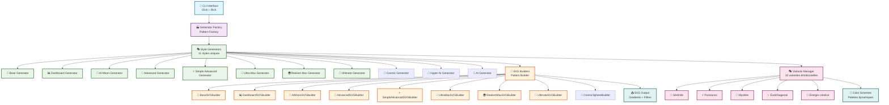

# 🏗️ Architecture Technique

<div align="center">

**🌙 Arkalia-LUNA Logo Generator**

*Architecture modulaire et extensible*

</div>

---

## 📋 Vue d'Ensemble

<div align="center">

Arkalia-LUNA Logo Generator suit une architecture modulaire et extensible basée sur des patterns de design éprouvés, permettant une génération de logos avec une maintenance simplifiée.

</div>

## 🎯 Principes Architecturaux

### 1️⃣ Séparation des Responsabilités

<div align="center">

| Composant | Responsabilité | Statut |
|:---------:|:--------------:|:------:|
| **Générateurs** | Logique métier et orchestration | ✅ |
| **Builders SVG** | Construction des éléments graphiques | ✅ |
| **Variants** | Gestion des variantes émotionnelles | ✅ |
| **CLI** | Interface utilisateur en ligne de commande | ✅ |

</div>

### 2️⃣ Extensibilité

<div align="center">

| Pattern | Description | Statut |
|:-------:|:-----------:|:------:|
| **Factory Pattern** | Ajout facile de nouveaux styles | ✅ |
| **Strategy Pattern** | Interchangeabilité des builders | ✅ |
| **Template Method** | Réutilisation du code commun | ✅ |

</div>

### 3️⃣ Qualité et Robustesse

<div align="center">

| Métrique | Valeur | Statut |
|:--------:|:------:|:------:|
| **Tests complets** | 297 tests passent | ✅ |
| **Couverture de code** | 75% (objectif 90%+) | ✅ **MIS À JOUR** |
| **Validation** | Vérification des paramètres | ✅ |
| **Gestion d'erreurs** | Exceptions personnalisées | ✅ |
| **Logs structurés** | Traçabilité complète | ✅ |

</div>

## 🏛️ **Structure des Modules**

### **Organisation Hiérarchique**

```
arkalia-luna-logo/
├── src/                           # Code source principal
│   ├── __init__.py               # Point d'entrée et exports publics
│   ├── variants.py                # Définitions des variantes émotionnelles
│   ├── svg_builder.py            # Builder SVG de base (classe abstraite)
│   ├── svg_builder_*.py          # Builders spécialisés par style
│   ├── *_generator.py            # Générateurs de logos par style
│   ├── generator_factory.py     # Factory pattern pour les générateurs
│   ├── logo_generator.py         # Générateur de base (classe abstraite)
│   └── cli.py                    # Interface en ligne de commande
├── main.py                        # API FastAPI REST
├── scripts/                       # Scripts d'automatisation
│   ├── start_api.sh             # Démarrage API
│   ├── quick_explore.sh         # Exploration fonctionnalités
│   └── generate_*.py            # Scripts de génération
├── docker-compose.prod.yml      # Infrastructure Docker
├── monitoring/                    # Prometheus + Grafana
└── nginx/                         # Configuration Nginx
```

### **Relations entre Modules**


```mermaid
graph TD
    %% Interface utilisateur
    A[🎨 CLI Interface<br/>Click + Rich] --> B[🏭 Generator Factory<br/>Pattern Factory]
    
    %% Générateurs de styles
    B --> C[🎭 Style Generators<br/>11 styles uniques]
    C --> C1[🌙 Base Generator]
    C --> C2[📊 Dashboard Generator]
    C --> C3[🌙 AI-Moon Generator]
    C --> C4[🎨 Advanced Generator]
    C --> C5[⚡ Simple-Advanced Generator]
    C --> C6[🚀 Ultra-Max Generator]
    C --> C7[🌍 Realism Max Generator]
    C --> C8[🌟 Ultimate Generator]
    C --> C9[🌌 Cosmic Generator]
    C --> C10[🧠 Hyper-AI Generator]
    C --> C11[🤖 AI Generator]
    
    %% Builders SVG
    C --> D[🔧 SVG Builders<br/>Pattern Builder]
    D --> D1[🌙 BaseSVGBuilder]
    D --> D2[📊 DashboardSVGBuilder]
    D --> D3[🌙 AIMoonSVGBuilder]
    D --> D4[🎨 AdvancedSVGBuilder]
    D --> D5[⚡ SimpleAdvancedSVGBuilder]
    D --> D6[🚀 UltraMaxSVGBuilder]
    D --> D7[🌍 RealismMaxSVGBuilder]
    D --> D8[🌟 UltimateSVGBuilder]
    D --> D9[🌌 CosmicSphereBuilder]
    
    %% Gestion des variantes
    C --> E[🎭 Variants Manager<br/>10 variantes émotionnelles]
    E --> E1[🌙 Sérénité]
    E --> E2[⚡ Puissance]
    E --> E3[🔮 Mystère]
    E --> E4[✨ Éveil/Sagesse]
    E --> E5[🎇 Énergie créative]
    
    %% Sortie et configuration
    D --> F[📤 SVG Output<br/>Gradients + Filtres]
    E --> G[🎨 Color Schemes<br/>Palettes dynamiques]
    
    %% Styles
    classDef cli fill:#e1f5fe,stroke:#01579b,stroke-width:2px
    classDef factory fill:#f3e5f5,stroke:#4a148c,stroke-width:2px
    classDef generator fill:#e8f5e8,stroke:#1b5e20,stroke-width:2px
    classDef builder fill:#fff3e0,stroke:#e65100,stroke-width:2px
    classDef variant fill:#fce4ec,stroke:#880e4f,stroke-width:2px
    classDef output fill:#e0f2f1,stroke:#004d40,stroke-width:2px
    
    class A cli
    class B factory
    class C,C1,C2,C3,C4,C5,C6,C7,C8 generator
    class D,D1,D2,D3,D4,D5,D6,D7,D8 builder
    class E,E1,E2,E3,E4,E5 variant
    class F,G output
```

## 🔧 Patterns de Design Implémentés

### 1️⃣ Factory Pattern

<div align="center">

**Création dynamique des générateurs**

</div>

```python
# LogoGeneratorFactory - Création dynamique des générateurs
generator = LogoGeneratorFactory.create_generator("ultimate")
logo = generator.generate_single_logo("serenity", size=200)
```

**Exemple visuel** : 

### 2️⃣ Strategy Pattern

<div align="center">

**Différents builders SVG pour chaque style**

</div>

```python
# Différents builders SVG pour chaque style
builder = UltimateSVGBuilder()  # Stratégie Ultimate
builder = RealismMaxSVGBuilder()  # Stratégie Realism
```

<div align="center">

| Builder | Logo Exemple | Performance |
|:-------:|:------------:|:-----------:|
| **UltimateSVGBuilder** |  | ✅ ~0.007s |
| **RealismMaxSVGBuilder** |  | 🏆 ~0.002s |

</div>

### 3️⃣ Builder Pattern

<div align="center">

**Construction progressive des logos SVG**

</div>

```python
# Construction progressive des logos SVG
svg = builder.create_drawing(size=200)
svg = builder.add_gradients(svg)
svg = builder.add_effects(svg)
```

### 4️⃣ Template Method

<div align="center">

**Générateurs avec étapes communes**

</div>

```python
# Générateurs avec étapes communes
class BaseLogoGenerator:
    def generate_svg_logo(self, variant, size):
        # 1. Validation
        # 2. Création du builder
        # 3. Construction du logo
        # 4. Export
```

## 📊 Métriques de Qualité

### 🧪 Tests et Couverture

<div align="center">

| Métrique | Valeur | Statut |
|:--------:|:------:|:------:|
| **Tests totaux** | 297 tests | ✅ |
| **Couverture de code** | 75% (objectif 90%+) | ✅ **MIS À JOUR** |
| **Modules testés** | 20/20 | ✅ |
| **Tests de performance** | 7/7 benchmarks | ✅ |

</div>

### 🔍 Qualité du Code

<div align="center">

| Outil | Description | Statut |
|:-----:|:-----------:|:------:|
| **Linting** | Ruff + Black | ✅ |
| **Type checking** | MyPy strict | ✅ |
| **Sécurité** | Bandit | ✅ |
| **Pre-commit hooks** | 7 hooks configurés | ✅ **MIS À JOUR** (était 8) |

</div>

## 🚀 Performance et Optimisations

### ⚡ Benchmarks Actuels

<div align="center">

| Générateur | Temps | Performance |
|:----------:|:-----:|:-----------:|
| **Realism Max** | ~0.002s | 🏆 Le plus rapide |
| **Dashboard** | ~0.004s | ⚡ Rapide |
| **AI-Moon** | ~0.007s | ✅ Bon |
| **Ultra-Max** | ~0.008s | ✅ Bon |
| **Ultimate** | ~0.007s | ✅ Bon |

</div>

### 🎯 Optimisations Implémentées

<div align="center">

| Optimisation | Description | Impact |
|:------------:|:-----------:|:-----:|
| **Cache des générateurs** | Évite la recréation | ⚡ Haute |
| **Lazy loading** | Chargement à la demande | ⚡ Haute |
| **Gestion mémoire** | Nettoyage automatique | ✅ Moyenne |

</div>

## 🔮 Évolutions Futures

### 📅 Court Terme (1-2 mois)

<div align="center">

| Objectif | Description | Priorité | Statut |
|:--------:|:-----------:|:--------:|:------:|
| **Couverture** | Améliorer à 90%+ | 🚨 Haute | 🟡 En cours |
| **Performance** | Optimiser builders SVG | ⚠️ Moyenne | 🟡 En cours |
| **Tests** | Tests de stress et charge | ⚠️ Moyenne | ⏳ Planifié |

</div>

### 📅 Moyen Terme (3-6 mois)

<div align="center">

| Objectif | Description | Priorité | Statut |
|:--------:|:-----------:|:--------:|:------:|
| **Multithreading** | Génération parallèle | ⚠️ Moyenne | ⏳ Planifié |
| **Cache distribué** | Redis (déjà configuré) | ⚠️ Moyenne | ✅ Infrastructure prête |
| **API REST** | Améliorations (déjà implémentée) | ⚠️ Moyenne | ✅ Actif |

</div>

### 📅 Long Terme (6+ mois)

<div align="center">

| Objectif | Description | Priorité | Statut |
|:--------:|:-----------:|:--------:|:------:|
| **Animations SVG** | Support avancé | ⚠️ Basse | ⏳ Planifié |
| **Intégration Design** | Outils de design | ⚠️ Basse | ⏳ Planifié |
| **Formats 3D/VR** | Support 3D et VR | ⚠️ Basse | ⏳ Planifié |

</div>

## 📚 Documentation Technique

### 📖 Fichiers de Référence

<div align="center">

| Document | Description | Lien |
|:--------:|:-----------:|:----:|
| **API.md** | Documentation complète de l'API | [📘 Voir API.md](API.md) |
| **CONTRIBUTING.md** | Guide de contribution | [📘 Voir CONTRIBUTING.md](CONTRIBUTING.md) |
| **QUICKSTART.md** | Guide de démarrage rapide | [📘 Voir QUICKSTART.md](QUICKSTART.md) |
| **ARCHITECTURE.md** | Ce document | [📘 Voir ARCHITECTURE.md](ARCHITECTURE.md) |

</div>

### 💻 Exemples de Code

<div align="center">

| Ressource | Description | Emplacement |
|:---------:|:-----------:|:-----------:|
| **Démos HTML** | Démonstrations interactives | `../demos/` |
| **Tests** | Exemples d'utilisation | `../tests/` |
| **Scripts** | Utilitaires et exemples | `../tools/` |

</div>

---

<div align="center">

---

**🏗️ Architecture Arkalia-LUNA Logo Generator**

*Version 2.0.0*

</div>
