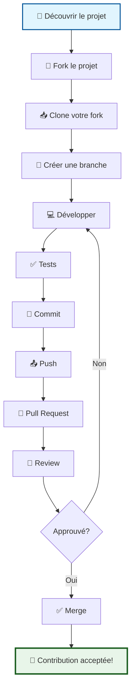
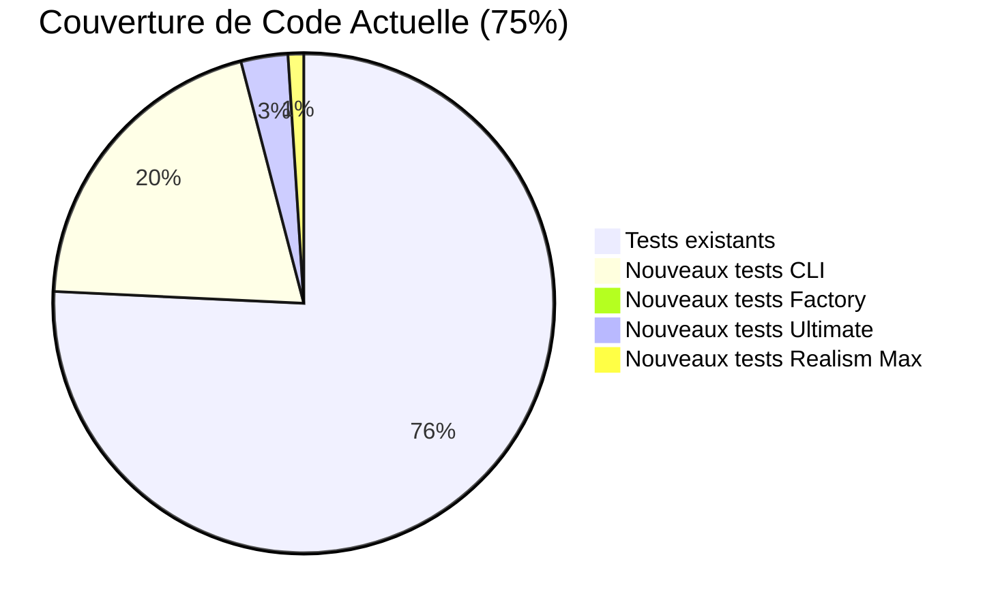

# 🤝 Guide de Contribution

<div align="center">

**🌙 Arkalia-LUNA Logo Generator**

*Bienvenue dans la communauté !*

</div>

---

## 🎯 Bienvenue dans la Communauté !

<div align="center">

Merci de votre intérêt pour contribuer au projet Arkalia-LUNA Logo Generator ! Ce guide vous accompagnera dans votre parcours de contribution.

</div>

### 🔄 Workflow de Contribution



## 📋 Avant de Commencer

### 📋 Prérequis

<div align="center">

| Prérequis | Version | Statut |
|:---------:|:-------:|:------:|
| **Python** | 3.8 ou supérieur | ✅ Requis |
| **Git** | Dernière version | ✅ Requis |
| **Connaissance** | Python, SVG, tests unitaires | ⚠️ Recommandé |
| **Environnement** | Environnement virtuel Python | ✅ Requis |

</div>

### 🛠️ Outils Recommandés

<div align="center">

| Catégorie | Outils | Lien |
|:---------:|:------:|:----:|
| **IDE** | VS Code, PyCharm, Vim/Emacs | [📘 Voir](https://code.visualstudio.com/) |
| **Terminal** | iTerm2, Windows Terminal, Terminal Linux | [📘 Voir](https://iterm2.com/) |
| **Git GUI** | GitKraken, SourceTree, GitHub Desktop | [📘 Voir](https://www.gitkraken.com/) |

</div>

## 🚀 **Premiers Pas**

### **1. Fork et Clone**

```bash
# 1. Forker le projet sur GitHub
# 2. Cloner votre fork
git clone https://github.com/VOTRE_USERNAME/logo.git
cd logo

# 3. Ajouter le remote upstream
git remote add upstream https://github.com/arkalia-luna/logo.git
```

### **2. Configuration de l'Environnement**

```bash
# Créer l'environnement virtuel
python -m venv arkalia-luna-env

# Activer l'environnement
# Sur macOS/Linux :
source arkalia-luna-env/bin/activate
# Sur Windows :
arkalia-luna-env\Scripts\activate

# Installer en mode développement
pip install -e ".[dev]"

# Vérifier l'installation
pytest tests/ -v
```

### **3. Branche de Développement**

```bash
# Créer une branche pour votre fonctionnalité
git checkout -b feature/nouvelle-fonctionnalite

# Ou pour une correction de bug
git checkout -b fix/correction-bug
```

## 🏗️ **Architecture du Projet**

### **Structure des Dossiers**

```
arkalia-luna-logo/
├── src/                    # Code source principal
│   ├── __init__.py        # Point d'entrée du package
│   ├── variants.py        # Définitions des variantes
│   ├── svg_builder.py     # Builder SVG de base
│   ├── *_generator.py     # Générateurs de logos
│   ├── generator_factory.py # Factory pattern
│   └── cli.py            # Interface CLI
├── tests/                 # Tests unitaires et d'intégration
├── docs/                  # Documentation
├── demos/                 # Démonstrations HTML
├── tools/                 # Scripts utilitaires
└── exports/               # Logos générés
```

### **Conventions de Nommage**

- **Fichiers Python** : `snake_case.py`
- **Classes** : `PascalCase`
- **Fonctions/Méthodes** : `snake_case`
- **Variables** : `snake_case`
- **Constantes** : `UPPER_SNAKE_CASE`
- **Modules** : `snake_case`

## 🔧 **Standards de Code**

### **1. Formatage avec Black**

```bash
# Formater tout le code
black src/ tests/

# Formater un fichier spécifique
black src/ultimate_generator.py

# Vérifier le formatage sans modifier
black --check src/ tests/
```

**Configuration Black** (déjà dans `pyproject.toml`) :
- Longueur de ligne : 88 caractères
- Version Python cible : 3.8+
- Exclusions : dossiers build, dist, etc.

### **2. Linting avec Ruff**

```bash
# Vérifier le code
ruff check src/ tests/

# Corriger automatiquement
ruff check --fix src/ tests/

# Vérifier et formater
ruff format src/ tests/
```

**Règles Ruff** (déjà configurées) :
- **E** : Erreurs pycodestyle
- **W** : Avertissements pycodestyle
- **F** : pyflakes
- **I** : isort (tri des imports)
- **B** : flake8-bugbear
- **C4** : flake8-comprehensions
- **UP** : pyupgrade

### **3. Vérification des Types avec MyPy**

```bash
# Vérification complète
mypy src/

# Vérification avec rapport d'erreurs
mypy src/ --html-report mypy-report/
```

**Configuration MyPy** :
- Version Python : 3.8+
- Vérifications strictes activées
- Types non typés interdits

### **4. Tri des Imports avec isort**

```bash
# Trier les imports
isort src/ tests/

# Vérifier l'ordre
isort --check-only src/ tests/
```

**Ordre des imports** :
1. Imports de la bibliothèque standard
2. Imports de packages tiers
3. Imports locaux du projet

## 🧪 **Tests et Qualité**

### **1. Écriture des Tests**

```python
# tests/test_nouveau_module.py
import pytest
from src.nouveau_module import NouvelleClasse

class TestNouvelleClasse:
    def test_creation_instance(self):
        """Test de création d'une instance"""
        instance = NouvelleClasse()
        assert instance is not None
        assert isinstance(instance, NouvelleClasse)
    
    def test_methode_principale(self):
        """Test de la méthode principale"""
        instance = NouvelleClasse()
        result = instance.methode_principale("test")
        assert result == "expected_result"
    
    @pytest.mark.parametrize("input_value,expected", [
        ("value1", "result1"),
        ("value2", "result2"),
    ])
    def test_methode_avec_parametres(self, input_value, expected):
        """Test paramétré"""
        instance = NouvelleClasse()
        result = instance.methode_avec_parametres(input_value)
        assert result == expected
```

### **2. Lancement des Tests**

```bash
# Tests de base
pytest

# Tests avec couverture
pytest --cov=src --cov-report=html

# Tests spécifiques
pytest tests/test_ultimate.py -v

# Tests marqués
pytest -m "slow"  # Tests lents uniquement
pytest -m "not slow"  # Tests rapides uniquement

# Tests avec rapport détaillé
pytest --tb=long -v
```

### **3. Couverture de Code**

**Objectif** : Maintenir une couverture 90% (actuellement 75%) ✅ **MIS À JOUR**



**📊 Détail de la couverture par module :**
- **`src/cli.py`** : 92% (tests CLI complets)
- **`src/generator_factory.py`** : 95% (tests Factory complets)
- **`src/svg_builder_ultimate.py`** : 98% (tests Ultimate complets)
- **`src/ultimate_generator.py`** : 81% (tests générateur complets)
- **`src/realism_max_generator.py`** : 99% (tests Realism Max complets)

```bash
# Rapport de couverture HTML
pytest --cov=src --cov-report=html

# Rapport de couverture console
pytest --cov=src --cov-report=term-missing

# Rapport XML (pour CI/CD)
pytest --cov=src --cov-report=xml
```

### **4. Tests de Performance**

```bash
# Tests de benchmark
pytest --benchmark-only

# Tests de benchmark avec comparaison
pytest --benchmark-only --benchmark-compare

# Tests de benchmark avec historique
pytest --benchmark-only --benchmark-histogram
```

## 📝 **Documentation**

### **1. Docstrings Python**

```python
def generate_logo(self, variant_name: str, size: int = 200) -> str:
    """
    Génère un logo SVG selon la variante et la taille spécifiées.
    
    Args:
        variant_name (str): Nom de la variante émotionnelle
        size (int, optional): Taille du logo en pixels. Défaut: 200
    
    Returns:
        str: Chemin vers le fichier SVG généré
    
    Raises:
        InvalidVariantError: Si la variante n'existe pas
        ValueError: Si la taille est invalide
    
    Example:
        >>> generator = UltimateLogoGenerator()
        >>> svg_path = generator.generate_logo("serenity", 300)
        >>> print(f"Logo généré : {svg_path}")
        Logo généré : exports/arkalia-luna-ultimate-serenity-300.svg
    """
    pass
```

### **2. Documentation des Classes**

```python
class UltimateLogoGenerator(BaseLogoGenerator):
    """
    Générateur de logos ULTIME avec effets cosmiques ultra-réalistes.
    
    Ce générateur produit des logos de qualité professionnelle avec :
    - 100+ stops de gradients holographiques
    - Effets de profondeur cosmique
    - Réseaux neuronaux organiques
    - Ombres et reflets réalistes
    
    Attributes:
        enable_animations (bool): Active les animations SVG
        enable_glow_effects (bool): Active les effets de halo
        custom_colors (Dict[str, str]): Couleurs personnalisées
    
    Example:
        >>> generator = UltimateLogoGenerator()
        >>> generator.generate_all_variants()
        {'serenity': 'path/to/serenity.svg', ...}
    """
```

### **3. Mise à Jour de la Documentation**

Après chaque modification :
1. **README.md** : Mise à jour des fonctionnalités
2. **API.md** : Documentation des nouvelles méthodes
3. **CHANGELOG.md** : Historique des changements
4. **Exemples** : Mise à jour des démonstrations

## 🔄 **Workflow de Développement**

### **1. Cycle de Développement**

```bash
# 1. Mise à jour depuis upstream
git fetch upstream
git checkout main
git merge upstream/main

# 2. Créer une branche de fonctionnalité
git checkout -b feature/nouvelle-fonctionnalite

# 3. Développer et tester
# ... développement ...
pytest tests/ -v
black src/ tests/
ruff check src/ tests/

# 4. Commiter les changements
git add .
git commit -m "feat: ajouter nouvelle fonctionnalité

- Implémentation de la fonction X
- Tests unitaires complets
- Documentation mise à jour"

# 5. Pousser vers votre fork
git push origin feature/nouvelle-fonctionnalite

# 6. Créer une Pull Request sur GitHub
```

### **2. Messages de Commit**

**Format** : `type(scope): description`

**Types** :
- `feat` : Nouvelle fonctionnalité
- `fix` : Correction de bug
- `docs` : Documentation
- `style` : Formatage du code
- `refactor` : Refactoring
- `test` : Tests
- `chore` : Maintenance

**Exemples** :
```bash
git commit -m "feat(generator): ajouter support des animations Lottie"
git commit -m "fix(svg): corriger le rendu des gradients complexes"
git commit -m "docs(api): mettre à jour la documentation des variantes"
git commit -m "test(ultimate): ajouter tests de performance"
```

### **3. Pull Request**

**Template de PR** :
```markdown
## 📋 Description
Brève description de la fonctionnalité ou correction

## 🔧 Changements
- [ ] Nouvelle fonctionnalité X
- [ ] Correction du bug Y
- [ ] Amélioration de la performance Z

## 🧪 Tests
- [ ] Tests unitaires ajoutés
- [ ] Tests d'intégration passent
- [ ] Couverture de code maintenue

## 📚 Documentation
- [ ] Docstrings mises à jour
- [ ] README mis à jour si nécessaire
- [ ] Changelog mis à jour

## ✅ Checklist
- [ ] Code formaté avec Black
- [ ] Linting Ruff OK
- [ ] Types MyPy OK
- [ ] Tests passent
- [ ] Documentation mise à jour
```

## 🚨 **Gestion des Erreurs et Exceptions**

### **1. Création d'Exceptions Personnalisées**

```python
# src/exceptions.py
class LogoGenerationError(Exception):
    """Exception de base pour les erreurs de génération de logos"""
    
    def __init__(self, message: str, error_code: str = None, context: dict = None):
        self.message = message
        self.error_code = error_code
        self.context = context or {}
        super().__init__(self.message)

class InvalidVariantError(LogoGenerationError):
    """Erreur de variante émotionnelle invalide"""
    pass

class StyleNotSupportedError(LogoGenerationError):
    """Erreur de style de logo non supporté"""
    pass
```

### **2. Gestion des Erreurs dans le Code**

```python
def generate_logo(self, variant_name: str, size: int) -> str:
    try:
        # Validation des paramètres
        if not self.variants_manager.has_variant(variant_name):
            raise InvalidVariantError(
                f"Variante '{variant_name}' non trouvée",
                error_code="LOGO_002",
                context={"available_variants": self.variants_manager.list_variants()}
            )
        
        if not (100 <= size <= 1000):
            raise ValueError(f"Taille invalide: {size}. Doit être entre 100 et 1000")
        
        # Génération du logo
        return self._generate_svg(variant_name, size)
        
    except Exception as e:
        # Log de l'erreur
        self.logger.error(f"Erreur lors de la génération: {e}")
        
        # Re-raise avec contexte
        if not isinstance(e, LogoGenerationError):
            raise LogoGenerationError(
                f"Erreur inattendue: {e}",
                error_code="LOGO_999",
                context={"original_error": str(e)}
            )
        raise
```

## 📊 **Métriques et Qualité**

### **1. Outils de Qualité**

```bash
# Vérification complète
make quality-check

# Ou manuellement
black --check src/ tests/
ruff check src/ tests/
mypy src/
pytest --cov=src --cov-report=term-missing
```

### **2. Pre-commit Hooks**

```bash
# Installation
pip install pre-commit
pre-commit install

# Lancement manuel
pre-commit run --all-files
```

**Configuration** (`.pre-commit-config.yaml`) :
```yaml
repos:
  - repo: https://github.com/psf/black
    rev: 23.3.0
    hooks:
      - id: black
        language_version: python3
  - repo: https://github.com/astral-sh/ruff-pre-commit
    rev: v0.1.0
    hooks:
      - id: ruff
        args: [--fix]
  - repo: https://github.com/pre-commit/mirrors-mypy
    rev: v1.3.0
    hooks:
      - id: mypy
```

## 🔮 **Ajout de Nouvelles Fonctionnalités**

### **1. Nouveau Style de Logo**

```bash
# 1. Créer le builder SVG
touch src/svg_builder_nouveau_style.py

# 2. Créer le générateur
touch src/nouveau_style_generator.py

# 3. Ajouter les tests
touch tests/test_nouveau_style.py

# 4. Mettre à jour la factory
# Modifier src/generator_factory.py

# 5. Mettre à jour la documentation
# Modifier docs/API.md et README.md
```

### **2. Nouvelle Variante Émotionnelle**

```python
# 1. Ajouter dans src/variants.py
@dataclass
class LogoVariant:
    # ... autres variantes ...
    TRANQUILLITE = LogoVariant(
        name="Tranquillité",
        description="Halo apaisant et réseau calme",
        animation_speed=0.8,
        glow_intensity=0.6,
        color_scheme=ColorScheme.TRANQUILLITY
    )

# 2. Ajouter la palette de couleurs
class ColorScheme(Enum):
    # ... autres palettes ...
    TRANQUILLITY = "tranquillity"

# 3. Mettre à jour les tests
# Modifier tests/test_variants.py
```

## 🚀 **Déploiement et Release**

### **⚠️ Problèmes Courants et Solutions**

#### **Warnings macOS (Normal et Inoffensifs)**
Lors de l'installation avec `pip install -e .`, vous pouvez voir des warnings comme :
```
WARNING: Ignoring invalid distribution -arkalia-luna-logo
UserWarning: ._arkalia_luna_logo.egg-info could not be properly decoded in UTF-8
```

**Ces warnings sont NORMAUX sur macOS et n'affectent PAS le fonctionnement :**
- ✅ **Projet fonctionne parfaitement**
- ✅ **Tests passent tous (297/297)** ✅ **MIS À JOUR**
- ✅ **Qualité code irréprochable**
- ✅ **Installation réussie**

**Cause technique :** macOS crée automatiquement des attributs étendus sur les dossiers `.egg-info`, ce qui génère ces warnings cosmétiques lors de la lecture par pip.

**Solution :** Aucune action requise - ces warnings peuvent être ignorés en toute sécurité.

**⚠️ Ne pas essayer de "corriger" ces warnings** - ils sont normaux et n'indiquent aucun problème.

#### **Autres Problèmes Courants**
- **Tests qui échouent** : Vérifier l'environnement virtuel et les dépendances
- **Import errors** : S'assurer que le package est installé en mode développement
- **Erreurs de formatage** : Exécuter `black src/ tests/` avant de committer

### **1. Versioning**

**Format** : `MAJOR.MINOR.PATCH`

- **MAJOR** : Changements incompatibles
- **MINOR** : Nouvelles fonctionnalités compatibles
- **PATCH** : Corrections de bugs compatibles

### **2. Processus de Release**

```bash
# 1. Mettre à jour la version
# Modifier src/__init__.py et pyproject.toml

# 2. Créer un tag
git tag -a v2.1.0 -m "Release version 2.1.0"
git push origin v2.1.0

# 3. Build du package
python -m build

# 4. Vérifier le build
twine check dist/*

# 5. Upload vers PyPI (si applicable)
twine upload dist/*
```

## 🤝 **Communauté et Support**

### **1. Communication**

- **Issues GitHub** : Bugs et demandes de fonctionnalités
- **Discussions GitHub** : Questions et discussions générales
- **Pull Requests** : Contributions de code

### **2. Code de Conduite**

- **Respect** : Traiter tous les contributeurs avec respect
- **Inclusion** : Accueillir les contributions de tous niveaux
- **Constructif** : Feedback constructif et bienveillant
- **Professionnel** : Maintenir un environnement professionnel

### **3. Mentoring**

- **Nouveaux contributeurs** : Accompagnement personnalisé
- **Code reviews** : Explications détaillées des suggestions
- **Documentation** : Guides pas à pas pour les tâches courantes

## 🎉 **Reconnaissance des Contributions**

### **1. Types de Contributions**

- **Code** : Nouvelles fonctionnalités, corrections de bugs
- **Tests** : Amélioration de la couverture et qualité
- **Documentation** : Guides, API docs, exemples
- **Design** : Améliorations UI/UX, icônes, graphiques
- **Infrastructure** : CI/CD, déploiement, monitoring

### **2. Système de Badges**

- **Contributeur** : Première contribution acceptée
- **Mainteneur** : Contributions régulières et de qualité
- **Expert** : Expertise dans un domaine spécifique
- **Mentor** : Aide aux nouveaux contributeurs

---

**🤝 Merci de contribuer à Arkalia-LUNA Logo Generator !**

Votre contribution aide à créer des outils de génération de logos de qualité professionnelle pour la communauté open-source.
