# 📚 Index de Documentation - Arkalia-LUNA Logo Generator

## 🎯 **Vue d'Ensemble**

Bienvenue dans la documentation complète d'Arkalia-LUNA Logo Generator ! Cette documentation est organisée pour vous permettre de trouver rapidement l'information dont vous avez besoin.

## 📖 **Documentation par Niveau d'Expertise**

### 🚀 **Débutant - Premiers Pas**
- **[QUICKSTART.md](QUICKSTART.md)** - Installation et premier logo en 5 minutes
- **[README.md](../README.md)** - Vue d'ensemble du projet et fonctionnalités

### 🔧 **Développeur - Utilisation Avancée**
- **[API.md](API.md)** - Documentation complète de l'API Python
- **[ARCHITECTURE.md](ARCHITECTURE.md)** - Architecture technique et patterns de design

### 🏗️ **Contributeur - Développement**
- **[CONTRIBUTING.md](CONTRIBUTING.md)** - Guide de contribution et standards de code
- **[CI-README.md](CI-README.md)** - Configuration CI/CD et tests
- **[workflow-next-steps.md](workflow-next-steps.md)** - **🚨 ROADMAP STRATÉGIQUE** - Plan d'amélioration par phases
- **[ROADMAP_PROGRESS.md](ROADMAP_PROGRESS.md)** - **📊 SUIVI DES PROGRÈS** - Avancement détaillé des phases
- **[ROADMAP_SUMMARY.md](ROADMAP_SUMMARY.md)** - **🎯 SYNTHÈSE RAPIDE** - Vue d'ensemble en un coup d'œil

### 📋 **Référence - Informations Techniques**
- **[CHANGELOG.md](../CHANGELOG.md)** - Historique des versions et changements
- **[config/](../config/)** - Configuration du projet et outils

## 🗂️ **Organisation par Thème**

### **🎨 Génération de Logos**
- **Styles disponibles** : 8 styles uniques (Base, Dashboard, AI-Moon, Advanced, Simple-Advanced, Ultra-Max, Realism Max, Ultimate)
- **Variantes émotionnelles** : 5 variantes (Sérénité, Puissance, Mystère, Éveil, Énergie Créative)
- **Formats d'export** : SVG haute qualité, PNG favicons

### **🏗️ Architecture et Code**
- **Patterns de design** : Factory, Strategy, Template Method, Builder
- **Structure modulaire** : Séparation des responsabilités
- **Tests et qualité** : Couverture 78% (+13 points), outils de qualité automatisés

### **🚀 Utilisation et Développement**
- **Interface CLI** : Commandes complètes avec Rich
- **API Python** : Interface programmatique complète
- **Configuration** : Personnalisation avancée des paramètres

## 📁 **Structure des Fichiers**

```
docs/
├── INDEX.md                    # Ce fichier - Index de documentation
├── QUICKSTART.md              # Guide de démarrage rapide
├── API.md                     # Documentation complète de l'API
├── ARCHITECTURE.md            # Architecture technique
├── CONTRIBUTING.md            # Guide de contribution
├── CI-README.md               # Configuration CI/CD
├── README.md                  # Documentation du projet (obsolète)
├── workflow-next-steps.md     # **🚨 ROADMAP STRATÉGIQUE** - Plan d'amélioration par phases
├── ROADMAP_PROGRESS.md        # **📊 SUIVI DES PROGRÈS** - Avancement détaillé
├── ROADMAP_SUMMARY.md         # **🎯 SYNTHÈSE RAPIDE** - Vue d'ensemble
├── PHASE2_UX_EXCEPTIONNELLE.md # **🎨 PHASE 2** - UX Exceptionnelle - Plan stratégique
├── PHASE2_PROGRESS.md         # **📊 PHASE 2** - Suivi des progrès détaillé
├── PHASE3_PRODUCTION.md       # **🚀 PHASE 3** - Production & Déploiement - TERMINÉE ✅
├── checklist-midjourney.md    # Checklist de qualité
└── briefs/                    # Briefs créatifs
    ├── creative-brief.md      # Brief créatif principal
    └── midjourney-prompts.md  # Prompts MidJourney
```

## 🔍 **Recherche Rapide**

### **Par Mot-Clé**

| Mot-Clé | Fichier | Section |
|---------|---------|---------|
| **Installation** | [QUICKSTART.md](QUICKSTART.md) | Installation en 5 minutes |
| **Premier logo** | [QUICKSTART.md](QUICKSTART.md) | Premier logo en 2 minutes |
| **API Python** | [API.md](API.md) | Classes et méthodes |
| **Architecture** | [ARCHITECTURE.md](ARCHITECTURE.md) | Patterns et structure |
| **Tests** | [CONTRIBUTING.md](CONTRIBUTING.md) | Tests et qualité |
| **Contribution** | [CONTRIBUTING.md](CONTRIBUTING.md) | Guide complet |
| **CI/CD** | [CI-README.md](CI-README.md) | Configuration |
| **Versions** | [CHANGELOG.md](../CHANGELOG.md) | Historique |

### **Par Tâche**

| Tâche | Fichier | Section |
|-------|---------|---------|
| **Installer le projet** | [QUICKSTART.md](QUICKSTART.md) | Installation rapide |
| **Générer un logo** | [QUICKSTART.md](QUICKSTART.md) | Premier logo |
| **Utiliser l'API** | [API.md](API.md) | Exemples d'utilisation |
| **Ajouter un style** | [CONTRIBUTING.md](CONTRIBUTING.md) | Nouvelles fonctionnalités |
| **Configurer CI/CD** | [CI-README.md](CI-README.md) | Configuration CI |
| **Comprendre l'architecture** | [ARCHITECTURE.md](ARCHITECTURE.md) | Vue d'ensemble |
| **Suivre la roadmap** | [workflow-next-steps.md](workflow-next-steps.md) | **🚨 Plan d'amélioration** |
| **Phase 2 UX** | [PHASE2_UX_EXCEPTIONNELLE.md](PHASE2_UX_EXCEPTIONNELLE.md) | **🎨 UX Exceptionnelle** |
| **Progrès Phase 2** | [PHASE2_PROGRESS.md](PHASE2_PROGRESS.md) | **📊 Suivi détaillé** |
| **Phase 3 Production** | [PHASE3_PRODUCTION.md](PHASE3_PRODUCTION.md) | **🚀 Déploiement TERMINÉ** ✅ |

## 🎯 **Parcours Recommandés**

### **🚀 Nouveau Utilisateur**
1. **[QUICKSTART.md](QUICKSTART.md)** - Installation et premier logo
2. **[README.md](../README.md)** - Vue d'ensemble des fonctionnalités
3. **[API.md](API.md)** - Utilisation programmatique

### **🧪 Structure des Tests**

```mermaid
graph TD
    A[📁 Tests/] --> B[🔧 Tests de Base]
    A --> C[📊 Tests de Couverture]
    A --> D[⚡ Tests de Performance]
    A --> E[🎨 Tests Spécialisés]
    
    %% Tests de base
    B --> B1[test_all_generators.py]
    B --> B2[test_variants.py]
    B --> B3[test_svg_builders.py]
    
    %% Tests de couverture
    C --> C1[test_cli_coverage.py]
    C --> C2[test_generator_factory_coverage.py]
    C --> C3[test_svg_builder_ultimate_coverage.py]
    C --> C4[test_ultimate_generator_coverage.py]
    C --> C5[test_realism_max_generator_coverage.py]
    
    %% Tests de performance
    D --> D1[test_benchmark.py]
    
    %% Tests spécialisés
    E --> E1[test_advanced.py]
    E --> E2[test_ai_moon.py]
    E --> E3[test_dashboard.py]
    
    %% Styles
    classDef base fill:#e8f5e8,stroke:#2e7d32,stroke-width:2px
    classDef coverage fill:#e3f2fd,stroke:#1565c0,stroke-width:2px
    classDef performance fill:#fff3e0,stroke:#f57c00,stroke-width:2px
    classDef special fill:#fce4ec,stroke:#c2185b,stroke-width:2px
    
    class B,B1,B2,B3 base
    class C,C1,C2,C3,C4,C5 coverage
    class D,D1 performance
    class E,E1,E2,E3 special
```



### **🔧 Développeur Intégrant**
1. **[API.md](API.md)** - Documentation de l'API
2. **[QUICKSTART.md](QUICKSTART.md)** - Exemples d'utilisation
3. **[ARCHITECTURE.md](ARCHITECTURE.md)** - Compréhension technique

### **🏗️ Contributeur Développeur**
1. **[CONTRIBUTING.md](CONTRIBUTING.md)** - Standards et workflow
2. **[ARCHITECTURE.md](ARCHITECTURE.md)** - Architecture du code
3. **[CI-README.md](CI-README.md)** - Tests et qualité

### **📚 Mainteneur Projet**
1. **[ARCHITECTURE.md](ARCHITECTURE.md)** - Vue d'ensemble technique
2. **[CONTRIBUTING.md](CONTRIBUTING.md)** - Standards de contribution
3. **[CI-README.md](CI-README.md)** - Infrastructure et déploiement

## 🔗 **Liens Externes**

### **Projet GitHub**
- **Repository** : [arkalia-luna/logo](https://github.com/arkalia-luna/logo)
- **Issues** : [GitHub Issues](https://github.com/arkalia-luna/logo/issues)
- **Discussions** : [GitHub Discussions](https://github.com/arkalia-luna/logo/discussions)
- **Actions** : [GitHub Actions](https://github.com/arkalia-luna/logo/actions)

### **Documentation en Ligne**
- **PyPI** : [arkalia-luna-logo](https://pypi.org/project/arkalia-luna-logo/)
- **ReadTheDocs** : [Documentation en ligne](https://arkalia-luna-logo.readthedocs.io/)

### **Ressources Supplémentaires**
- **Demos** : [Démonstrations HTML](../demos/)
- **Exports** : [Logos générés](../exports/)
- **Tests** : [Tests unitaires](../tests/)

## 📝 **Mise à Jour de la Documentation**

### **Quand Mettre à Jour**
- **Nouvelle fonctionnalité** : Mettre à jour [API.md](API.md) et [README.md](../README.md)
- **Changement d'architecture** : Mettre à jour [ARCHITECTURE.md](ARCHITECTURE.md)
- **Nouveau guide** : Ajouter dans cet index
- **Correction** : Mettre à jour le fichier concerné

### **Standards de Documentation**
- **Format** : Markdown avec emojis pour la lisibilité
- **Structure** : Hiérarchie claire avec titres et sous-titres
- **Exemples** : Code fonctionnel et commenté
- **Liens** : Navigation interne et externe
- **Version** : Indiquer la version de la documentation

## 🆘 **Besoin d'Aide ?**

### **Questions Fréquentes**
- **Installation** : Consultez [QUICKSTART.md](QUICKSTART.md)
- **Utilisation** : Consultez [API.md](API.md)
- **Développement** : Consultez [CONTRIBUTING.md](CONTRIBUTING.md)

### **Support Communautaire**
- **GitHub Issues** : Pour les bugs et demandes de fonctionnalités
- **GitHub Discussions** : Pour les questions et discussions générales
- **Pull Requests** : Pour les contributions de code

### **Contact Direct**
- **Email** : team@arkalia-luna.dev
- **Auteur** : Athalia
- **Projet** : Arkalia-LUNA

---

**📚 Documentation organisée et maintenue - Version 2.0.0**

*Dernière mise à jour : 2024-12-19*
