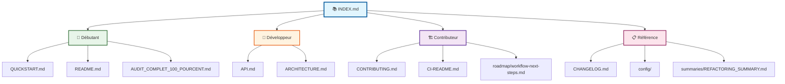
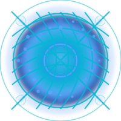
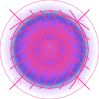
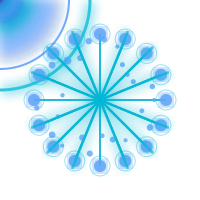
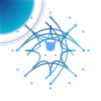
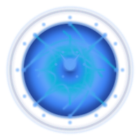
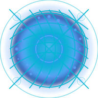
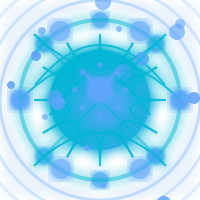
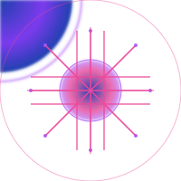
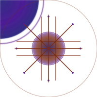

# 📚 Index de Documentation

<div align="center">

**🌙 Arkalia-LUNA Logo Generator**

*Documentation complète et organisée*

</div>

---

## 🎯 Vue d'Ensemble

<div align="center">

Bienvenue dans la documentation complète d'Arkalia-LUNA Logo Generator ! Cette documentation est organisée pour vous permettre de trouver rapidement l'information dont vous avez besoin.

</div>

### 📊 Navigation Rapide


```mermaid
graph TD
    A[📚 INDEX.md] --> B[🚀 Débutant]
    A --> C[🔧 Développeur]
    A --> D[🏗️ Contributeur]
    A --> E[📋 Référence]
    
    B --> B1[QUICKSTART.md]
    B --> B2[README.md]
    B --> B3[AUDIT_COMPLET_100_POURCENT.md]
    
    C --> C1[API.md]
    C --> C2[ARCHITECTURE.md]
    
    D --> D1[CONTRIBUTING.md]
    D --> D2[CI-README.md]
    D --> D3[roadmap/workflow-next-steps.md]
    
    E --> E1[CHANGELOG.md]
    E --> E2[config/]
    E --> E3[summaries/REFACTORING_SUMMARY.md]
    
    style A fill:#e1f5fe,stroke:#01579b,stroke-width:3px
    style B fill:#e8f5e9,stroke:#1b5e20,stroke-width:2px
    style C fill:#fff3e0,stroke:#e65100,stroke-width:2px
    style D fill:#f3e5f5,stroke:#4a148c,stroke-width:2px
    style E fill:#fce4ec,stroke:#880e4f,stroke-width:2px
```

### ⚡ Quick Links

<div align="center">

| Besoin | Document | Lien Direct |
|:------:|:--------:|:-----------:|
| **🚀 Démarrer rapidement** | QUICKSTART.md | [📘 Voir](QUICKSTART.md) |
| **📋 API complète** | API.md | [📘 Voir](API.md) |
| **🏗️ Architecture** | ARCHITECTURE.md | [📘 Voir](ARCHITECTURE.md) |
| **🤝 Contribuer** | CONTRIBUTING.md | [📘 Voir](CONTRIBUTING.md) |
| **🧠 ComfyUI** | COMFYUI.md | [📘 Voir](COMFYUI.md) |
| **📊 Roadmap** | roadmap/ROADMAP_SUMMARY.md | [📘 Voir](roadmap/ROADMAP_SUMMARY.md) |

</div>

## 📖 Documentation par Niveau d'Expertise

### 🚀 Débutant - Premiers Pas

<div align="center">

| Document | Description | Lien Direct |
|:--------:|:-----------:|:-----------:|
| **QUICKSTART.md** | Installation et premier logo en 5 minutes | [📘 Voir](QUICKSTART.md) |
| **README.md** | Vue d'ensemble du projet et fonctionnalités | [📘 Voir](../README.md) |
| **AUDIT_COMPLET_100_POURCENT.md** | 📊 Utilisation complète - Audit complet | [📘 Voir](audits/AUDIT_COMPLET_100_POURCENT.md) |

</div>

### 🔧 Développeur - Utilisation Avancée

<div align="center">

| Document | Description | Lien Direct |
|:--------:|:-----------:|:-----------:|
| **API.md** | Documentation complète de l'API Python | [📘 Voir](API.md) |
| **ARCHITECTURE.md** | Architecture technique et patterns de design | [📘 Voir](ARCHITECTURE.md) |
| **COMFYUI.md** | 🧠 ComfyUI + Hyper-AI Generator - Génération IA avancée (scripts start/stop inclus) | [📘 Voir](COMFYUI.md) |
| **GUIDE_COMFYUI_UTILISATION.md** | 🎨 Guide d'utilisation ComfyUI - Où faire le prompt ? (Méthode 1 vs Méthode 2) | [📘 Voir](GUIDE_COMFYUI_UTILISATION.md) |

</div>

### 🏗️ Contributeur - Développement

<div align="center">

| Document | Description | Lien Direct |
|:--------:|:-----------:|:-----------:|
| **CONTRIBUTING.md** | Guide de contribution et standards de code | [📘 Voir](CONTRIBUTING.md) |
| **CI-README.md** | Configuration CI/CD et tests | [📘 Voir](CI-README.md) |
| **workflow-next-steps.md** | 🚨 ROADMAP STRATÉGIQUE - Plan d'amélioration | [📘 Voir](roadmap/workflow-next-steps.md) |
| **ROADMAP_PROGRESS.md** | 📊 SUIVI DES PROGRÈS - Avancement détaillé | [📘 Voir](roadmap/ROADMAP_PROGRESS.md) |
| **ROADMAP_SUMMARY.md** | 🎯 SYNTHÈSE RAPIDE - Vue d'ensemble | [📘 Voir](roadmap/ROADMAP_SUMMARY.md) |

</div>

### 📋 Référence - Informations Techniques

<div align="center">

| Document | Description | Lien Direct |
|:--------:|:-----------:|:-----------:|
| **CHANGELOG.md** | Historique des versions et changements | [📘 Voir](../CHANGELOG.md) |
| **config/** | Configuration du projet et outils | [📁 Voir](../config/) |
| **REFACTORING_SUMMARY.md** | Résumé de la réorganisation | [📘 Voir](summaries/REFACTORING_SUMMARY.md) |
| **GITHUB_READY.md** | État du projet pour GitHub | [📘 Voir](github/GITHUB_READY.md) |
| **GITHUB_SETUP.md** | Configuration GitHub | [📘 Voir](github/GITHUB_SETUP.md) |
| **ANALYSE_FICHIERS_MD.md** | Analyse et nettoyage des fichiers markdown | [📘 Voir](misc/ANALYSE_FICHIERS_MD.md) |

</div>

## 🗂️ Organisation par Thème

### 🎨 Génération de Logos

<div align="center">

| Élément | Détails | Lien |
|:-------:|:-------:|:----:|
| **Styles disponibles** | 11 styles uniques | [📘 Voir API.md](API.md#styles-disponibles) |
| **Variantes émotionnelles** | 10 variantes | [📘 Voir API.md](API.md#variantes-émotionnelles) |
| **Formats d'export** | SVG haute qualité, PNG favicons | [📘 Voir QUICKSTART.md](QUICKSTART.md#export) |

</div>

**Styles disponibles** : Base, Dashboard, AI-Moon, Advanced, Simple-Advanced, Ultra-Max, Realism Max, Ultimate, AI, Cosmic, Hyper-AI

**Variantes émotionnelles** : Sérénité, Puissance, Mystère, Éveil, Énergie Créative, Pluie/Gris, Orage/Colère, Vive/Explosion, Ensoleillé, Neige

### 🎨 Exemples Visuels de Logos

<div align="center">

#### Variante Sérénité (Exemples)

| Style | Logo | Description |
|:-----:|:----:|:-----------:|
| **Dashboard** |  | Style professionnel épuré |
| **Ultra-Max** |  | Effets avancés et dynamiques |
| **Simple-Advanced** |  | Équilibre simplicité/sophistication |

#### Variante Puissance (Exemples)

| Style | Logo | Description |
|:-----:|:----:|:-----------:|
| **Dashboard** |  | Énergie professionnelle |
| **Ultra-Max** |  | Puissance dynamique |

#### Variante Mystère (Exemples)

| Style | Logo | Description |
|:-----:|:----:|:-----------:|
| **Dashboard** |  | Ambiance mystérieuse |
| **Ultra-Max** |  | Mystère intensifié |

</div>

### 🏗️ Architecture et Code

<div align="center">

| Élément | Détails | Lien |
|:-------:|:-------:|:----:|
| **Patterns de design** | Factory, Strategy, Template Method, Builder | [📘 Voir ARCHITECTURE.md](ARCHITECTURE.md#patterns-de-design) |
| **Structure modulaire** | Séparation des responsabilités | [📘 Voir ARCHITECTURE.md](ARCHITECTURE.md#structure-des-modules) |
| **Tests et qualité** | Couverture 75% (objectif 90%), 297 tests | [📘 Voir ARCHITECTURE.md](ARCHITECTURE.md#métriques-de-qualité) |

</div>

### 🚀 Utilisation et Développement

<div align="center">

| Élément | Description | Lien |
|:-------:|:-----------:|:----:|
| **Interface CLI** | Commandes complètes avec Rich | [📘 Voir QUICKSTART.md](QUICKSTART.md#via-interface-en-ligne-de-commande) |
| **API Python** | Interface programmatique complète | [📘 Voir API.md](API.md) |
| **Configuration** | Personnalisation avancée | [📘 Voir CONTRIBUTING.md](CONTRIBUTING.md#configuration) |

</div>

## 📁 **Structure des Fichiers**

```
docs/
├── INDEX.md                    # Ce fichier - Index de documentation
├── QUICKSTART.md              # Guide de démarrage rapide
├── API.md                     # Documentation complète de l'API
├── ARCHITECTURE.md            # Architecture technique
├── CONTRIBUTING.md            # Guide de contribution
├── CI-README.md               # Configuration CI/CD
├── README.md                  # Documentation du projet
├── roadmap/                   # 📊 Roadmap et progression
│   ├── workflow-next-steps.md     # **🚨 ROADMAP STRATÉGIQUE** - Plan d'amélioration par phases
│   ├── ROADMAP_PROGRESS.md        # **📊 SUIVI DES PROGRÈS** - Avancement détaillé
│   ├── ROADMAP_SUMMARY.md         # **🎯 SYNTHÈSE RAPIDE** - Vue d'ensemble
│   ├── PHASE2_UX_EXCEPTIONNELLE.md # **🎨 PHASE 2** - UX Exceptionnelle - Plan stratégique
│   ├── PHASE2_PROGRESS.md         # **📊 PHASE 2** - Suivi des progrès détaillé
│   └── PHASE3_PRODUCTION.md       # **🚀 PHASE 3** - Production & Déploiement - TERMINÉE ✅
├── summaries/                 # 📝 Résumés et statuts
│   └── REFACTORING_SUMMARY.md     # Résumé de la réorganisation
├── github/                    # 🔧 Configuration GitHub
│   ├── GITHUB_READY.md           # État du projet pour GitHub
│   └── GITHUB_SETUP.md           # Configuration GitHub
├── audits/                    # 🔍 Audits et intégrations
│   └── AUDIT_COMPLET_100_POURCENT.md  # Audit complet du potentiel du projet
├── misc/                      # 📋 Divers
│   ├── ANALYSE_FICHIERS_MD.md     # Analyse et nettoyage des fichiers markdown
│   ├── checklist-midjourney.md    # Checklist de qualité
│   └── reddit-post-content.md     # Contenu pour Reddit
└── briefs/                    # 🎨 Briefs créatifs
    ├── creative-brief.md      # Brief créatif principal
    └── midjourney-prompts.md  # Prompts MidJourney
```

## 🔍 **Recherche Rapide**

### **Par Mot-Clé**

| Mot-Clé | Fichier | Section |
|---------|---------|---------|
| **Installation** | [QUICKSTART.md](QUICKSTART.md) | Installation en 5 minutes |
| **Premier logo** | [QUICKSTART.md](QUICKSTART.md) | Premier logo en 2 minutes |
| **API Python** | [API.md](API.md) | Classes et méthodes |
| **Architecture** | [ARCHITECTURE.md](ARCHITECTURE.md) | Patterns et structure |
| **Tests** | [CONTRIBUTING.md](CONTRIBUTING.md) | Tests et qualité |
| **Contribution** | [CONTRIBUTING.md](CONTRIBUTING.md) | Guide complet |
| **CI/CD** | [CI-README.md](CI-README.md) | Configuration |
| **Versions** | [CHANGELOG.md](../CHANGELOG.md) | Historique |

### **Par Tâche**

| Tâche | Fichier | Section |
|-------|---------|---------|
| **Installer le projet** | [QUICKSTART.md](QUICKSTART.md) | Installation rapide |
| **Générer un logo** | [QUICKSTART.md](QUICKSTART.md) | Premier logo |
| **Utiliser l'API** | [API.md](API.md) | Exemples d'utilisation |
| **Ajouter un style** | [CONTRIBUTING.md](CONTRIBUTING.md) | Nouvelles fonctionnalités |
| **Configurer CI/CD** | [CI-README.md](CI-README.md) | Configuration CI |
| **Comprendre l'architecture** | [ARCHITECTURE.md](ARCHITECTURE.md) | Vue d'ensemble |
| **Suivre la roadmap** | [roadmap/workflow-next-steps.md](roadmap/workflow-next-steps.md) | **🚨 Plan d'amélioration** |
| **Phase 2 UX** | [roadmap/PHASE2_UX_EXCEPTIONNELLE.md](roadmap/PHASE2_UX_EXCEPTIONNELLE.md) | **🎨 UX Exceptionnelle** |
| **Progrès Phase 2** | [roadmap/PHASE2_PROGRESS.md](roadmap/PHASE2_PROGRESS.md) | **📊 Suivi détaillé** |
| **Phase 3 Production** | [roadmap/PHASE3_PRODUCTION.md](roadmap/PHASE3_PRODUCTION.md) | **🚀 Déploiement TERMINÉ** ✅ (Grafana avancé, histogrammes, CI Artillery) |

## 🎯 **Parcours Recommandés**

### **🚀 Nouveau Utilisateur**
1. **[QUICKSTART.md](QUICKSTART.md)** - Installation et premier logo
2. **[README.md](../README.md)** - Vue d'ensemble des fonctionnalités
3. **[audits/AUDIT_COMPLET_100_POURCENT.md](audits/AUDIT_COMPLET_100_POURCENT.md)** - Utiliser 100% du potentiel
4. **[API.md](API.md)** - Utilisation programmatique

### **🧪 Structure des Tests**


```mermaid
graph TD
    A[📁 Tests/] --> B[🔧 Tests de Base]
    A --> C[📊 Tests de Couverture]
    A --> D[⚡ Tests de Performance]
    A --> E[🎨 Tests Spécialisés]
    
    %% Tests de base
    B --> B1[test_all_generators.py]
    B --> B2[test_variants.py]
    B --> B3[test_svg_builders.py]
    
    %% Tests de couverture
    C --> C1[test_cli_coverage.py]
    C --> C2[test_generator_factory_coverage.py]
    C --> C3[test_svg_builder_ultimate_coverage.py]
    C --> C4[test_ultimate_generator_coverage.py]
    C --> C5[test_realism_max_generator_coverage.py]
    
    %% Tests de performance
    D --> D1[test_benchmark.py]
    
    %% Tests spécialisés
    E --> E1[test_advanced.py]
    E --> E2[test_ai_moon.py]
    E --> E3[test_dashboard.py]
    
    %% Styles
    classDef base fill:#e8f5e8,stroke:#2e7d32,stroke-width:2px
    classDef coverage fill:#e3f2fd,stroke:#1565c0,stroke-width:2px
    classDef performance fill:#fff3e0,stroke:#f57c00,stroke-width:2px
    classDef special fill:#fce4ec,stroke:#c2185b,stroke-width:2px
    
    class B,B1,B2,B3 base
    class C,C1,C2,C3,C4,C5 coverage
    class D,D1 performance
    class E,E1,E2,E3 special
```

### **🔧 Développeur Intégrant**
1. **[API.md](API.md)** - Documentation de l'API
2. **[QUICKSTART.md](QUICKSTART.md)** - Exemples d'utilisation
3. **[ARCHITECTURE.md](ARCHITECTURE.md)** - Compréhension technique

### **🏗️ Contributeur Développeur**
1. **[CONTRIBUTING.md](CONTRIBUTING.md)** - Standards et workflow
2. **[ARCHITECTURE.md](ARCHITECTURE.md)** - Architecture du code
3. **[CI-README.md](CI-README.md)** - Tests et qualité

### **📚 Mainteneur Projet**
1. **[ARCHITECTURE.md](ARCHITECTURE.md)** - Vue d'ensemble technique
2. **[CONTRIBUTING.md](CONTRIBUTING.md)** - Standards de contribution
3. **[CI-README.md](CI-README.md)** - Infrastructure et déploiement

## 🔗 **Liens Externes**

### **Projet GitHub**
- **Repository** : [arkalia-luna/logo](https://github.com/arkalia-luna/logo)
- **Issues** : [GitHub Issues](https://github.com/arkalia-luna/logo/issues)
- **Discussions** : [GitHub Discussions](https://github.com/arkalia-luna/logo/discussions)
- **Actions** : [GitHub Actions](https://github.com/arkalia-luna/logo/actions)

### **Documentation en Ligne**
- **PyPI** : [arkalia-luna-logo](https://pypi.org/project/arkalia-luna-logo/)
- **ReadTheDocs** : [Documentation en ligne](https://arkalia-luna-logo.readthedocs.io/)

### **Ressources Supplémentaires**
- **Demos** : [Démonstrations HTML](../demos/)
- **Exports** : [Logos générés](../exports/)
- **Tests** : [Tests unitaires](../tests/)

## 📝 **Mise à Jour de la Documentation**

### **Quand Mettre à Jour**
- **Nouvelle fonctionnalité** : Mettre à jour [API.md](API.md) et [README.md](../README.md)
- **Changement d'architecture** : Mettre à jour [ARCHITECTURE.md](ARCHITECTURE.md)
- **Nouveau guide** : Ajouter dans cet index
- **Correction** : Mettre à jour le fichier concerné

### **Standards de Documentation**
- **Format** : Markdown avec emojis pour la lisibilité
- **Structure** : Hiérarchie claire avec titres et sous-titres
- **Exemples** : Code fonctionnel et commenté
- **Liens** : Navigation interne et externe
- **Version** : Indiquer la version de la documentation

## 🎨 Showcase Visuel

<div align="center">

### 🌟 Galerie de Tous les Styles

**Variante Sérénité - Comparaison Visuelle**

| Style | Logo | Performance | Complexité |
|:-----:|:----:|:-----------:|:----------:|
| **🌙 Base** |  | ⚡ ~0.002s | ⭐ Simple |
| **📊 Dashboard** |  | ⚡ ~0.004s | ⭐⭐ Modéré |
| **🌙 AI-Moon** |  | ✅ ~0.007s | ⭐⭐⭐ Avancé |
| **🎨 Advanced** |  | ✅ ~0.006s | ⭐⭐⭐ Avancé |
| **⚡ Simple-Advanced** |  | ⚡ ~0.005s | ⭐⭐ Modéré |
| **🚀 Ultra-Max** |  | ✅ ~0.008s | ⭐⭐⭐⭐ Complexe |
| **🌍 Realism Max** |  | 🏆 ~0.002s | ⭐⭐⭐ Avancé |
| **🌟 Ultimate** |  | ✅ ~0.007s | ⭐⭐⭐⭐⭐ Extrême |

</div>

### 🎭 Comparaison des Variantes

<div align="center">

**Style Dashboard - Toutes les Variantes**

| Variante | Logo | Caractéristique |
|:--------:|:----:|:---------------:|
| **🌙 Sérénité** |  | Calme et mystique |
| **⚡ Puissance** |  | Énergique et dynamique |
| **🔮 Mystère** |  | Intrigant et mystérieux |
| **✨ Éveil** |  | Lumineux et éclairé |
| **🎇 Créative** |  | Coloré et créatif |

</div>

### 📱 Favicons Disponibles

<div align="center">

| Variante | Favicon 32x32 | Usage |
|:--------:|:-------------:|:-----:|
| **🌙 Sérénité** |  | Applications calmes |
| **⚡ Puissance** |  | Applications dynamiques |
| **🔮 Mystère** |  | Applications créatives |
| **✨ Éveil** |  | Applications éducatives |
| **🎇 Créative** |  | Applications design |

</div>

## 🆘 Besoin d'Aide ?

<div align="center">

| Question | Document | Lien Direct |
|:--------:|:--------:|:-----------:|
| **Installation** | QUICKSTART.md | [📘 Voir](QUICKSTART.md) |
| **Utilisation** | API.md | [📘 Voir](API.md) |
| **Développement** | CONTRIBUTING.md | [📘 Voir](CONTRIBUTING.md) |

</div>

### 🤝 Support Communautaire

<div align="center">

| Support | Description | Lien |
|:-------:|:-----------:|:----:|
| **GitHub Issues** | Bugs et demandes de fonctionnalités | [📘 Voir](https://github.com/arkalia-luna/logo/issues) |
| **GitHub Discussions** | Questions et discussions | [📘 Voir](https://github.com/arkalia-luna/logo/discussions) |
| **Pull Requests** | Contributions de code | [📘 Voir](https://github.com/arkalia-luna/logo/pulls) |

</div>

---

**📚 Documentation organisée et maintenue - Version 2.0.0**

*Dernière mise à jour : Novembre 2025*
