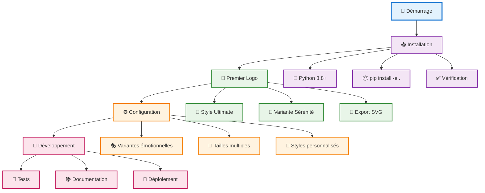

# 🚀 Guide de Démarrage Rapide - Arkalia-LUNA Logo Generator

## ⚡ **Installation en 5 Minutes**

### **Prérequis Système**

- **Python** : 3.8 ou supérieur
- **Pip** : Gestionnaire de packages Python
- **Git** : Contrôle de version (optionnel)

### **Installation Rapide**

```bash
# 1. Cloner le projet
git clone https://github.com/arkalia-luna/logo.git
cd logo

# 2. Créer l'environnement virtuel
python -m venv arkalia-luna-env

# 3. Activer l'environnement
# Sur macOS/Linux :
source arkalia-luna-env/bin/activate
# Sur Windows :
arkalia-luna-env\Scripts\activate

# 4. Installer le package
pip install -e .

# 5. Vérifier l'installation
arkalia-luna-logo --help
```

### **Installation avec Conda (Alternative)**

```bash
# Créer l'environnement Conda
conda create -n arkalia-luna python=3.10
conda activate arkalia-luna

# Installer les dépendances
pip install -e .
```

## 🎯 **Premier Logo en 2 Minutes**

### **Via Interface en Ligne de Commande**

```bash
# Générer un logo ULTIME (recommandé)
arkalia-luna-logo generate serenity --style ultimate

# Générer tous les logos d'un style
arkalia-luna-logo generate-all --style ultimate

# Créer des favicons
arkalia-luna-logo favicon-all
```

### **Via Code Python**

```python
# Import rapide
from src.ultimate_generator import UltimateLogoGenerator

# Créer et utiliser
generator = UltimateLogoGenerator()
svg_path = generator.generate_single_logo("serenity", size=200)

print(f"Logo généré : {svg_path}")
```

## 🔄 **Flux de Travail Recommandé**



## 🌙 **Styles Disponibles Immédiatement**

### **1. ULTIME (Recommandé pour commencer)**

```bash
arkalia-luna-logo generate serenity --style ultimate
```

**Pourquoi commencer par ULTIME ?**
- ✅ Effets cosmiques ultra-réalistes
- ✅ 100+ stops de gradients holographiques
- ✅ Qualité professionnelle garantie
- ✅ Compatible tous les usages

### **2. AI-MOON (Style organique)**

```bash
arkalia-luna-logo generate power --style ai_moon
```

**Idéal pour :**
- Applications IA et machine learning
- Interfaces organiques et fluides
- Projets innovants et futuristes

### **3. Dashboard (Style professionnel)**

```bash
arkalia-luna-logo generate mystery --style dashboard
```

**Parfait pour :**
- Applications d'entreprise
- Interfaces utilisateur
- Documentation technique

## 🎨 **Variantes Émotionnelles**

### **Les 5 Variantes Disponibles**

| Variante | Description | Utilisation |
|----------|-------------|-------------|
| **Sérénité** | Halo doux, pulsations lentes | Applications calmes, méditation |
| **Puissance** | Halo vibrant, réseau accéléré | Applications dynamiques, gaming |
| **Mystère** | Brumes mouvantes, réseau irrégulier | Applications créatives, art |
| **Éveil** | Halo rayonnant, Λ-core clair | Applications éducatives, sagesse |
| **Énergie Créative** | Flux rapides, reflets multicolores | Applications créatives, design |

### **Génération de Toutes les Variantes**

```bash
# Toutes les variantes d'un style
arkalia-luna-logo generate-all --style ultimate

# Variantes spécifiques
arkalia-luna-logo generate serenity power --style ultimate
```

## 📁 **Structure des Exports**

### **Organisation Automatique**

```
exports/
├── unified/                      # Organisation par style
│   ├── logos/
│   │   ├── ultimate/            # Logos ULTIME
│   │   ├── ai_moon/            # Logos AI-MOON
│   │   └── dashboard/          # Logos Dashboard
│   └── favicons/               # Favicons PNG
├── svg/                         # Logos SVG individuels
└── *.png                        # Favicons PNG individuels
```

### **Nommage des Fichiers**

- **Format** : `arkalia-luna-{style}-{variant}-{size}.svg`
- **Exemple** : `arkalia-luna-ultimate-serenity-200.svg`
- **Tailles** : 100, 200, 300, 400, 500 pixels

## 🔧 **Configuration Avancée**

### **Personnalisation des Couleurs**

```python
from src.ultimate_generator import UltimateLogoGenerator

generator = UltimateLogoGenerator(
    custom_colors={
        "primary": "#1a1a2e",      # Bleu profond
        "secondary": "#16213e",    # Bleu marine
        "accent": "#0f3460"        # Bleu accent
    }
)
```

### **Paramètres de Génération**

```python
# Personnalisation complète
generator = UltimateLogoGenerator(
    output_dir="custom_exports",
    enable_animations=True,
    enable_glow_effects=True,
    custom_effects={
        "glow_intensity": 1.0,
        "animation_speed": 1.5
    }
)
```

## 🧪 **Tests et Validation**

### **Vérification de l'Installation**

```bash
# Tests de base
pytest tests/ -v

# Tests avec couverture
pytest --cov=src --cov-report=html

# Tests de performance
pytest --benchmark-only
```

### **Validation des Logos Générés**

```bash
# Vérifier la structure des exports
arkalia-luna-logo info

# Lister les variantes disponibles
arkalia-luna-logo list-variants

# Vérifier la qualité des logos
arkalia-luna-logo validate-all
```

## 🚨 **Résolution de Problèmes**

### **Problèmes Courants**

#### **1. Erreur d'Import**

```bash
# Solution : Réinstaller le package
pip uninstall arkalia-luna-logo
pip install -e .
```

#### **2. Dépendances Manquantes**

```bash
# Solution : Installer les dépendances de développement
pip install -e ".[dev]"
```

#### **3. Erreur de Permissions**

```bash
# Solution : Vérifier les permissions du dossier exports
chmod 755 exports/
```

### **Logs de Débogage**

```bash
# Activer le mode verbeux
arkalia-luna-logo --verbose generate serenity --style ultimate

# Logs détaillés
export ARKALIA_LUNA_DEBUG=1
arkalia-luna-logo generate serenity --style ultimate
```

## 📚 **Prochaines Étapes**

### **1. Explorer les Styles**

```bash
# Tester tous les styles
for style in ultimate ai_moon dashboard ultra_max simple_advanced; do
    arkalia-luna-logo generate serenity --style $style
done
```

### **2. Personnaliser les Logos**

```python
# Créer des variantes personnalisées
from src.variants import LogoVariant, ColorScheme

custom_variant = LogoVariant(
    name="Personnalisé",
    description="Ma variante unique",
    animation_speed=1.2,
    glow_intensity=0.9,
    color_scheme=ColorScheme.SERENITY
)
```

### **3. Intégrer dans un Projet**

```python
# Utilisation dans une application Flask
from flask import Flask, send_file
from src.ultimate_generator import UltimateLogoGenerator

app = Flask(__name__)
generator = UltimateLogoGenerator()

@app.route('/logo/<variant>')
def get_logo(variant):
    svg_path = generator.generate_single_logo(variant, size=200)
    return send_file(svg_path, mimetype='image/svg+xml')
```

## 🎉 **Félicitations !**

Vous avez maintenant :
- ✅ Installé Arkalia-LUNA Logo Generator
- ✅ Généré votre premier logo
- ✅ Compris l'architecture du projet
- ✅ Personnalisé vos premiers logos

**Prochaine étape** : Consultez la [documentation API complète](API.md) pour explorer toutes les fonctionnalités avancées !

---

**🚀 Guide créé pour une prise en main rapide et efficace - Version 2.0.0**
