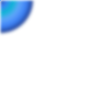
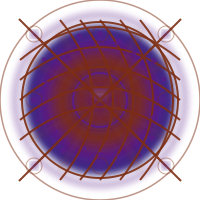
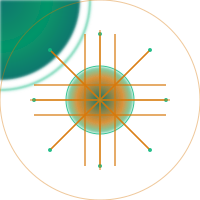
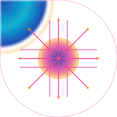
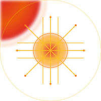
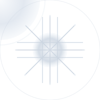

# 🌙 Arkalia-LUNA Logo Project

<div align="center">

**🎯 Générateur de Logos Techno-Mystiques**

*Fusionnant IA futuriste et mysticisme lunaire*

</div>

---

## 🎯 Objectif

<div align="center">

Créer l'identité visuelle complète d'Arkalia-LUNA : un logo techno-mystique fusionnant IA futuriste et mysticisme lunaire.

</div>

## 📁 Structure du Projet

```
arkalia-luna-logo/
├── assets/           # Ressources visuelles
│   ├── concepts/     # Concepts initiaux DALL-E
│   ├── generated/    # Images générées MidJourney
│   └── final/        # Logos finaux validés
├── src/              # Code source Python
│   ├── *_generator.py    # Générateurs de logos
│   ├── svg_builder*.py   # Builders SVG spécialisés
│   ├── generator_factory.py  # Factory pattern
│   └── cli.py         # Interface en ligne de commande
├── exports/          # Exports finaux
│   ├── *.svg         # Logos SVG générés
│   ├── *.png         # Favicons PNG
│   └── demo-gif/     # Démonstrations animées
└── docs/             # Documentation
    ├── briefs/       # Briefs créatifs
    ├── specs/        # Spécifications techniques
    └── guidelines/   # Guide d'utilisation
```

## 🚀 Workflow

1. **Génération Python** → 11 générateurs de logos SVG
2. **Variantes émotionnelles** → 10 variantes (5 de base + 5 dynamiques)
3. **Export SVG/PNG** → Formats vectoriels et raster
4. **API FastAPI** → Interface REST pour génération
5. **Docker** → Infrastructure de production complète ✅ **MIS À JOUR**

## 🎨 Variantes Émotionnelles

<div align="center">

| Variante | Logo Exemple | Description | Caractéristiques |
|:--------:|:------------:|:-----------:|:----------------:|
| 🌙 **Sérénité** |  | Halo doux, pulsations lentes | Ambiance calme et mystique |
| ⚡ **Puissance** |  | Halo vibrant, réseau accéléré | Énergie intense et dynamique |
| 🔮 **Mystère** |  | Brumes mouvantes, réseau irrégulier | Ambiance mystérieuse et intrigante |
| ✨ **Éveil/Sagesse** |  | Halo rayonnant, Λ-core clair | Sagesse éclairée et lumineuse |
| 🎇 **Énergie créative** |  | Flux rapides, reflets multicolores | Créativité débordante et colorée |
| 🌧️ **Pluie** |  | Ambiance pluvieuse, réseau apaisé | Dynamique douce et apaisante |
| ⛈️ **Orage** |  | Énergie électrique, réseau intense | Dynamique puissante et explosive |
| 💥 **Explosive** |  | Énergie maximale, réseau accéléré | Dynamique extrême et vive |
| ☀️ **Ensoleillé** |  | Luminosité intense, réseau clair | Dynamique lumineuse et positive |
| ❄️ **Neige** |  | Pureté cristalline, réseau apaisé | Dynamique calme et sereine |

</div>

## 🛠️ Technologies

<div align="center">

| Catégorie | Technologies |
|:---------:|:------------:|
| **Génération** | Python, SVG builders |
| **Vectoriel** | SVG natif |
| **API** | FastAPI |
| **Infrastructure** | Docker Compose (5 services) |
| **Export** | PNG, SVG |
| **Monitoring** | Prometheus + Grafana |

</div>

## 📋 Checklist de Qualité

<div align="center">

| Critère | Statut | Description |
|:-------:|:-------:|:-------------|
| ✅ | **Lisibilité** | Visible en petit format (favicon, CLI) |
| ✅ | **Réseau neuronal** | Organique et vivant |
| ✅ | **Halo** | Respirant et élégant |
| ✅ | **Λ-core** | Visible et rayonnant |
| ✅ | **Palette** | Bleu + iridescences cohérentes |
| ✅ | **Mystique** | Raffiné (pas cheap/occult) |
| ✅ | **Tech** | Organique (pas angulaire/rigide) |
| ✅ | **Profondeur** | Cosmique (pas plat/superficiel) |

</div>

## 🎯 Prochaines Étapes

<div align="center">

| Étape | Action | Statut |
|:-----:|:------:|:------:|
| 1️⃣ | Générer tous les logos | ✅ Fait |
| 2️⃣ | Tester toutes les variantes | ✅ Fait |
| 3️⃣ | API FastAPI opérationnelle | ✅ Fait |
| 4️⃣ | Infrastructure Docker | ✅ Fait |
| 5️⃣ | Monitoring Prometheus/Grafana | ✅ Fait |

</div>

---

<div align="center">

**🌙 Arkalia-LUNA Logo Project**

*Créé avec passion pour l'art techno-mystique*

</div>
