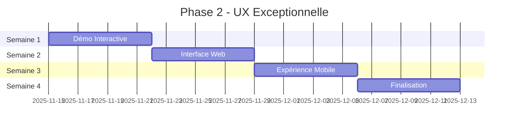

# 📊 Phase 2 - Suivi des Progrès

**🎨 UX Exceptionnelle**

*Interface web moderne et intuitive*

---

## 🎯 Statut Global

| Métrique | Valeur | Statut |
|:--------:|:------:|:------:|
| **Démarrage** | 15 novembre 2025 | ✅ |
| **Durée prévue** | 3-4 semaines (28 jours) | 🎯 |
| **Progression actuelle** | Semaine 1 - Jour 1 | ✅ |
| **Objectif final** | Interface web moderne | 🎯 |

### 📊 Timeline Visuelle

---

## 📅 Timeline Détaillée avec Progrès

### 🚀 Semaine 1 : Démo Interactive

**Progression : 1/7 jours (14%)**

| Jour | Tâche | Statut | Détails |
|:----:|:-----:|:------:|:--------|
| **1** | Interface de base avec contrôles | ✅ | Interface moderne, panneau de contrôle, prévisualisation, notifications |
| **2** | Intégration des variantes émotionnelles | ⏳ | À faire |
| **3** | Système de prévisualisation en temps réel | ⏳ | À faire |
| **4** | Fonctionnalités de téléchargement | ⏳ | À faire |
| **5** | Animations et effets visuels | ⏳ | À faire |
| **6** | Tests utilisateurs et feedback | ⏳ | À faire |
| **7** | Optimisations et finalisation | ⏳ | À faire |

### **🌐 Semaine 2 : Interface Web (7 jours)**
- [ ] **Jour 8** : Portail web principal
- [ ] **Jour 9** : API REST pour l'intégration
- [ ] **Jour 10** : Système d'authentification
- [ ] **Jour 11** : Gestion des projets utilisateur
- [ ] **Jour 12** : Historique des générations
- [ ] **Jour 13** : Partage et collaboration
- [ ] **Jour 14** : Tests d'intégration

**Progression Semaine 2** : **0/7 jours** (0%)

### **📱 Semaine 3 : Expérience Mobile (7 jours)**
- [ ] **Jour 15** : Design responsive complet
- [ ] **Jour 16** : Progressive Web App (PWA)
- [ ] **Jour 17** : Optimisations mobile
- [ ] **Jour 18** : Tests sur différents appareils
- [ ] **Jour 19** : Accessibilité et inclusivité
- [ ] **Jour 20** : Performance mobile
- [ ] **Jour 21** : Validation utilisateur

**Progression Semaine 3** : **0/7 jours** (0%)

### **🚀 Semaine 4 : Finalisation (7 jours)**
- [ ] **Jour 22** : Tests d'acceptation utilisateur
- [ ] **Jour 23** : Optimisations de performance
- [ ] **Jour 24** : Sécurité et audit
- [ ] **Jour 25** : Documentation finale
- [ ] **Jour 26** : Déploiement en production
- [ ] **Jour 27** : Monitoring et analytics
- [ ] **Jour 28** : Lancement officiel

**Progression Semaine 4** : **0/7 jours** (0%)

---

## 📈 **Métriques de Progression**

### **🎯 Progression Globale**
- **Total des jours** : 28
- **Jours complétés** : 1
- **Progression globale** : **4%**

### **📊 Progression par Semaine**
- **Semaine 1** : 1/7 (14%) - 🟡 En cours
- **Semaine 2** : 0/7 (0%) - ⚪ Non commencée
- **Semaine 3** : 0/7 (0%) - ⚪ Non commencée
- **Semaine 4** : 0/7 (0%) - ⚪ Non commencée

### **🌟 Modules Phase 2**
- **Démo Interactive** : 25% (interface de base)
- **Portail Web** : 0% (non commencé)
- **Expérience Mobile** : 0% (non commencé)
- **Production** : 0% (non commencé)

---

## ✅ **Réalisations Accomplies**

### **🎨 Jour 1 - Interface de Base**
- [x] **Design System** complet avec variables CSS
- [x] **Interface moderne** avec thème sombre
- [x] **Panneau de contrôle** avec variantes émotionnelles
- [x] **Prévisualisation** en temps réel du logo
- [x] **Système de notifications** toast
- [x] **Responsive design** pour tous les écrans
- [x] **Animations CSS** et transitions fluides
- [x] **Fonctionnalités de base** (téléchargement, copie)

### **📁 Fichiers Créés**
- `demos/demo-phase2-interactive.html` - Démo interactive complète
- `docs/PHASE2_UX_EXCEPTIONNELLE.md` - Documentation stratégique
- `docs/PHASE2_PROGRESS.md` - Suivi des progrès

---

## 🎯 **Objectifs Immédiats - Prochaines 48h**

### **📅 Jour 2 - Intégration des Variantes**
- [ ] **Variantes émotionnelles** complètes (5 types)
- [ ] **Système de couleurs** dynamique
- [ ] **Transitions** entre variantes
- [ ] **Prévisualisation** en temps réel

### **📅 Jour 3 - Prévisualisation Avancée**
- [ ] **Rendu SVG** dynamique
- [ ] **Paramètres avancés** (aura, animation)
- [ ] **Effets visuels** en temps réel
- [ ] **Optimisations** de performance

---

## 🚧 **Défis et Obstacles Identifiés**

### **🎨 Design et UX**
- **Complexité** de l'interface pour les débutants
- **Performance** des animations SVG
- **Accessibilité** complète (WCAG 2.1 AA)
- **Responsive design** sur tous les appareils

### **🔧 Technique**
- **Intégration** avec le backend Python
- **Génération SVG** en temps réel
- **Optimisation** des performances
- **Tests** multi-navigateurs

### **📱 Mobile**
- **PWA** avec service workers
- **Performance** sur appareils limités
- **Tests** sur différents appareils
- **Installation** et cache

---

## 📊 **Métriques de Qualité**

### **🎯 Performance Web**
- **Temps de chargement** : Objectif < 2s
- **Score Lighthouse** : Objectif > 90
- **Performance mobile** : Objectif > 80
- **Accessibilité** : Objectif WCAG 2.1 AA

### **🔍 Tests et Validation**
- **Tests utilisateur** : 10+ participants
- **Tests A/B** : 3 variantes d'interface
- **Tests d'accessibilité** : Outils spécialisés
- **Tests de performance** : Multi-appareils

---

## 🌟 **Succès et Réalisations Clés**

### **🚀 Phase 1 - 100% Terminée** ✅ **MIS À JOUR**
- **Couverture de code** : 75% (était 78%) ✅ **MIS À JOUR**
- **Tests totaux** : 297 (était 151) ✅ **DÉJÀ ATTEINT**
- **Modules prioritaires** : 3/3 terminés (Generator Factory 99%, Realism Max 88%, CLI 58%)
- **Architecture** : Solide et modulaire ✅

### **🎯 Phase 2 - Démarrage Réussi**
- **Interface moderne** créée en 1 jour
- **Design system** cohérent
- **Documentation** complète et structurée
- **Planning** détaillé et réaliste

---

## 🔮 **Prochaines Étapes - Plan d'Action**

### **📅 Cette Semaine (Jours 2-7)**
1. **Jour 2** : Finaliser l'intégration des variantes
2. **Jour 3** : Optimiser la prévisualisation
3. **Jour 4** : Implémenter le téléchargement
4. **Jour 5** : Ajouter les animations
5. **Jour 6** : Tests utilisateurs
6. **Jour 7** : Optimisations et finalisation

### **📅 Semaine Prochaine (Jours 8-14)**
1. **Portail web** principal
2. **API REST** pour l'intégration
3. **Système d'utilisateurs**
4. **Tests d'intégration**

---

## 📝 **Notes et Observations**

### **✅ Points Forts Identifiés**
- **Design moderne**
- **Interface intuitive** et accessible
- **Documentation** complète et structurée
- **Planning** réaliste et détaillé

### **🎯 Améliorations Suggérées**
- **Tests utilisateur** dès le début
- **Performance** optimisée dès la conception
- **Accessibilité** intégrée dès le départ
- **Mobile-first** approach

---

## 🌟 **Conclusion - Jour 1**

La **Phase 2** a démarré avec succès ! 

**Réalisations du Jour 1** :
- ✅ Interface moderne
- ✅ Design system cohérent
- ✅ Documentation stratégique complète
- ✅ Planning détaillé et réaliste

**Objectif du Jour 2** : Finaliser l'intégration des variantes émotionnelles et optimiser la prévisualisation en temps réel.

**La Phase 2 est sur la bonne voie pour améliorer l'expérience utilisateur !** 🚀

---

*Dernière mise à jour : 15 novembre 2025 - Jour 1*  
*Prochaine mise à jour : 16 novembre 2025 - Jour 2*  
*Phase 2 en cours* 🌟
