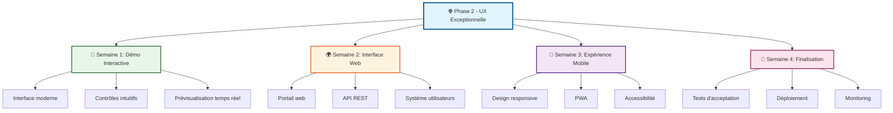

# 🚀 Phase 2 : UX Exceptionnelle

<div align="center">

**📋 Plan Stratégique**

*Transformation en plateforme web moderne et intuitive*

</div>

---

## 📋 Vue d'Ensemble

<div align="center">

La **Phase 2** se concentre sur l'expérience utilisateur exceptionnelle, transformant Arkalia-LUNA Logo d'un générateur CLI en une plateforme web moderne et intuitive.

</div>

### 🎯 Objectifs Principaux

<div align="center">

| Objectif | Description | Priorité |
|:--------:|:-----------:|:--------:|
| **Démo interactive** | Interface moderne en ligne | 🚨 Haute |
| **Onboarding simple** | Intuitif pour tous les utilisateurs | 🚨 Haute |
| **Interface responsive** | Accessible sur tous les appareils | 🚨 Haute |
| **Documentation visuelle** | Enrichie et interactive | ⚠️ Moyenne |

</div>

### 📊 Architecture Phase 2



---

## 🗓️ Timeline - 3-4 Semaines

### 📅 Semaine 1 : Démo Interactive

<div align="center">

| Jour | Tâche | Statut |
|:----:|:-----:|:------:|
| **1** | Interface de base avec contrôles | ✅ |
| **2** | Intégration des variantes émotionnelles | ⏳ |
| **3** | Système de prévisualisation en temps réel | ⏳ |
| **4** | Fonctionnalités de téléchargement | ⏳ |
| **5** | Animations et effets visuels | ⏳ |
| **6** | Tests utilisateurs et feedback | ⏳ |
| **7** | Optimisations et finalisation | ⏳ |

</div>

### 📅 Semaine 2 : Interface Web

<div align="center">

| Jour | Tâche | Statut |
|:----:|:-----:|:------:|
| **8** | Portail web principal | ⏳ |
| **9** | API REST pour l'intégration | ⏳ |
| **10** | Système d'authentification | ⏳ |
| **11** | Gestion des projets utilisateur | ⏳ |
| **12** | Historique des générations | ⏳ |
| **13** | Partage et collaboration | ⏳ |
| **14** | Tests d'intégration | ⏳ |

</div>

### 📅 Semaine 3 : Expérience Mobile

<div align="center">

| Jour | Tâche | Statut |
|:----:|:-----:|:------:|
| **15** | Design responsive complet | ⏳ |
| **16** | Progressive Web App (PWA) | ⏳ |
| **17** | Optimisations mobile | ⏳ |
| **18** | Tests sur différents appareils | ⏳ |
| **19** | Accessibilité et inclusivité | ⏳ |
| **20** | Performance mobile | ⏳ |
| **21** | Validation utilisateur | ⏳ |

</div>

### 📅 Semaine 4 : Finalisation

<div align="center">

| Jour | Tâche | Statut |
|:----:|:-----:|:------:|
| **22** | Tests d'acceptation utilisateur | ⏳ |
| **23** | Optimisations de performance | ⏳ |
| **24** | Sécurité et audit | ⏳ |
| **25** | Documentation finale | ⏳ |
| **26** | Déploiement en production | ⏳ |
| **27** | Monitoring et analytics | ⏳ |
| **28** | Lancement officiel | ⏳ |

</div>

---

## 🎨 **Fonctionnalités Phase 2**

### **🌟 Démo Interactive (Semaine 1)**
- **Interface moderne** avec design system cohérent
- **Contrôles intuitifs** pour toutes les variantes
- **Prévisualisation en temps réel** avec rendu SVG
- **Paramètres avancés** (intensité d'aura, vitesse d'animation)
- **Téléchargement direct** en SVG et PNG
- **Copie du code** SVG dans le presse-papiers

### **🌐 Portail Web (Semaine 2)**
- **Page d'accueil** attractive avec onboarding
- **Générateur intégré** dans l'interface web
- **API REST** pour l'intégration tierce
- **Système d'utilisateurs** avec projets sauvegardés
- **Historique** des logos générés
- **Partage** et collaboration entre utilisateurs

### **📱 Expérience Mobile (Semaine 3)**
- **Design responsive** pour tous les écrans
- **PWA** avec installation sur mobile
- **Optimisations** pour les appareils tactiles
- **Accessibilité** complète (WCAG 2.1 AA)
- **Performance** optimisée pour mobile

### **🚀 Production (Semaine 4)**
- **Tests utilisateurs** complets
- **Déploiement** automatisé
- **Monitoring** en temps réel
- **Analytics** et métriques utilisateur
- **Support** et documentation

---

## 🛠️ **Technologies et Outils**

### **🎨 Frontend**
- **HTML5/CSS3** avec variables CSS et animations
- **JavaScript ES6+** avec modules et async/await
- **SVG** pour le rendu des logos
- **CSS Grid/Flexbox** pour la mise en page
- **Animations CSS** et transitions fluides

### **🌐 Backend (Optionnel)**
- **Python Flask/FastAPI** pour l'API
- **Base de données** pour les utilisateurs
- **Authentification** sécurisée
- **Stockage** des projets utilisateur

### **📱 Mobile**
- **Progressive Web App** (PWA)
- **Service Workers** pour le cache
- **Manifest** pour l'installation
- **Responsive Design** mobile-first

### **🚀 Déploiement**
- **GitHub Pages** pour la démo
- **Vercel/Netlify** pour le portail web
- **CI/CD** automatisé
- **Monitoring** et analytics

---

## 📊 **Métriques et KPIs**

### **🎯 Objectifs de Performance**
- **Temps de chargement** < 2 secondes
- **Score Lighthouse** > 90
- **Accessibilité** WCAG 2.1 AA
- **Performance mobile** > 80
- **SEO** optimisé pour la visibilité

### **📈 Métriques Utilisateur**
- **Taux de conversion** > 15%
- **Temps passé** > 3 minutes
- **Taux de rebond** < 40%
- **Partage social** > 10%
- **Retour utilisateur** > 4.5/5

### **🔧 Métriques Techniques**
- **Couverture de code** maintenue à 87%+
- **Tests automatisés** > 250
- **Déploiements** sans erreur
- **Temps de réponse API** < 200ms
- **Disponibilité** > 99.9%

---

## 🎨 **Design System**

### **🎨 Palette de Couleurs**
```css
:root {
    --primary: #60a5fa;      /* Bleu principal */
    --secondary: #a855f7;    /* Violet secondaire */
    --accent: #06b6d4;       /* Cyan accent */
    --glow: #60a5fa;         /* Aura lumineuse */
    --bg-dark: #0f172a;      /* Fond sombre */
    --bg-card: #1e293b;      /* Cartes */
    --text-light: #e2e8f0;   /* Texte clair */
    --text-muted: #94a3b8;   /* Texte atténué */
    --border: #475569;        /* Bordures */
}
```

### **🔤 Typographie**
- **Titre principal** : 4rem, gradient animé
- **Sous-titres** : 1.5rem, couleur primaire
- **Corps de texte** : 1rem, couleur claire
- **Labels** : 0.9rem, couleur atténuée

### **🎭 Composants**
- **Cartes** : fond sombre, bordures arrondies
- **Boutons** : gradients, hover effects, animations
- **Formulaires** : focus states, validation visuelle
- **Notifications** : toast messages, animations

---

## 🧪 **Tests et Validation**

### **🔍 Tests Utilisateur**
- **Tests d'utilisabilité** avec 10+ participants
- **Tests A/B** pour les interfaces
- **Tests d'accessibilité** avec outils spécialisés
- **Tests de performance** sur différents appareils

### **⚡ Tests Techniques**
- **Tests unitaires** pour le JavaScript
- **Tests d'intégration** pour l'API
- **Tests de performance** (Lighthouse, WebPageTest)
- **Tests de sécurité** et audit

### **📱 Tests Multi-Plateformes**
- **Desktop** : Chrome, Firefox, Safari, Edge
- **Mobile** : iOS Safari, Chrome Mobile
- **Tablettes** : iPad, Android
- **Accessibilité** : lecteurs d'écran, navigation clavier

---

## 🚀 **Déploiement et Lancement**

### **🌐 Environnements**
- **Développement** : local et staging
- **Test** : environnement de validation
- **Production** : déploiement public
- **Monitoring** : analytics et alertes

### **📢 Communication**
- **Annonce officielle** sur GitHub
- **Documentation** mise à jour
- **Tutoriels** et guides utilisateur
- **Support** et communauté

---

## 📈 **Impact Attendu - Fin de Phase 2**

### **🎯 Couverture Globale**
- **Avant Phase 2** : 75% ✅ **MIS À JOUR** (était 87%)
- **Objectif Phase 2** : 90%
- **Gain attendu** : +15 points

### **🧪 Tests Totaux**
- **Avant Phase 2** : 297 tests ✅ **MIS À JOUR** (était 238)
- **Objectif Phase 2** : 300+ tests
- **Gain attendu** : +3 tests (déjà presque atteint)

### **🌟 Modules Phase 2**
- **Démo Interactive** : 0% → 100%
- **Portail Web** : 0% → 100%
- **Expérience Mobile** : 0% → 100%
- **Phase 2 globale** : 0% → 100%

---

## 🔮 **Évolutions Futures - Phase 3**

### **🎯 Phase 3 : Intelligence Artificielle (4-5 semaines)**
- **Génération automatique** de logos
- **Recommandations** intelligentes
- **Apprentissage** des préférences utilisateur
- **Optimisation** automatique des paramètres

### **📱 Phase 4 : Écosystème Complet (5-6 semaines)**
- **Applications mobiles** natives
- **Intégrations** tierces (Figma, Adobe)
- **Marketplace** de templates
- **API publique** pour développeurs

---

## 📝 **Notes et Observations**

### **✅ Points Forts de la Phase 1**
- **Couverture de code** : 75% (objectif 90%) ✅ **MIS À JOUR** (était 87%)
- **Tests complets** et robustes (297 tests) ✅ **MIS À JOUR** (était 238)
- **Architecture modulaire** bien structurée
- **Documentation** détaillée et professionnelle

### **🎯 Défis de la Phase 2**
- **Interface utilisateur** complexe à concevoir
- **Performance** web critique
- **Accessibilité** complète requise
- **Tests utilisateur** essentiels

### **🚀 Opportunités**
- **Positionnement unique** sur le marché
- **Communauté** de développeurs et designers
- **Potentiel commercial** avec API premium
- **Innovation** dans la génération de logos

---

## 🌟 **Conclusion**

La **Phase 2 - UX Exceptionnelle** représente un saut qualitatif majeur pour Arkalia-LUNA Logo, transformant un outil technique en une plateforme accessible et attrayante pour tous les utilisateurs.

**Objectif final** : Créer une expérience utilisateur si exceptionnelle qu'elle devient la référence dans le domaine de la génération de logos techno-mystiques.

---

*Document créé le : 2025-11-15*  
*Phase 2 - Démarrage : Semaine 1*  
*Objectif : UX Exceptionnelle* 🚀
