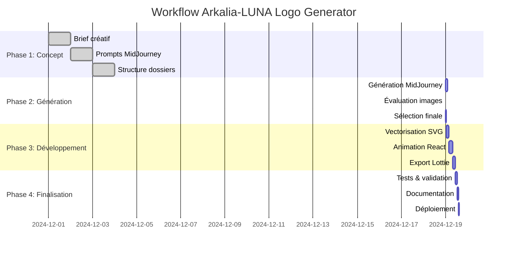

# 🚀 Workflow - Prochaines Étapes Arkalia-LUNA

## 🔄 **Workflow de Développement**



## 📍 État actuel du projet  

## 🎯 Prochaines actions immédiates

### **1. Génération MidJourney (À FAIRE MAINTENANT)**

**Lancer les 2 variantes sélectionnées :**

#### **Variante "Réseau+" (basée sur Image 3 DALL-E)**
```
Arkalia-LUNA emblem, luminous holographic moon, dense organic neural pathways intertwining with subtle techno circuits, small crystalline Λ core glowing, ethereal breathing halo and refined mist, deep blue base with holographic iridescence (violet turquoise silver), poetic and elegant, no eye, no harsh geometry, high detail but clean silhouette, iconic circular composition, mystical yet dignified, futuristic-organic aesthetic --ar 1:1 --v 6.0 --stylize 150 --quality 1
```

#### **Variante "Halo sérénité" (basée sur Image 4 DALL-E)**
```
Arkalia-LUNA emblem, luminous holographic moon, organic neural pathways intertwining with subtle techno circuits, small crystalline Λ core glowing, ethereal breathing halo and refined mist, deep blue base with holographic iridescence (violet turquoise silver), poetic and elegant, no eye, no harsh geometry, high detail but clean silhouette, iconic circular composition, mystical yet dignified, futuristic-organic aesthetic --ar 1:1 --v 6.0 --stylize 90 --quality 1
```

**Instructions :**
- Générer 2-3 variantes par prompt
- Sauvegarder dans `assets/generated/`
- Nommer : `mj-reseau-1.png`, `mj-halo-1.png`, etc.

### **2. Évaluation et sélection (DÈS RÉCEPTION)**

**Utiliser la checklist** `docs/checklist-midjourney.md` :
- Évaluer chaque image (1-5 sur 8 critères)
- Calculer le score total (/40)
- Sélectionner les 2 meilleures
- Noter les points forts/faibles

### **3. Développement du code final (APRÈS SÉLECTION)**

**Vectorisation SVG :**
- Convertir les meilleures images en SVG
- Créer les calques : lune, réseau, halo, Λ-core
- Optimiser pour différentes tailles

**Animation React :**
- Intégrer le vrai design dans `ArkaliaLogo.jsx`
- Ajuster les animations selon les variantes
- Tester toutes les émotions

**Export Lottie :**
- Créer les 5 variantes émotionnelles
- Optimiser pour web/mobile
- Tester sur différentes plateformes

## 📊 Planning estimé

| Phase | Durée | Livrables |
|-------|-------|-----------|
| **Génération MidJourney** | 1-2h | 4-6 images générées |
| **Évaluation** | 30min | 2 images sélectionnées |
| **Vectorisation** | 2-3h | SVG optimisés |
| **Animation React** | 3-4h | Composants animés |
| **Export Lottie** | 2-3h | Pack multi-émotions |
| **Tests & finitions** | 1-2h | Logo final validé |

## 🎨 Variantes émotionnelles à développer

1. **🌙 Sérénité** : Halo lent, pulsations douces
2. **⚡ Puissance** : Halo vibrant, réseau accéléré  
3. **🔮 Mystère** : Brumes mouvantes, réseau irrégulier
4. **✨ Éveil/Sagesse** : Halo rayonnant, Λ-core clair
5. **🎇 Énergie créative** : Flux rapides, reflets multicolores

## 🛠️ Outils nécessaires

- **MidJourney** : Génération des concepts
- **Illustrator/Inkscape** : Vectorisation SVG
- **React** : Animation web
- **After Effects** : Export Lottie (optionnel)
- **Lottie Web** : Test des animations

## 📋 Checklist de validation finale

- [ ] Logo lisible en petit format (16x16, 32x32)
- [ ] Réseau neuronal organique et vivant
- [ ] Halo respirant et élégant
- [ ] Λ-core visible et rayonnant
- [ ] Palette bleu + iridescences cohérentes
- [ ] 5 variantes émotionnelles fonctionnelles
- [ ] Export SVG, React, Lottie
- [ ] Tests sur différentes plateformes

## 🚀 Action immédiate

**LANCE MAINTENANT les 2 prompts MidJourney** et envoie-moi les résultats pour qu'on puisse passer à l'étape suivante ! 🎨✨
